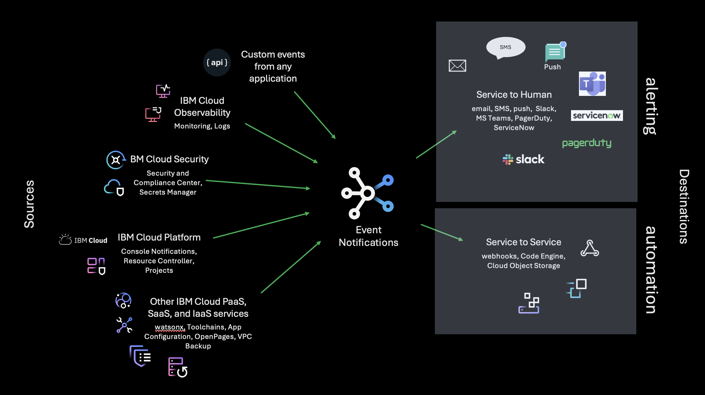

---

copyright:
  years: 2020, 2024
lastupdated: "2024-10-07"

keywords: event-notifications, event notifications, about event notifications

subcollection: event-notifications

---

{{site.data.keyword.attribute-definition-list}}

# What is {{site.data.keyword.en_short}}?
{: #en-about}

{{site.data.keyword.en_full}} is a routing service that provides you information about critical events that occur in your {{site.data.keyword.cloud_notm}} account or triggers automated actions by using webhooks. You can filter and route event notifications from {{site.data.keyword.cloud_notm}} services like monitoring, to communication channels like email, SMS, and webhooks.
{: shortdesc}

{: caption="{{site.data.keyword.en_short}}" caption-side="bottom"}

## Features
{: #en-features}

### Centralized alert routing
{: #en-features-routing}

From a single dashboard, you can route event notifications from {{site.data.keyword.compliance_long}} (SCC), {{site.data.keyword.secrets-manager_full_notm}}, or {{site.data.keyword.monitoringfull_notm}} to relevant stakeholders. You can also filter alerts by severity and choose a communication channel that is most appropriate, for example SMS or push for immediate priority or email for lesser priority alerts.

### Filtered source events
{: #en-features-filter}

Filter incoming events into one or more topics. Use filters to fine-tune topic content to adjust the event set you need. Connect multiple topics to one source, or connect multiple sources to a single topic.

### Built-in communication providers
{: #en-features-providers}

{{site.data.keyword.en_short}} comes with basic email and SMS capability that is built into the service. Add the {{site.data.keyword.cloud_notm}} email or {{site.data.keyword.cloud_notm}} SMS destination to any {{site.data.keyword.en_short}} subscription for instant connectivity. With a few more steps, you can add the push notification destination to your source list and subscribe to that destination as well.

### Webhooks
{: #en-features-webhooks}

Send event notifications to any webhook destination. Use webhooks to integrate outbound notifications into management and collaboration tools, or into your own applications.

### Fanout
{: #en-features-fanout}

Route a single event notification to many destinations with just a few clicks. Send the notification to a person, to your application, and to your automation suite, all at the same time.

### Governance
{: #en-features-governance}

{{site.data.keyword.en_short}} user and notification activity can be tracked through {{site.data.keyword.cloudaccesstraillong_notm}} and {{site.data.keyword.loganalysislong_notm}} so you can find out what happened and when.

## Concepts
{: #en-concepts}

Learn about {{site.data.keyword.en_full}} concepts such as filters, conditions, and topics.

### Event
{: #en-event}

An occurrence of something of interest that is associated with {{site.data.keyword.cloud_notm}} platform or services and apps that run on it.  

### Event notification
{: #en-eventn}

A digitized message that is triggered when an event occurs. Event notifications come in to the {{site.data.keyword.en_short}} service from event sources. Sometimes "event notification" is shortened to "event" or "notification" in the context of the {{site.data.keyword.en_short}} service.

### Event source
{: #en-source-1}

A service or application on {{site.data.keyword.cloud_notm}} that emits event notifications and publishes them to a topic within the {{site.data.keyword.en_short}} service. A source is a registered entity in an {{site.data.keyword.en_short}} service instance. Several services on {{site.data.keyword.cloud_notm}} are set to be integrated to send notifications to {{site.data.keyword.en_short}}.

{{site.data.keyword.monitoringlong_notm}}, {{site.data.keyword.compliance_long}}, {{site.data.keyword.secrets-manager_full_notm}} Platform Notifications for {{site.data.keyword.cloud_notm}}, {{site.data.keyword.cloud_notm}} Resource Lifecycle Events, {{site.data.keyword.cloud_notm}} Projects, and Toolchain are enabled. A source can publish to multiple topics. In other contexts sources are identified as producers or publishers.

Size limit for a send notification request is limited to 64 KB.

### Filter
{: #en-filters}

A mechanism for selectively passing event notifications from a source into a topic. A topic has an independent filter for each source that is connected to it.

#### Condition
{: #en-conditions}

One of many criteria can be used for filtering. {{site.data.keyword.en_short}} whose attributes match a condition are passed through to a topic. Notifications whose attributes do not match a condition are dropped.

### Ingested event notification
{: #en-ingested}

- An event notification that is evaluated by a filter. Ingested events are a primary billing metric. The price for ingested events is the same for all sources. If no filter is defined for a source, none of the events from that source are ingested. 

- If a filter is defined for a source but no event notifications are passed through, the number of notifications that bounced are still considered "ingested" because they were analyzed by a filter. 

### Topic
{: #en-topics}

- A landing place for filtered events. Topics hold a set of incoming event notifications of interest. Each source is connected to a topic through a user-defined filter. Notifications that pass into a topic are pushed to all subscribed destinations. A topic can connect to multiple sources. 

- Event notifications that end up in a topic are routed to destinations. A topic can be connected to multiple sources. Although topics are innately coupled to sources by using filters, they are not innately coupled to destinations. That coupling happens through subscriptions.

### Destination
{: #en-destinations}

A delivery target for {{site.data.keyword.en_short}}. In other contexts, destinations are also called channels, sinks, consumers, or subscribers.

- Human destination: A device, server, or application presents notifications for human consumption. Examples of human destinations are email servers, SMS text providers, and push notification services. 

   Specific email addresses, phone numbers, and device IDs can be part of a subscription to a destination, but they are not part of the destination itself.
   {: note}

- Service destinations: A cloud service or an application where notifications are consumed programmatically. A webhook to a backend microservice is an example of a service destination.

#### Service-to-service
{: #en-destinations-s2s}

A way to describe a notification that travels from a cloud service to a service destination. In other contexts, service-to-service is also categorized as app-to-app.

#### Service-to-human
{: #en-destinations-s2h}

A way to describe a notification that travels from a cloud service to a human destination. In other contexts, service-to-human is also categorized as app-to-person.

### Subscription
{: #en-subscriptions}

An association of one topic to one destination. If a destination requires additional information to operate correctly (for example, email addresses for an email destination), then that information is included in the subscription.

### Subscriber
{: #en-subscriber}

An entity that is targeted by a subscription. For webhooks, the webhook host is the subscriber. For human destinations, email addresses and phone numbers (or the people who own them) are subscribers.

One subscription can have only one destination, but it can have many subscribers within that destination. 
{: note}

### Outbound digital message
{: #en-outbound}

An event notification that is sent from the {{site.data.keyword.en_short}} service to a subscriber. Outbound digital messages are a primary billing metric for the {{site.data.keyword.en_short}} service. The price for outbound digital messages varies by destination (for example, outbound digital messages to SMS are priced differently than outbound digital messages to email). In most cases a dispatch (attempt to deliver) is considered an outbound digital message, regardless of whether the delivery was successfully.

### Digital message origin
{: #en-outbound-origin}

The originating phone number or origin ID for a text message, and the originating domain or IP address for email. In, most countries the sender is obligated by law to be transparent about the origin of a digital message. If you select the IBM SMS Service or IBM Email Service as a destination for your subscriptions, the text messages that user receives has an origin that is owned by IBM.

### SMS message
{: #en-sms}

A text message in **Simple Messaging Service** format.

#### SMS message segment
{: #en-sms-segemnt}

A group of 160 characters within an SMS text message. A single message can contain many segments. Each message segment counts as one outbound digital message for billing purposes.

#### SMS unit
{: #en-sms-unit}

A pricing unit for SMS text messages.

## {{site.data.keyword.en_short}} relationship model
{: #en-relation}

{{site.data.keyword.en_short}} includes sources, filters, topics, destinations, and subscriptions. The relationship between these elements is shown in Figure 1.

{: caption="Figure 1. {{site.data.keyword.en_short}} relationship model" caption-side="bottom"}

Events originate outside {{site.data.keyword.en_short}}, for example, from {{site.data.keyword.cloud_notm}} services. An 'event source' within {{site.data.keyword.en_short}} represents a connection between {{site.data.keyword.en_short}} and one of these event-producing services.

Topics have associated filters that determine which source events are published. Topics can have multiple sources, each with their own filter. Topics isolate events of interest from various sources and aggregate them into one entity.

Subscriptions tie topics to destinations. While a single topic or destination can be associated with multiple subscriptions, a subscription is one-to-one, meaning it ties one topic to one destination. For service-to-human channels, one subscription can contain multiple recipients. For example, a subscription to an email destination is not restricted to just one email address but instead has a recipient list that might hold many addresses.

### Event notification flow
{: #en-flow}

When an event occurs in a registered source, the source sends an event notification to the {{site.data.keyword.en_short}} service. Based on the filters or conditions that are defined on the source, this incoming notification is targeted to one or several topics. The notification is delivered to all destinations, which are subscribed to the targeted topics.

### Event notification format
{: #en-format}

A notification sent to the {{site.data.keyword.en_short}} service must conform to the [CNCF](https://www.cncf.io/) [CloudEvents](https://cloudevents.io/) format.

### More about filters
{: #en-more-filter}

A filter is a conditional statement, which connects a source to a topic. Filters are written to route notifications of interest to a particular topic. All notifications that pass through the filters into a topic are then routed to the topic subscribers. Filtering is absent between topic and destination.

To simplify filtering, a source might include **event categories** in their notifications. Event categories are standard filter keys with the following hierarchy: Event Category -> Event Type -> Severity. Event categories simplify filtering because they appear as dropdown selection boxes when you are creating topics and filters in the {{site.data.keyword.en_short}} UI. For more advance filtering, use [JSONPath](https://jsonpath.com/) in the `Custom Filter` field. For more on JSONPath, see [JSONPath Online Evaluator](https://restfulapi.net/json-jsonpath/).
