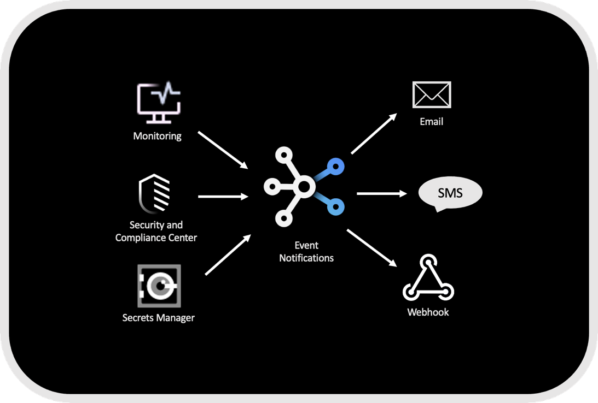

---

copyright:
  years: 2020, 2021
lastupdated: "2021-11-29"

keywords: event-notifications, event notifications, about event notifications

subcollection: event-notifications

---

{:codeblock: .codeblock}
{:external: target="_blank" .external}
{:important: .important}
{:note: .note}
{:pre: .pre}
{:screen: .screen}
{:shortdesc: .shortdesc}
{:tip: .tip}

# What is {{site.data.keyword.en_short}}? 
{: #en-about}

 {{site.data.keyword.en_full}} is an event notification routing service that notifies you to critical events that occur in your {{site.data.keyword.Bluemix_notm}} account or triggers automated actions by using webhooks. You can filter and route event notifications from {{site.data.keyword.Bluemix_notm}} services like Monitoring, Security and Compliance Center, and Secrets Manager to email, SMS, and webhooks.
{: shortdesc}

{: caption="Figure 1. {{site.data.keyword.en_short}} schema" caption-side="bottom" }

## Features
{: #en-features}

### Centralized alert routing
{: #en-features-routing}
From a single dashboard, route event notifications from {{site.data.keyword.compliance_long}} (SCC), {{site.data.keyword.secrets-manager_full_notm}}, or {{site.data.keyword.Bluemix_notm}} {{site.data.keyword.prf_hubshort}} to relevant stakeholders. Filter alerts by severity and choose a communication channel that is most appropriate, SMS for immediate priority and email for a secondary level of urgency.

### Filtered source events
{: #en-features-filter}
Filter incoming events into one or more topics. Use filters to fine-tune topic content to adjust the event set you need. Connect multiple topics to one source, or connect multiple sources to a single topic.

### Built-in communication providers
{: #en-features-providers}
{{site.data.keyword.en_short}} provides basic email and SMS capability that is built in the service. Add the {{site.data.keyword.Bluemix_notm}} email or {{site.data.keyword.Bluemix_notm}} SMS destination to any {{site.data.keyword.en_short}} subscription for instant connectivity.

### Webhooks
{: #en-features-webhooks}
Send event notifications to any webhook destination.  Use webhooks to integrate outbound notifications into management and collaboration tools, or into your own applications.

### Fanout
{: #en-features-fanout}
Route a single event notification to many destinations with just a few clicks. Send the notification to a person, to your application, and to your automation suite, all at the same time.

### Governance
{: #en-features-governance}
{{site.data.keyword.en_short}} user and notification activity can be tracked through {{site.data.keyword.cloudaccesstraillong_notm}} and {{site.data.keyword.loganalysislong_notm}} so you can find out what happened when.

