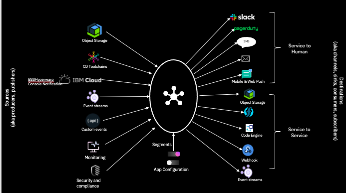

---

copyright:
  years: 2020, 2021
lastupdated: "2021-08-18"

keywords: event-notifications, event notifications, about event notifications

subcollection: event-notifications

---

{:codeblock: .codeblock}
{:external: target="_blank" .external}
{:important: .important}
{:note: .note}
{:pre: .pre}
{:screen: .screen}
{:shortdesc: .shortdesc}
{:tip: .tip}

#  {{site.data.keyword.en_short}} terms
{: #en-overview}

This document lists the standard terms and their definitions used in the  {{site.data.keyword.en_short}}  services.

<!-- {: caption="Figure 1.{{site.data.keyword.en_short}} overview" caption-side="bottom"} -->

## Source
{: #en-source}
 {{site.data.keyword.en_short}} originate from sources. A source a registered entity in an {{site.data.keyword.en_short}} service instance which publishes notifications. At present sources are limited to those categorized as IBM Source.

    - IBM Source
      An IBM Source is a source in {{site.data.keyword.en_short}} where notifications are published from an {{site.data.keyword.Bluemix_notm}} service. There are several services on {{site.data.keyword.Bluemix_notm}} which are integrated to sent notifications to {{site.data.keyword.en_short}}. Examples include {{site.data.keyword.compliance_short}}, {{site.data.keyword.prf_hubshort}}, and {{site.data.keyword.secrets-manager_short}}.

    - Service to Service Authorization
    Service to Service Authorization is used to enable an IBM Service to publish notifications to the {{site.data.keyword.en_short}} service. A customer who is interested in notifications from an IBM service has to authorize such a source service to publish to an instance of the {{site.data.keyword.en_short}} service.      

## Topics
{: #en-topics}
A logical entity which connects one or more sources to destinations. A topic lets you logically group multiple sources based on pre-defined filters, and target notifications from such a group into multipe destinations.
The concept of topics helps decouple sources and destinations. A source for a notification does not need to be aware of all the destinations that it will be targeted to.

## Filters
{: #en-filters}
A filter is a conditional statement, which connects a Source to a Topic. Filters are written to route notifications of interest to a particular topic; notifications passing the conditional statement of the filter will pass through the {{site.data.keyword.en_short}} system and be delivered to all the destinations that are subscribed to the same topic.

   - More details on [JSONPath](https://jsonpath.com/) and
   -[JSON with JSONPath](https://restfulapi.net/json-jsonpath/)

   Multiple sources can route to a topic by defining a filter for each such source -> topic connection.
   A source can also route to multiple Topics.

## Destinations
{: #en-destinations}
Destinations represent locations to which notifications are to be delivered. Destinations can be categorized as human or an app.
   -Examples of human destinations include SMS, Email, Push Notifications, Slack
   -Examples of Application/Service destinations include Webhooks, Event Streams(Kafka), Elastic Search

{{site.data.keyword.en_short}} supports the following destinations:
   - Email: Email is a pre-defined destination, with SendGrid as the email provider. All emails from {{site.data.keyword.en_short}} service will be from a fixed IBM email-id.
   - SMS: SMS is a pre-defined destination. An IBM-owned number and  Twilio the service platform is used to support text messaging.
   - Webhook: Customers can use webhook destinations to process notifications from the {{site.data.keyword.en_short}} service. Customers can also write their own custom applications to receive  notifications from {{site.data.keyword.en_short}} service. Such an application is defined as webhooks destinations.
   Webhook signing: {{site.data.keyword.en_short}} provides an option for users to enable signing of the notification payload. This enables the webhook to validate that the incoming notification is from a trusted source - i.e. {{site.data.keyword.en_short}} service.

## Subscriptions
{: #en-subscriptions}  
Destinations subscribe to Topics. Multiple destinations can subscribe to a single Topic.
An email subscription is a list of all emails IDs, and an SMS subscription is a list of all phone numbers that a notification has to be routed to. A Webhook subscription links a webhook destination to a topic.

## Notifications
{: #en-notifications}
Whenever an event occurs in a registered source, a notification is sent to the {{site.data.keyword.en_short}} service. Based on the filters/conditions defined on such a registered source, this incoming notification is targeted to one or several Topics. The notification is then delivered to all destinations subscribed to these targeted topics. A notification sent to {{site.data.keyword.en_short}} has to be of a pre-defined format, as defined here. (link)

## Event Category
{: #en-categories}
When a source is registered into {{site.data.keyword.en_short}}, one can additionally (and optinally) define Event Category for the source which identifies notifications from a particular source that may be of interest. Event Category hierarchy reads as Event Category -> Event Type -> Severity.
The benefit of defining event categories is that, the {{site.data.keyword.en_short}} UI displays these categories in the Topics page where filters are created. The customer can easily select common categories from such a drop down, while advanced filters can be handwritten in JSONPath format.
