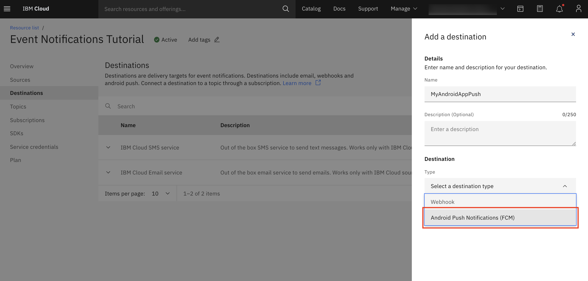
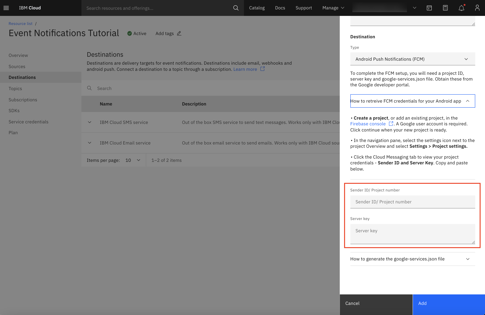

---

copyright:
  years: 2015, 2022
lastupdated: "2022-07-29"

keywords: event notifications, event-notifications, tutorials, push, android, firebase, fcm

subcollection: event-notifications

content-type: tutorial
account-plan: lite, standard
completion-time: 10m

---

{{site.data.keyword.attribute-definition-list}}

# Create an {{site.data.keyword.en_short}} push destination for Android (FCM)
{: #en-create-en-destination-push-fcm}
{: toc-content-type="tutorial"}
{: toc-completion-time="10m"}

Create an {{site.data.keyword.en_short}} push destination configured for Firebase Cloud Messaging (FCM) to send messages to Android devices.
{: shortdesc}

## Create a push destination
{: #en-create-destination-push-fcm}
{: step}

- Click `Destinations` in the {{site.data.keyword.en_short}} console.
- Click `Add`.
- Enter a name and an optional description, and select `Android Push Notifications (FCM)` as the destination type. 

{: caption="Figure 1. Create a push FCM destination" caption-side="bottom"}

## Retrieve FCM credentials
{: #en-destination-push-fcm-credentials }
{: step}

Follow the instructions in the console to retrieve your sender ID and server key from Google Firebase.

{: caption="Figure 2. Retrieve FCM credentials" caption-side="bottom"}

## Add the `google-services.json` file to your app
{: #en-destination-push-fcm-servicesjson }
{: step}

- Follow the instructions in the console to generate a google-services.json file from Google Firebase.
- Download the file and add it to the root directory of your mobile app.

{: caption="Figure 3. generate `google-services.json` file" caption-side="bottom"}

## Add the destination
{: #en-destination-finish}
{: step}

Click `Add`.
