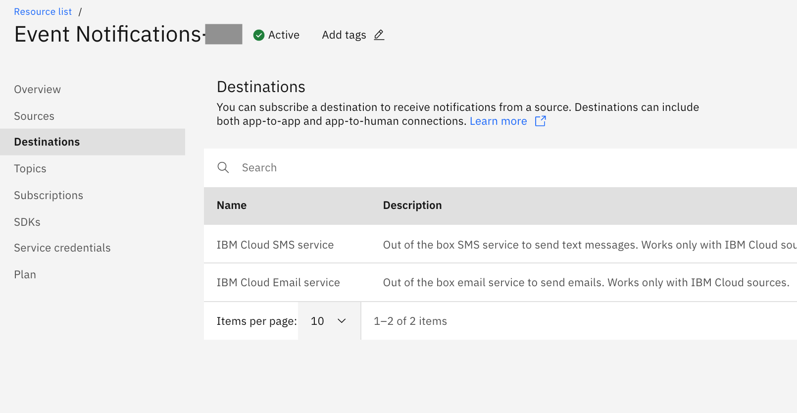
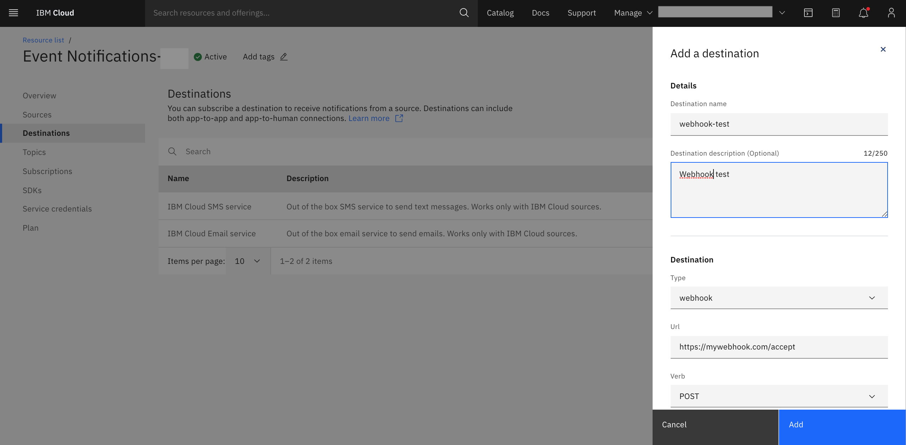
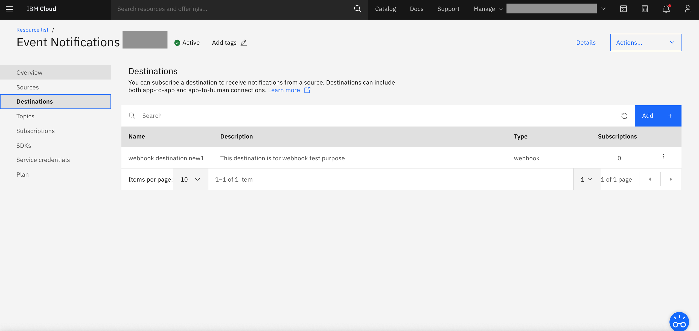

---

copyright:
  years: 2015, 2020
lastupdated: "2020-09-21"

keywords: event notifications, event-notifications, tutorials

subcollection: event-notifications

content-type: tutorial
services:
account-plan: lite
completion-time: 10m

---

{{site.data.keyword.attribute-definition-list}}

# Create an {{site.data.keyword.en_short}} destination
{: #en-create-en-destination}

Destinations are custom protocols, which are either services or user reachable entities.
Presently, {{site.data.keyword.en_short}} supports three destination types:
- SMTP_IBM
- SMS_IBM
- Webhook
{: shortdesc}

Of these, email-ibm and email-sms are supported out of the box.

## Create a destination
{: #en-create-destination}
{: step}

- Click destinations in the {{site.data.keyword.en_short}} console.

{: caption="Figure 1. Create a destination" caption-side="bottom"}

## Add destination details
{: #en-destination-details }
{: step}

- Destination name; name of the Destination.
- Destination description; add a description for the destination, which is optional.
- Destination type; select type under Destination.

{: caption="Figure 2. Add destination details" caption-side="bottom"}

## Add the destination
{: #en-destination-finish}
{: step}

- Click `Add`.

{: caption="Figure 4. Add a destination" caption-side="bottom"}
