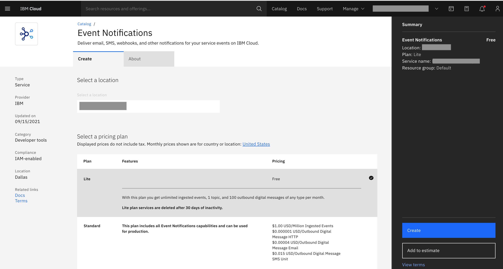
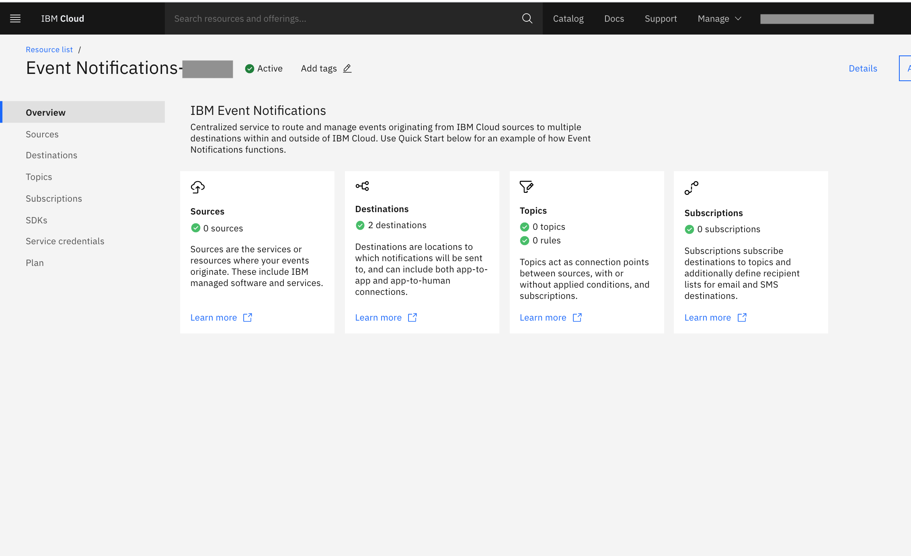

---

copyright:
  years: 2015, 2020
lastupdated: "2020-09-17"

keywords: event notifications, event-notifications, tutorials

subcollection: event-notifications

content-type: tutorial
services:
account-plan: lite
completion-time: 10m

---

{{site.data.keyword.attribute-definition-list}}

# Create an {{site.data.keyword.en_short}} service instance
{: #en-create-en-instance}

The basic steps that get you started:

## Log in to your {{site.data.keyword.Bluemix_notm}} account
{: #en-log-in}
{: step}

In the {{site.data.keyword.Bluemix_notm}} [catalog](https://test.cloud.ibm.com/catalog#services), search and select [{{site.data.keyword.en_short}}](https://test.cloud.ibm.com/catalog/services/event-notifications). The service configuration screen opens.

{: caption="Figure 1. Configuration screen" caption-side="bottom"}

## Select a region
{: #en-select}
{: step}

Currently, Dallas (us-south), London (eu-gb), and Sydney (au-syd) region is supported.

## Select a pricing plan
{: #en-pricing}
{: step}

Currently, only Lite and Standard pricing plans are defined. With the Lite plan, you get unlimited ingested events, 1 topic, and 100 outbound digital messages of any type per month.
With the Standard plan, you are charged for ingested events and for outbound digital messages. An ingested event is one that is received and filtered. If a source is connected but no filters are defined for it, the incoming events are dropped and you are not charged. Outbound digital messages come in various types, and each type is priced separately.

## Add a service name
{: #en-configure}
{: step}

Configure your resource with a service name, or use the preset name.

## Select a resource group
{: #en-resource}
{: step}

The resource group selection helps how you want resources to be organized in your account. The resource group that you select cannot be changed after the service instance is created.

## Define tags
{: #en-tags}
{: step}

Optionally, define Tags that are required to identify this service instance.

## Create the {{site.data.keyword.en_short}} service instance
{: #en-create}
{: step}

Click Create. A new service instance is created and the {{site.data.keyword.en_short}} console displayed.

{: caption="Figure 2. {{site.data.keyword.en_short}} console" caption-side="bottom"}
