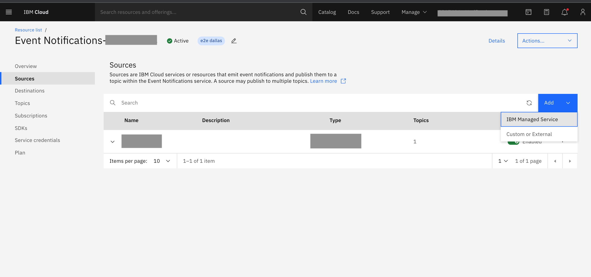
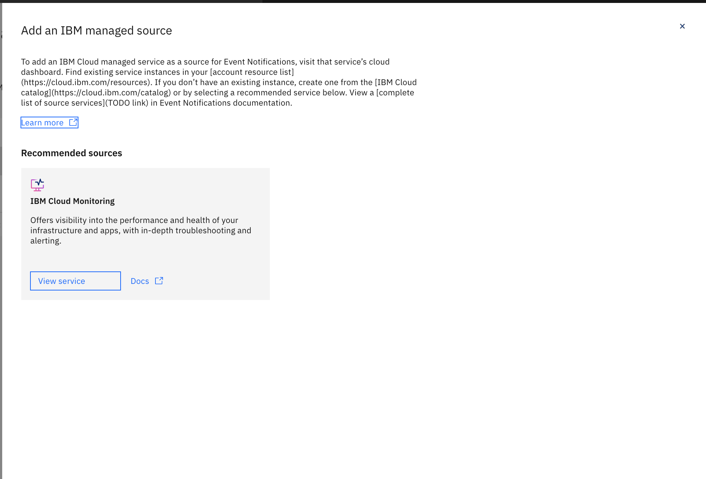

---

copyright:
  years: 2015, 2020
lastupdated: "2020-10-20"

keywords: event notifications, event-notifications, tutorials

subcollection: event-notifications

content-type: tutorial
services:
account-plan: lite
completion-time: 10m

---

{{site.data.keyword.attribute-definition-list}}

# Create an {{site.data.keyword.en_short}} source
{: #en-create-en-source}

**Source** is the initiator of events to the {{site.data.keyword.en_short}} service. Source information is also an ask for {{site.data.keyword.en_short}} event payload to track the actual initiator of the notification event, via the service.
{: shortdesc}

## IBM provided sources
{: #en-ibm-source}

IBM provided sources are IBM services that offer users the ability to add {{site.data.keyword.en_short}} service as an add-on, create topics, and write their own rules or filters to receive notifications when certain conditions (rules) are a match.

This is enabled by IBM Cloud Services S2S integration with {{site.data.keyword.en_short}} service, as described
[here](https://pages.github.ibm.com/Notification-Hub/planning/internal-adopters/onboarding-procedure.html).

The supported IBM Cloud Services can be seen under Add--> IBM managed services.

{: caption="Figure 1. Add a source" caption-side="bottom"}

## Add IBM provided source
{: #en-ibm-source-add}
{: step}
- Click `Add`, and select IBM Managed Service.
- Visit that service's cloud dashboard.
- Find existing service instances in your [account resource list](https://cloud.ibm.com/resources).
- If you don't have an existing instance, create one from the [IBM Cloud catalog](https://cloud.ibm.com/catalog).

{: caption="Figure 2. Add an IBM managed source" caption-side="bottom"}

## List of IBM provided sources
{: #en-ibm-source-list}

- [IBM Cloud Monitoring](https://cloud.ibm.com/catalog/services/ibm-cloud-monitoring?callback=%2Fobserve%2Fmonitoring%2Fcreate)