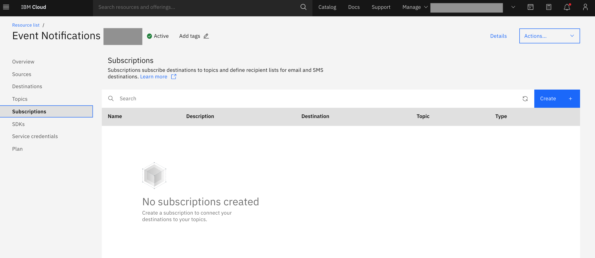
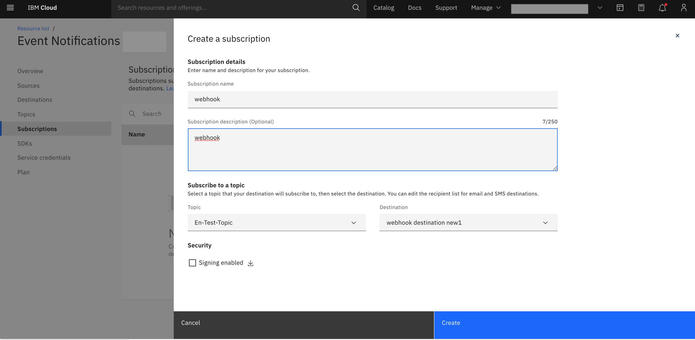
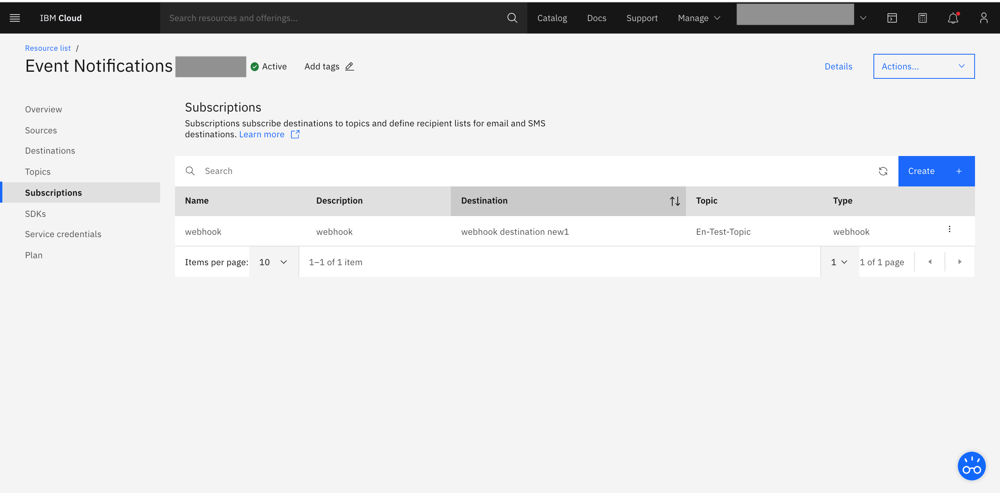

---

copyright:
  years: 2015, 2020
lastupdated: "2020-09-21"

keywords: event notifications, event-notifications, tutorials

subcollection: event-notifications

content-type: tutorial
services:
account-plan: lite
completion-time: 10m

---

{{site.data.keyword.attribute-definition-list}}

# Create an {{site.data.keyword.en_short}} subscription
{: #en-create-en-subscription}

Destinations subscribe to topics. Multiple destinations can subscribe to a single topic. An email subscription is a list of all emails IDs, and an SMS subscription is a list of all phone numbers that a notification is routed to. A webhook subscription links a webhook destination to a topic.
{: shortdesc}

Of these, SMTP_IBM and SMS_IBM are supported out of the box.

## Create a subscription
{: #en-create-subscription}
{: step}

- Click subscriptions in the {{site.data.keyword.en_short}} console.

{: caption="Figure 1. Create a subscription" caption-side="bottom"}

## Add subscription details
{: #en-subscription-details }
{: step}

- Click `Create` to display subscription wizard.
- Fill in subscription details:
    - Subscription name; name of the subscription.
    - Subscription description; add an optional description.
- Under Subscribe to a topic section select a topic from the drop down list and select a destination from from the destination drop down.
- Destination type; select type under Destination.

{: caption="Figure 2. Add subscription details" caption-side="bottom"}

## Enable the subscription
{: #en-subscription-finish}
{: step}

- Click `Create` in the subscription wizard.

{: caption="Figure 4. Add a destination" caption-side="bottom"}
