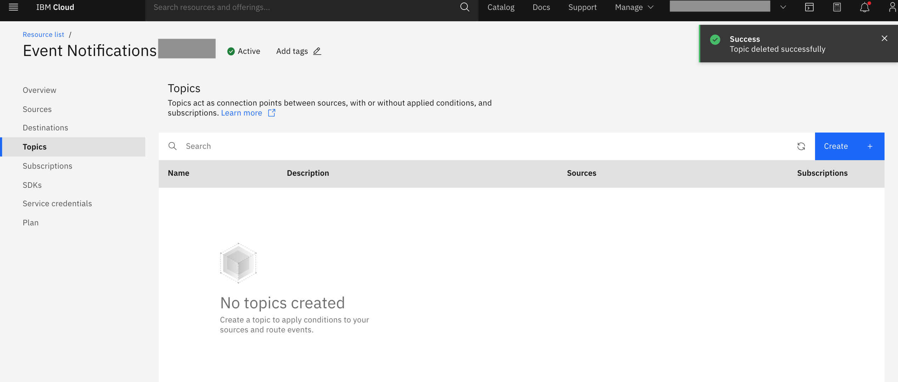
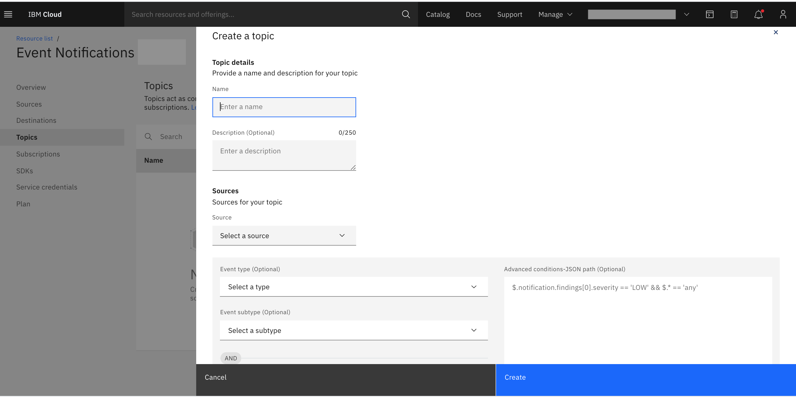
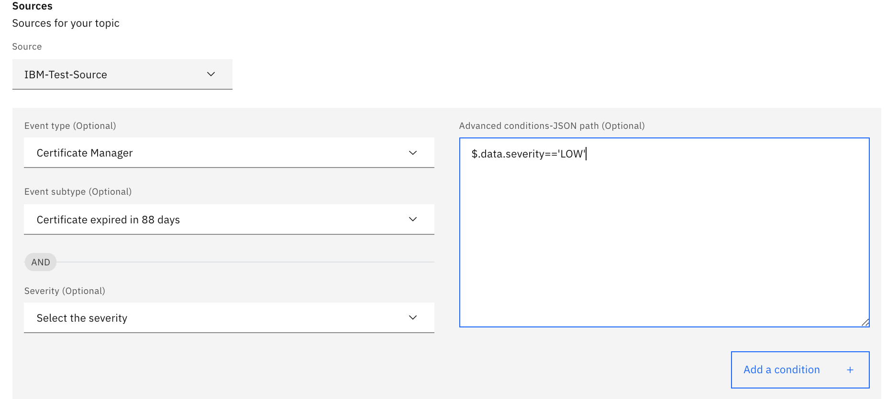
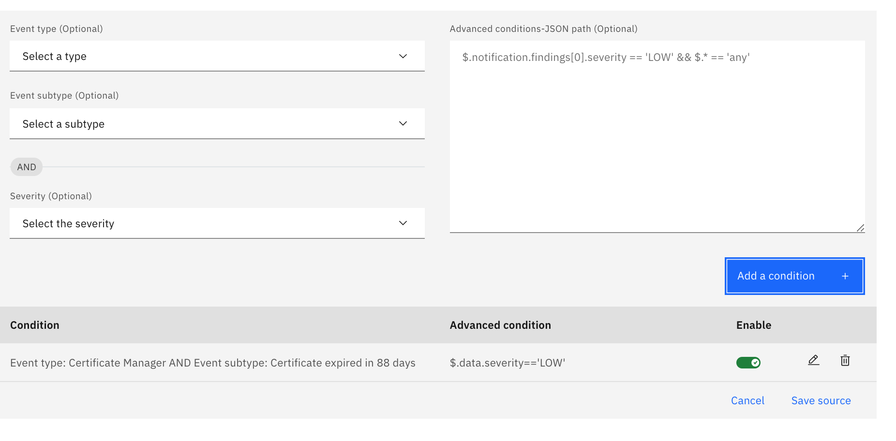
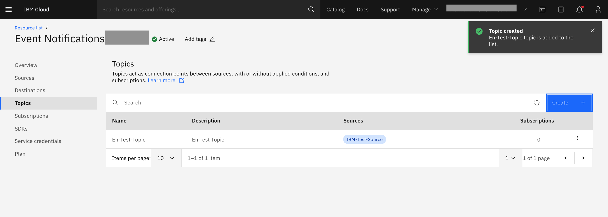

---

copyright:
  years: 2015, 2020
lastupdated: "2020-09-21"

keywords: event notifications, event-notifications, tutorials

subcollection: event-notifications

content-type: tutorial
services:
account-plan: lite
completion-time: 10m

---

{{site.data.keyword.attribute-definition-list}}

# Create an {{site.data.keyword.en_short}} topic
{: #en-create-en-topic}

{{site.data.keyword.en_short}} **topic** is based on a publish and subscription model. You can send notifications/alerts to multiple destination types, (email, SMS, and others) that are subscribed to a particular topic. Configure topics as needed and {{site.data.keyword.en_short}} handles the routing and delivering of alerts reliably to the right destinations.
{: shortdesc}

- Each topic is created under a registered source.
- Each topic can have its own set of rules, which routes the incoming payload to the respective topic.

## Select topics in the {{site.data.keyword.en_short}} console.
{: #en-create-topic}
{: step}

{: caption="Figure 1. Create a topic" caption-side="bottom"}

- Click on `Create`, and enter the topic details.
- Name; name of the topic.
- Description; add a description for the topic (optional).
- Source; select a source from the dropdown list.

{: caption="Figure 2. Add topic details" caption-side="bottom"}

## Add rules to your topic
{: #en-topic-rules  }
{: step}

You can create a topic with steps 1. Step 2 is for provisioning custom rules for the topic, which is optional.
{: note}

- Event type; select event type from the dropdown list.
- Event sub type; select event sub type from the event sub type dropdown list.
- Severity; select severity from the severity dropdown list.
- Advanced conditions; you can write your own custom conditions, which follow [jsonpath specifications](https://jsonpath.com/).

{: caption="Figure 3. Add rules to topic" caption-side="bottom"}

## Finish adding rules to your topic
{: #en-topic-condition}
{: step}

- Click on `Add a condition`.

If you do not select any rules, a default rule gets added, which means all notifications route to the topic by default.
{: note}

{: caption="Figure 4. Add a condition" caption-side="bottom"}

## Create a topic
{: #en-topic-create}
{: step}

- Click `Create` in the topic wizard.

{: caption="Figure 5. Finish creating a topic" caption-side="bottom"}

