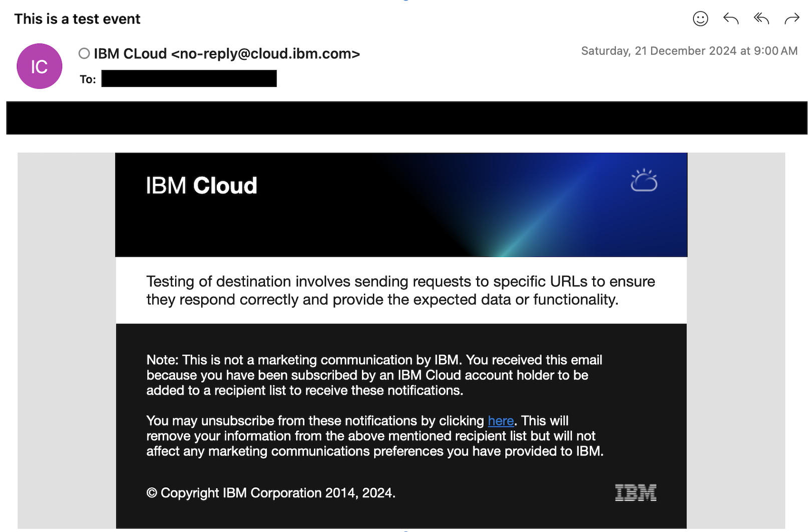

---

copyright:
  years: 2025
lastupdated: "2025-01-07"

keywords: event-notifications, event notifications, about event notifications, cron scheduler, topics, sources

subcollection: event-notifications

---
{{site.data.keyword.attribute-definition-list}}

# Periodic Timer
{: #en-periodic-timer}

The Periodic timer is an event scheduler in the {{site.data.keyword.cloud_notm}} {{site.data.keyword.en_short}} service that generates events periodically based on the cron expressions. Periodic Event scheduling is important in large-scale applications where the client cannot maintain the periodic timer. Therefore rather than relying on the client to schedule events, {{site.data.keyword.en_short}} will manage the scheduling of events based on a certain period defined by the user. 

## Scheduling an Event

### **Step 1 : Creating a topic using the Periodic Timer as a source**

1. Navigate to your {{site.data.keyword.en_short}} instance and click on Topics. Click on **Add**. Provide the name and description of the topic. Select Periodic Timer as the source.

    {: caption="Creating a topic" caption-side="bottom"}

1. Now you have to define the time window and the cron expression for Event Scheduling. The periodic timer will operate within the time window you specify. If no start time is provided, the timer starts immediately, and if no end time is set, it will continue to trigger until manually disabled. At first you will see the default cron expression and time window as highlighted below:

    {: caption="Cron Default Expression" caption-side="bottom"}

    Once you have set the time window and defined the cron expression, you will see the events scheduled as shown below:

    {: caption="Setting the time period and defining Cron Expression" caption-side="bottom"}

    **Cron Expressions**

    Syntax : `<MINUTE> <HOUR> <DAY-OF-MONTH> <MONTH> <DAY-OF-WEEK>`

    | Name         | Allowed values  | Allowed Special Characters |
    |--------------|-----------------|----------------------------|
    | Minutes      | 0-59            | , - * /                    |
    | Hours        | 0-23            | , - * /                    |
    | Day of month | 1-31            | , - * / ? L W              |
    | Month        | 0-11 or JAN-DEC | , - * /                    |
    | Day of week  | 1-7 or SUN-SAT  | , - * / ? L #              |
    {: caption="Cron Expressions" caption-side="bottom"}

    **Allowed Special Characters**

    **","** - Allows additional values. For example , in the day-of-week field , `sun,mon,tue` includes events scheduled on sunday,monday and tuesday. 

    **"-"** - Allows defining ranges. For example, in the day-of-month field 23-30 includes events scheduled on 23 to 30 of a month.

    **"*"** - Includes every value in a field. For example, in the hour field, * includes all the hours of a day.

    **"/"** -  Specifies increments. For example, in the minute field, you can mention 1/5 to specify every fifth minute, starting from the first minute of the hour (for example, the 6th, 16th, and 26th minute, and so on).

    **"?"** - Allows any value in a field. For example, in the Month field if JAN was entered and in the day-of-week field if **?** was entered it includes events scheduled on any day in JAN.

    **"L"** - Specifies the last day of the month/week.

    **"W"** - Specifies a weekday in a month. For example, In the Day-of-month field, 5W specifies the weekday closest to the fifth day of the month.

    **"#"** - Specifies a certain instance of the specified day of the week within a month. For example, 6#4 would be the fourth Friday of the month: 6 refers to Friday because it is the sixth day of each week, and the 4 refers to the fourth day of that type within the month.

    Click **Create**.

1. Review the newly created topic. 

    {: caption="Reviewing Topic" caption-side="bottom"}

### **Step 2 : Creating a subscription**

Refer [here](/docs/event-notifications?topic=event-notifications-en-create-en-subscription) to see how to create a subscription. 

Once a subscription has been created, an invitation Email/SMS will be sent to subscribe to the {{site.data.keyword.en_short}} topic. 

{: caption="Invitation Email to subscribe to topic" caption-side="bottom"}

### **Step 3 : Verifying that an Event occurs at scheduled time**

Once the event has been scheduled, the next step would be to verify that an event occurs at the scheduled time and a notification is sent to the destination. 

{: caption="Email Notification when Event takes place at scheduled time" caption-side="bottom"}
