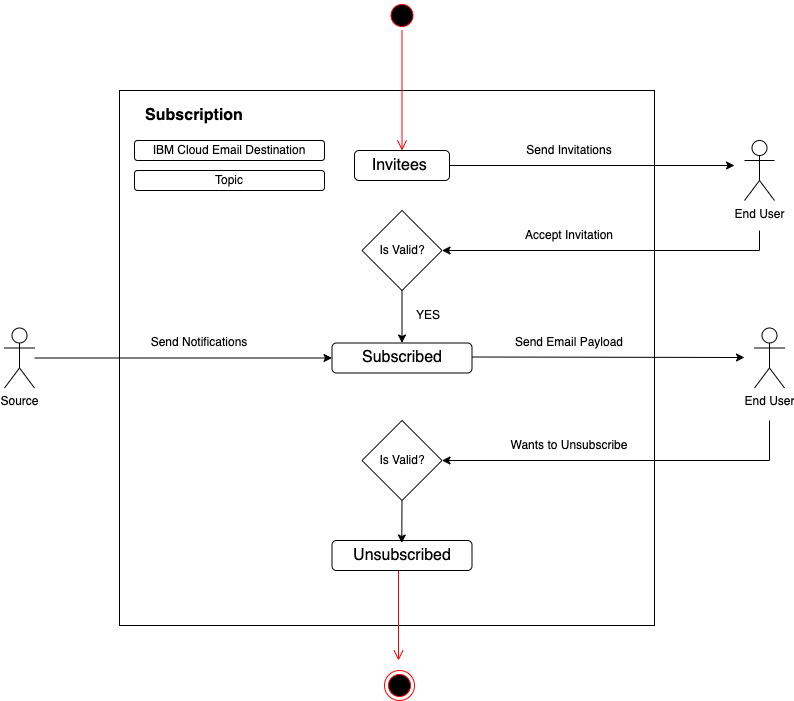

---

copyright:
  years: 2021, 2024
lastupdated: "2024-01-03"

keywords: event-notifications, event notifications, about event notifications, destinations, email

subcollection: event-notifications

content-type: tutorial
account-plan: lite, standard
completion-time: 10m

---

{{site.data.keyword.attribute-definition-list}}

# Email Destinations
{: #en-destinations-email}

{{site.data.keyword.en_short}} provides a built-in SMTP server for sending transactional and informational event notification emails to recipients who need to be aware of events that happen within your {{site.data.keyword.cloud_notm}} account.
{: shortdesc}

In the default mode, the emails originate from `no-reply@cloud.ibm.com` or `event-notifications@cloud.ibm.com`, while you can add your own reply-to address. If you are using the email service with custom domain, the email originates from the custom domain that you have chosen. Except for test emails, the content cannot be modified within {{site.data.keyword.en_short}}.

{: caption="Figure 1. Email state diagram" caption-side="bottom"}

## Adding an email service destination
{: #en-destinations-email-add}

Upon the creation of a new instance, you will notice the presence of the  pre-configured `{{site.data.keyword.cloud_notm}} Email Service` in the destination tab. This pre-configured email destination is poised to meet your immediate communication needs, providing a hassle-free setup for instant usability. Follow [the detailed steps](/docs/event-notifications?topic=event-notifications-en-destinations-default-domain) to get started with default domain email destination

Under Add destinations list, `Custom Email` destination is available to create. This unique option empowers you to tailor your communication by adding your own domain. You now have the flexibility to send emails using the email address associated with your specific domain, creating a personalized touch to your correspondence. Follow [the detailed steps](/docs/event-notifications?topic=event-notifications-en-destinations-custom-domain) to get started with custom domain email destination.

We advise following [the suggested etiquettes](/docs/event-notifications?topic=event-notifications-en-email-bestpractices) when utilizing the IBM Cloud email service.

## Email charges
{: #en-destinations-email-charge}

Every message that is sent by the {{site.data.keyword.cloud_notm}} email service counts as one outbound digital message and is charged. For example, if a subscription has 100 email addresses and the subscription topic received 1000 events during the month is as follows:

Total Outbound Digital messages = (number of email addresses) x (topic events)

In the example, the total outbound digital messages are as follows:

100 x 1000 = 100000 outbound digital messages

You are charged for messages that are successfully sent by the {{site.data.keyword.cloud_notm}} email service regardless of whether the remote email server successfully delivered the message to the recipient. For example, bounced emails still count as outbound digital messages. So vet your email list carefully to prevent unnecessary charges.

You can monitor your email usage by setting up a monitoring dashboard through the `Actions` menu of the {{site.data.keyword.en_short}} dashboard. See [Monitor {{site.data.keyword.en_short}} service metrics with {{site.data.keyword.monitoringfull_notm}}](/docs/event-notifications?topic=event-notifications-en-monitoring#en-monitoring) for details.

## Unsubscribe
{: #en-unsubscribe-email-destination}

You can subscribe to or unsubscribe from specific {{site.data.keyword.en_short}} email notifications. Also, users can opt out of receiving notifications for any subscription.

The **Active** tab displays the list of recipients email addresses and the date activated. The **Unsubscribed** tab displays the list of recipients who don't want to receive any email notification.

To unsubscribe, do the following steps:
- Under email subscription, click the `Unsubscribed` dialog to modify subscription settings and unsubscribe from mailing lists.
- Select or deselect the `Unsubscribed` dialog, which automatically reflects in the subscription wizard.

The role of an Admin:
- Only an admin can move or modify an unsubscribed email ID to `Active`.
- Only an admin can clear unsubscribed email lists.
- An admin cannot manually move or add users to the unsubscribed list.
