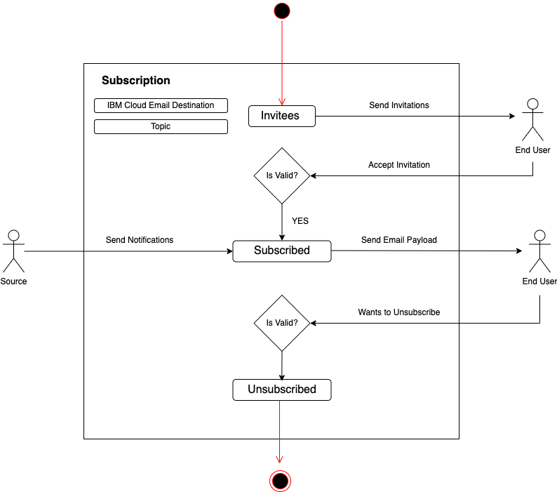

---

copyright:
  years: 2021, 2024
lastupdated: "2024-01-03"

keywords: event-notifications, event notifications, about event notifications, destinations, email

subcollection: event-notifications
---

{{site.data.keyword.attribute-definition-list}}

# Email Destinations
{: #en-destinations-email}

Use {{site.data.keyword.en_short}} email destinations to send event-driven notifications to recipients by email. Two destination types are available: Inbuilt Email and IBM Cloud Email service with custom domain.
{: shortdesc}

- [Inbuilt Email](/docs/event-notifications?topic=event-notifications-en-destination-email-destination-default)
The Inbuilt Email destination provides an SMTP relay for sending transactional and informational event notification emails to recipients who need to be aware of events that occur within your {{site.data.keyword.cloud_notm}} account. This destination can be used to send email notifications for events that originate only from IBM Cloud sources. The content cannot be modified within {{site.data.keyword.en_short}}. This destination is available by default whenever you create an instance of {{site.data.keyword.en_short}}. These emails originate from `no-reply@cloud.ibm.com` or `event-notifications@cloud.ibm.com`. You can add your own reply-to address.

- [IBM Cloud Email service with custom domain](/docs/event-notifications?topic=event-notifications-en-destinations-custom-email)
The Custom Domain Email destination allows you to send emails by using the email address that is associated with your own domain. You can also send your own email content. This destination type supports Email Templates and Personalization.

## Adding an email service destination
{: #en-destinations-email-add}

When you create a new {{site.data.keyword.en_short}} instance, a pre-configured `{{site.data.keyword.cloud_notm}} Email Service` destination is available in the **Destinations** page. Follow [the detailed steps](/docs/event-notifications?topic=event-notifications-en-destination-email-destination-default) to get started with the default domain email destination.

To send your own email content or send emails from your own domain, click **Add destinations** and select the `Custom Email` destination. Follow [the detailed steps](/docs/event-notifications?topic=event-notifications-en-destinations-custom-email) to get started with the custom domain email destination.

Follow [the suggested best practices](/docs/event-notifications?topic=event-notifications-en-email-bestpractices) when you use the IBM Cloud email service.

 Sending invitations or emails to Group Email addresses or Distribution Lists is not supported.
 {: note}

## Subscription workflow
{: #en-destinations-email-subscription-flow}

Both {{site.data.keyword.en_short}} email destinations support a subscription workflow. This workflow sends an invitation email to all email addresses that are subscribed to an email destination. The invitation contains a link to accept further notifications from the subscription. Notification emails are sent to a subscribed email address only if the recipient accepts the invitation.

The following diagram shows the workflow, from invited to subscribed to unsubscribed.

{: caption="Email state diagram" caption-side="bottom"}

## Unsubscribe
{: #en-unsubscribe-email-destination}

You can subscribe to or unsubscribe from specific {{site.data.keyword.en_short}} email notifications. Users can also opt out of receiving notifications for any subscription.

The **Active** tab displays the list of recipient email addresses and the date that each address was activated. The **Unsubscribed** tab displays the list of recipients who do not want to receive any email notifications.

To unsubscribe, complete the following steps:
- Under the email subscription, click the **Unsubscribed** tab to modify subscription settings and unsubscribe from mailing lists.
- Select or deselect entries in the **Unsubscribed** tab, which are automatically reflected in the subscription wizard.

The role of an Admin:
- Only an admin can move or modify an unsubscribed email ID to `Active`.
- Only an admin can clear unsubscribed email lists.
- An admin cannot manually move or add users to the unsubscribed list.

## Email charges
{: #en-destinations-email-charge}

Every message that is sent by the {{site.data.keyword.cloud_notm}} email service counts as one outbound digital message. For example, if a subscription has 100 email addresses and the subscription topic receives 1000 events during the month, the total is calculated as follows:

Total Outbound Digital messages = (number of email addresses) x (topic events)

In the example, the total outbound digital messages are as follows:

100 x 1000 = 100000 outbound digital messages

You are charged for messages that are successfully sent by the {{site.data.keyword.cloud_notm}} email service regardless of whether the remote email server successfully delivered the message to the recipient. For example, bounced emails still count as outbound digital messages. So vet your email list carefully to prevent unnecessary charges.

You can monitor your email usage by setting up a monitoring dashboard through the **Actions** menu of the {{site.data.keyword.en_short}} dashboard. See [Monitor {{site.data.keyword.en_short}} service metrics with {{site.data.keyword.monitoringfull_notm}}](/docs/event-notifications?topic=event-notifications-monitoring) for details.
