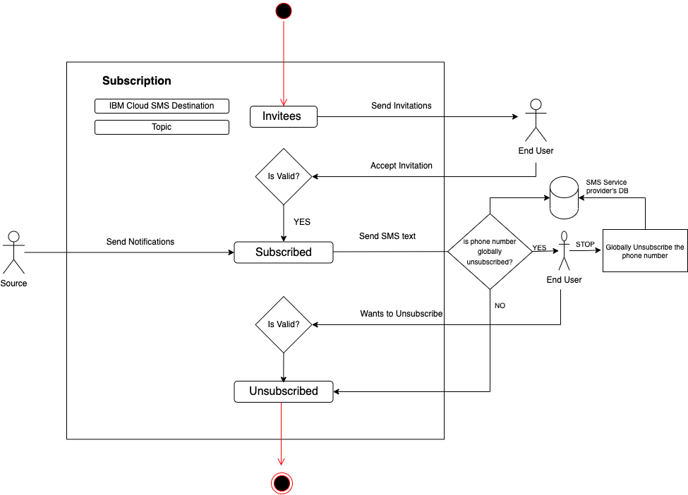

---

copyright:
  years: 2020, 2023
lastupdated: "2023-05-30"

keywords: event-notifications, event notifications, about event notifications, destinations, sms

subcollection: event-notifications

---

{{site.data.keyword.attribute-definition-list}}

# {{site.data.keyword.cloud_notm}} SMS service
{: #en-destinations-sms}

{{site.data.keyword.en_short}} provides a built-in SMS service for sending transactional and informational event notification text messages to recipients who need to be aware of events that happen within your {{site.data.keyword.cloud_notm}} account.
{: shortdesc}

The text messages originate from IBM-owned phone numbers or alphanumeric sender IDs. Except for test messages, the content cannot be modified within {{site.data.keyword.en_short}}.

{: caption="Figure 1. SMS state diagram" caption-side="bottom"}

## Adding an SMS destination
{: #en-destinations-sms-add}

{{site.data.keyword.cloud_notm}} SMS service is a destination that provided by default and ready for immediate use. When a new instance is created, you see an entry `{{site.data.keyword.cloud_notm}} SMS service` in the destination tab. The SMS destination is pre-configured and is ready to use.

## Using an {{site.data.keyword.cloud_notm}} SMS service destination
{: #en-destinations-sms-use}

`{{site.data.keyword.cloud_notm}} SMS service` as the destination type is only supported for US and Canada numbers.
{: important}

To use the SMS service destination, add it to a subscription along with the phone numbers of the recipients. Within a single subscription, you can add up to 3 phone numbers for lite plan and 100 phone numbers for standard plan. The subscription also needs a topic to filter events of interest from your sources. When an event lands in the topic, {{site.data.keyword.en_short}} immediately routes the event notification to your SMS recipients.

When you select `{{site.data.keyword.cloud_notm}} SMS service` as the destination type, you can add up to 3 phone numbers for lite plan and 100 phone numbers for standard plan, to the recipient list. To comply with the regulatory standards, you may need to get a consent (opt-in) from the SMS recipients to receive SMSs from each of the {{site.data.keyword.en_short}} subscriptions.

### Create a subscription with IBM SMS service as destination
{: #en-create-subscription-sms-destination}

1. From the {{site.data.keyword.en_short}} dashboard, click **Subscriptions** in the navigation menu.

1. Click `Create +` to display **Create a Subscription** side panel.

1. Complete the following subscription details:
   - `Name`: name of the subscription.
   - `Description`: add an optional description for this subscription

1. Select a `Topic` from the list.

1. Select `{{site.data.keyword.cloud_notm}} SMS service` as **Destination** from the list.

1. The **Recipients** section displays three tabs:
   - *Invited* - displays the list of phone numbers added to the subscription. Enter the phone numbers that need to receive SMS notifications and need to be part of the subscription.
   - *Active* - displays the list of phone numbers added to the subscription and confirmed by the user to receive SMS notifications.
   - *Unsubscribed* - displays the list of phone numbers added to the subscription and refused by the user not to receive SMS notifications.

   Add the user's phone numbers with a *+ and country code*, who needs to receive SMS messages as part of this subscription, with comma (,) as separator between the numbers.

1. Click **Create**. The recipient automatically receives initial message that they have been invited to subscribe to the topic. This is the `opt-in` message.

The Opt-in message contains:
- invitee name or account
- name of the subscription
- name of the topic
- a link that will take you to a web page. The web page contains information that the recipient is subscribed to receive SMS notifications to a topic and a **Confirm** button. When the recipient click the **Confirm** button, then the recipient's number is moved from *Invited* tab to *Active* tab. A confirmation message also displaying that the recipient has accepted to receive SMS notifications. The confirmation message also contains a link to **Unsubscribe**, which on clicking moves to recipient's number to the *Unsubscribed* tab.
- an expiration time for the opt-in message.

{{site.data.keyword.en_short}} are routed only to opted-in recipients. To stop receiving the notifications, recipient can click the **Unsubscribe** link in the message. Once unsubscribed, the recipients will not receive any notifications on the topic they have unsubscribed. To restart the subscription, the recipient need to contact {{site.data.keyword.IBM_notm}} {{site.data.keyword.en_short}} service administrator to add the number back to subscription.

In some cases, the carrier service allows keywords like `START` and `STOP` for receiving notifications and to stop notifications.

When a recipient doesn't wants to receive any SMS notification, they can opt out by sending a response `STOP`, which immediately disables sending notifications to the recipient. However, the phone number is moved to **Unsubscribed** tab only on the next attempt to send an SMS to the same number.

To add a recipient number back to active list, take the following steps:

1. Recipient needs to send `START` message back to the number from which SMS was received.
1. After sending `START` message, the recipient can contact their {{site.data.keyword.IBM_notm}} {{site.data.keyword.en_short}} service administrator to add the number back to subscription.

By adding phone numbers, you represent on behalf of yourself and your company that you have properly informed the individuals, to whom the added phone numbers pertain, of their addition to this recipient list and purpose thereof, and have the required consents to do so.
{: note}

## SMS segment
{: #en-destinations-sms-segment}

SMS segments are character batches (of length 160 characters) of an SMS message, used by carriers to measure the message size.

If a message contains less than 160 characters, then it is considered as one SMS segment. If a message contains over 160 characters, for example, of 200 characters, then it is considered as 2 segments, first segment has 160 character and the second segment has 40 characters.

## SMS charges
{: #en-destinations-sms-charge}

Because SMS delivery rates vary widely with location, SMS text messages are charged in terms of `SMS Units`. An SMS unit is a fixed unit of cost. Therefore, the number of units that are consumed by a message varies based on the destination country, and {{site.data.keyword.en_short}} service charges vary. Table 1 shows the current SMS Units by country.

| Supported Country Code        | SMS Units |
|-------------------------------|-----------|
| +1684 (American Samoa) | 9.77 units | 
| +376 (Andorra) | 0.64 units | 
| +54 (Argentina) | 2.67 units | 
| +247 (Ascension Island) | 7.32 units | 
| +61 (Australia) | 2.2 units | 
| +43 (Austria) | 3.43 units | 
| +994 (Azerbaijan) | 3.74 units | 
| +1242 (Bahamas) | 1.03 units | 
| +973 (Bahrain) | 0.96 units | 
| +880 (Bangladesh) | 6.33 units | 
| +375 (Belarus) | 3.03 units | 
| +32 (Belgium) | 4.39 units | 
| +229 (Benin) | 2.67 units | 
| +1441 (Bermuda) | 2.01 units | 
| +975 (Bhutan) | 1.65 units | 
| +591 (Bolivia) | 2.48 units | 
| +387 (Bosnia and Herzegovina) | 3.18 units | 
| +267 (Botswana) | 1.65 units | 
| +55 (Brazil) | 3.03 units | 
| +673 (Brunei) | 1.19 units | 
| +359 (Bulgaria) | 3.33 units | 
| +855 (Cambodia) | 6.89 units | 
| +1 (Canada) | 0.97 units | 
| +238 (Cape Verde) | 3.24 units | 
| +56 (Chile) | 2.4 units | 
| +86 (China) | 2.75 units | 
| +57 (Colombia) | 3.3 units | 
| +682 (Cook Islands) | 1.15 units | 
| +506 (Costa Rica) | 2.1 units | 
| +385 (Croatia) | 2.13 units | 
| +53 (Cuba) | 1.87 units | 
| +5999 (Curacao) | 10.25 units | 
| +357 (Cyprus) | 2.66 units | 
| +420 (Czechia) | 2.2 units | 
| +45 (Denmark) | 0.91 units | 
| +1809 (Dominican Republic) | 3.19 units | 
| +593 (Ecuador) | 3.59 units | 
| +20 (Egypt) | 4.18 units | 
| +291 (Eritrea) | 6.59 units | 
| +372 (Estonia) | 3.73 units | 
| +268 (Eswatini) | 0.57 units | 
| +251 (Ethiopia) | 6.15 units | 
| +500 (Falkland Islands) | 3.66 units | 
| +298 (Faroe Islands) | 0.72 units | 
| +679 (Fiji) | 2.2 units | 
| +358 (Finland) | 3.63 units | 
| +33 (France) | 2.48 units | 
| +594 (French Guiana) | 6.76 units | 
| +689 (French Polynesia) | 7.54 units | 
| +995 (Georgia) | 1.1 units | 
| +49 (Germany) | 6.52 units | 
| +350 (Gibraltar) | 0.61 units | 
| +30 (Greece) | 2.75 units | 
| +299 (Greenland) | 0.61 units | 
| +590 (Guadeloupe) | 4.39 units | 
| +1671 (Guam) | 0.78 units | 
| +502 (Guatemala) | 2.2 units | 
| +504 (Honduras) | 1.91 units | 
| +852 (Hong Kong) | 1.93 units | 
| +36 (Hungary) | 3.46 units | 
| +354 (Iceland) | 1.25 units | 
| +91 (India) | 3.34 units | 
| +62 (Indonesia) | 25.02 units | 
| +98 (Iran) | 7.46 units | 
| +353 (Ireland) | 2.68 units | 
| +972 (Israel) | 3.9 units | 
|(Italy) | 3.08 units | 
| +81 (Japan) | 2.75 units | 
| +962 (Jordan) | 1.1 units | 
| +7 (Kazakhstan) | 10.5 units | 
| +254 (Kenya) | 12.69 units | 
| +686 (Kiribati) | 1.19 units | 
| +383 (Kosovo) | 4.18 units | 
| +965 (Kuwait) | 2.12 units | 
| +996 (Kyrgyzstan) | 1.76 units | 
| +856 (Laos) | 1.73 units | 
| +371 (Latvia) | 2.56 units | 
| +961 (Lebanon) | 1.69 units | 
| +266 (Lesotho) | 3.85 units | 
| +218 (Libya) | 11.08 units | 
| +423 (Liechtenstein) | 1.33 units | 
| +370 (Lithuania) | 0.7 units | 
| +352 (Luxembourg) | 0.7 units | 
| +853 (Macau) | 1.44 units | 
| +60 (Malaysia) | 2.48 units | 
| +356 (Malta) | 1.38 units | 
| +692 (Marshall Islands) | 10.99 units | 
| +596 (Martinique) | 8.85 units | 
| +230 (Mauritius) | 1.14 units | 
| +262 (Mayotte) | 9.52 units | 
| +52 (Mexico) | 1.93 units | 
| +691 (Micronesia) | 4.97 units | 
| +373 (Moldova) | 2.35 units | 
| +976 (Mongolia) | 1.03 units | 
| +212 (Morocco) | 2.98 units | 
| +95 (Myanmar) | 4.75 units | 
| +264 (Namibia) | 1.76 units | 
| +674 (Nauru) | 10.41 units | 
| +977 (Nepal) | 1.91 units | 
| +31 (Netherlands) | 3.63 units | 
| +687 (New Caledonia) | 6.59 units | 
| +64 (New Zealand) | 3.68 units | 
| +505 (Nicaragua) | 2.61 units | 
| +234 (Nigeria) | 9.36 units | 
| +850 (North Korea) | 0.42 units | 
| +1670 (Northern Mariana Islands) | 0.78 units | 
| +47 (Norway) | 2.48 units | 
| +968 (Oman) | 2.94 units | 
| +92 (Pakistan) | 5.39 units | 
| +507 (Panama) | 3.03 units | 
| +595 (Paraguay) | 0.78 units | 
| +51 (Peru) | 2.2 units | 
| +63 (Philippines) | 1.65 units | 
| +48 (Poland) | 2.64 units | 
| +351 (Portugal) | 2.48 units | 
| +1787 (Puerto Rico) | 0.44 units | 
| +974 (Qatar) | 2.39 units | 
| +262 (Réunion Island) | 7.42 units | 
| +40 (Romania) | 3.24 units | 
| +7 (Russia) | 35.34 units | 
| +250 (Rwanda) | 1.53 units | 
| +290 (Saint Helena) | 7.32 units | 
| +508 (Saint Pierre and Miquelon) | 3.66 units | 
| +378 (San Marino) | 3.44 units | 
| +966 (Saudi Arabia) | 1.85 units | 
| +381 (Serbia) | 1 units | 
| +65 (Singapore) | 1.32 units | 
| +421 (Slovakia) | 3.3 units | 
| +386 (Slovenia) | 1.17 units | 
| +27 (South Africa) | 1.78 units | 
| +82 (South Korea) | 1.54 units | 
| +34 (Spain) | 3.3 units | 
| +94 (Sri Lanka) | 4.78 units | 
| +249 (Sudan) | 8.26 units | 
| +597 (Suriname) | 0.88 units | 
| +46 (Sweden) | 2.22 units | 
| +41 (Switzerland) | 2.67 units | 
| +963 (Syria) | 12.28 units | 
| +886 (Taiwan) | 1.97 units | 
| +255 (Tanzania) | 2.09 units | 
| +66 (Thailand) | 1.1 units | 
| +1868 (Trinidad and Tobago) | 1.52 units | 
| +90 (Turkey) | 1.16 units | 
| +993 (Turkmenistan) | 3.85 units | 
| +688 (Tuvalu) | 0.42 units | 
| +256 (Uganda) | 7.56 units | 
| +380 (Ukraine) | 9.56 units | 
| +971 (United Arab Emirates) | 1.1 units | 
| +44 (United Kingdom) | 1.6 units | 
| +1 (United States) | 0.61 units | 
| +598 (Uruguay) | 4.39 units | 
| +998 (Uzbekistan) | 13.71 units | 
| +58 (Venezuela) | 1.8 units | 
| +84 (Vietnam) | 3.61 units | 
| +1340 (Virgin Islands, US) | 2.39 units | 
| +681 (Wallis and Futuna) | 7.84 units | 
| +967 (Yemen) | 2.65 units | 
{: caption="Table 1. Destination country and unit per segment" caption-side="bottom"}

Longer notifications (notifications greater than 160 characters) might be split into multiple segments. Each segment is considered a message, as is each recipient phone number. For example, if an incoming notification is split into three SMS segments, and the message is sent to five subscribed phone numbers, then the total consumed SMS units for the incoming message is as follows:

Total SMS units = (Number of Segments) x (Number of phone numbers) x (SMS Unit for the country)

In the example, the total SMS units for messages that are sent to destination numbers in the United States is:

3 x 5 x 1 = 15 SMS units

You are charged for messages that are successfully sent by the {{site.data.keyword.cloud_notm}} SMS service to the local SMS provider regardless of whether the message was successfully delivered to the local device. So verify your phone number list carefully to prevent unnecessary charges.

You can monitor your SMS usage by setting up a monitoring dashboard through the `Actions` menu in the {{site.data.keyword.en_short}} dashboard. See [Monitor {{site.data.keyword.en_short}} service metrics with {{site.data.keyword.monitoringfull_notm}}](/docs/event-notifications?topic=event-notifications-en-monitoring) for details.
