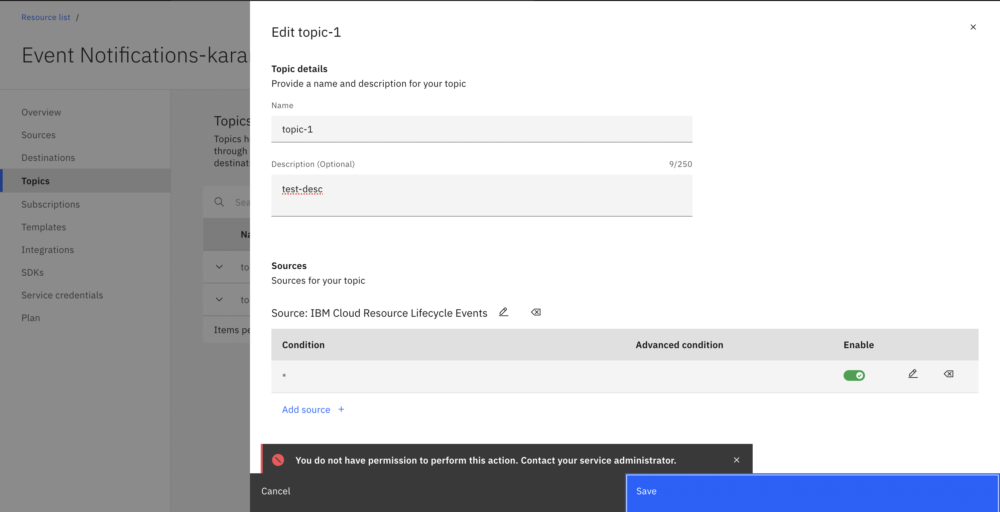

---

copyright:
  years: 2025
lastupdated: "2025-07-08"

keywords: event-notifications, event notifications, managing service access, iam, account, topics, subscriptions

subcollection: event-notifications

content-type: tutorial
account-plan: standard
completion-time: 15m

---
{{site.data.keyword.attribute-definition-list}}

# Assigning access to individual topics and subscriptions
{: #en-assign-access-to-topics-subscriptions}
{: toc-content-type="tutorial"}
{: toc-completion-time="15m"}

This tutorial shows you how to assign access roles for users against Topics and Subscriptions, by creating and modifying IAM access policies. The details of the IAM roles are as follows: 

##### Applicable roles:
1. Reader: To enable access to topics/subscriptions in an instance, a user must at least have **Reader** level privileges to the particular {{site.data.keyword.en_short}} instance. With only Reader access, the user can only view and cannot edit any resources in the {{site.data.keyword.en_short}} instance.
1. Writer: Only **Writer** role is applicable for given topics/subscriptions. When an {{site.data.keyword.en_short}} instance is accessed by a user with Writer role,the user can only update topics and/or subscriptions.

A user cannot be assigned **Manager** Role to delete specific topics/subscriptions. This action can be carried out by a user who is assigned the Manager role to the whole Event Notifications instance.
 {: note}

## Before you begin
{: #topics-subscriptions-access-step-0}

If you are already managing instances of {{site.data.keyword.en_short}} or IAM, you do not need to create more. However, as this tutorial will modify and configure the instance we are working with, make sure that any accounts or services are not being used in a production environment.

For this tutorial, you need:

- An {{site.data.keyword.cloud}} Platform account
- An instance of {{site.data.keyword.cloud_notm}} {{site.data.keyword.en_short}}
- To complete the steps to manage access to the service, you should be the owner of the {{site.data.keyword.en_short}} instance. In other words, your user ID needs **administrator platform permissions** to use the IAM service. You may have to contact or work with an account administrator.

## Grant Reader access to {{site.data.keyword.en_short}} instance
{: #topics-subscriptions-access-step-1}
{: step}

To enable access to topics/subscriptions in an instance, the user must at least have **Reader** level privileges to the particular {{site.data.keyword.en_short}} instance.
{: note}

1. Navigate to IAM by following the **Manage** drop-down menu, and selecting **Access (IAM)**. Follow the **Users** link in the navigation menu, and select the user requiring limited access.
2. Click on **Access** tab. Click on the **Assign access** button. Select the **Access policy** tile and select **{{site.data.keyword.en_short}}**.
3. Select the radio toggle next to **Specific resources**. Select **Service Instance** from the _Attribute type_ drop-down menu. Select the {{site.data.keyword.en_short}} instance which you want to assign access. {: caption="Selecting Event Notifications Instance."}
4. In the _Roles and access_ section, select the role **Reader**. You'll also need the Platform **Viewer** role, if you don't already have it, in order to view the UI. {: caption="Selecting Roles for Event Notification instance."}
5. Click **Next** and include conditions if needed which is optional.
6. Click **Add**.

## Grant Writer access to specific Environment
{: #topics-subscriptions-access-step-2}
{: step}

We'll repeat the step 1, but this time we'll use **Topic ID/Subscription ID** resource attribute and select **Writer** role.

In an access policy , we can have either Topic ID **or** Subscription ID. Both cannot be present in the same access policy. If you want an access policy for more than 1 topic/subscription , create separate access policies for each topic/subscription.
{: note}

Only **Writer** role is applicable for given Topics/Subscriptions. **Reader** Role is already assigned at instance level in Step 1. So we do not need to assign Reader role for given topics/subscriptions. **Manager** Role is **not** applicable for topics/subscriptions.
{: important}

1. Navigate to the Topics/Subscriptions section of your {{site.data.keyword.en_short}} instance and copy

- The Topic ID if you want to create an access policy for a topic **OR**

{: caption="Accessing Topic ID"} 

- The Subscription ID if you want to create an access policy for a subscription.

{: caption="Accessing Subscription ID"}

2. Click on the **Assign access** button. Select the **Access policy** tile and select **{{site.data.keyword.en_short}}**.
3. Select the radio toggle next to **Specific resources**. Select **Topic ID/Subscription ID** from the _Attribute type_ drop-down menu. Paste the Topic/Subscription ID that you had copied previously. {: caption="Selecting specific Topic/Subscription"}
4. In the _Roles and access_ section, select the role **Writer**. {: caption="Selecting Roles for specific Topic/Subscription"}
5. Click **Next** and include conditions if needed which is optional.
6. Click **Add**.

## Review access policies
{: #topics-subscriptions-access-step-3}
{: step}

At this stage, you should have two access policies created as shown in the following image. One access policy with **Reader & Viewer** roles for the instance, another with **Writer** role for the topics/subscriptions.

{: caption="Reviewing Access Policies"}

## Verify that it works
{: #topics-subscriptions-access-step-4}
{: step}

When this {{site.data.keyword.en_short}} instance is accessed by a user with Writer role, the user can only update topics and/or subscriptions.

When a user tries to perform any action such as editing topics or subscriptions, for which the user is not assigned Writer Role, the action is denied as shown in the following image.
{: note}

- **UI output:**

{: caption="Access denied to Topic/Subscription as shown in the UI"}

- **API/CLI/Terraform output with status code 403:**

```javascript
{
  "status_code":403,
  "trace":"e7bed498-6a41-4af0-89dc-cc08c4dc0e45",
  "errors": [{"code":"authorization_error",
  "message":"Unfortunately you don't have a permission to access requested resource",
  "more_info":"https://test.cloud.ibm.com/apidocs/event-notifications#event-notifications-api-authentication" }]
}
```
{: codeblock}
