---

copyright:
  years: 2022
lastupdated: "2022-05-05"

keywords: event-notifications, event notifications migration, notifications, destinations, push, migration

subcollection: event-notifications

---

{{site.data.keyword.attribute-definition-list}}

# Migrate your apps from {{site.data.keyword.mobilepushfull}} service to {{site.data.keyword.en_full}}
{: #en-migrate-apps}

You can migrate your mobile apps from the deprecated IBM Cloud Push Notifications service to {{site.data.keyword.en_short}} to continue to use Push. 
{: shortdesc}

## Introduction
{: #en-migrate-intro}

{{site.data.keyword.en_short}} is a routing service that tells you about critical events that occur in your {{site.data.keyword.Bluemix_notm}} account. You can filter and route {{site.data.keyword.en_full}} from {{site.data.keyword.Bluemix_notm}} services like Monitoring, Security and Compliance Center, and Secrets Manager to communication channels like email, SMS, push notifications, and webhooks.

This guide outlines the steps to migrate your mobile apps and the backend to integrate with the {{site.data.keyword.en_short}} service.

Take the following steps to migrate your mobile apps:

* Create and configure an instance of {{site.data.keyword.en_full}}
* Modify your Android or iOS mobile app to work with the {{site.data.keyword.en_short}} service 
* Modify your backend to integrate with the new API of the {{site.data.keyword.en_short}} service 
* Release the new version of the mobile app 

## Create and configure an instance of the {{site.data.keyword.en_short}} service
{: #en-migrate-create}
{: step}

Create an instance of the {{site.data.keyword.en_short}} service. This procedure does not use any advanced capabilities of the {{site.data.keyword.en_short}} service. Within the service, you create an API source, a topic, a subscription, and a destination as outlined in figure 1. 
For a more detailed explanation of the concepts of {{site.data.keyword.en_short}}, see [Getting started with {{site.data.keyword.en_full}}](/docs/event-notifications?topic=event-notifications-getting-started).

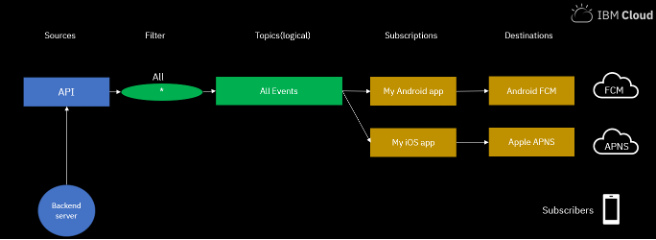{: caption="Figure 1. Push capability in {{site.data.keyword.en_short}}" caption-side="bottom"}

### Create a source
{: #en-migrate-create-source}

Create an API source. This source represents the backend from which you send the notifications. 


### Create a topic
{: #en-migrate-create-topic}

Create a topic where all the events from the backend flow into. However, this topic does not do any filtering, define a filter that sends all events from the source to this topic.

### Create a destination
{: #en-migrate-create-destination}

Create a destination of the required type. 

### Create a subscription
{: #en-migrate-create-subscription}

Create a subscription from the topic to the destination.

### Create service credentials
{: #en-migrate-create-credentials}

Create a set of credentials with the role of “Device Manager”.

## Modify an Android mobile application
{: #en-migrate-modify-android}
{: step}


Modify the mobile app source code to use the new {{site.data.keyword.en_short}} SDKs. You replace the existing {{site.data.keyword.mobilepushshort}} service SDK with the {{site.data.keyword.en_short}} FCM SDK.

### Create an Android destination
{: #en-migrate-create-android-destination}

Create a destination of type `Android Push Notification` (FCM) for the Android app. Provide the Sender ID and Server Key from your Google console. 

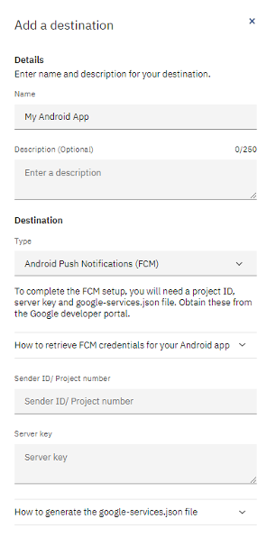{: caption="Figure 2. Create Android destination" caption-side="bottom"}

### Modify your project in Firebase console
{: #en-migrate-modify-project-firebase}

The package name for the {{site.data.keyword.mobilepushshort}} SDK was `com.ibm.mobilefirstplatform.clientsdk.android.push`. The new Event Notification SDK has the package `com.ibm.cloud.eventnotifications.destination.android`. Update your project in Firebase Console with the new package, then download and replace the new `google-services.jsonfile` in your Android project.

1. Go to the [Firebase Console](https://console.firebase.google.com)

   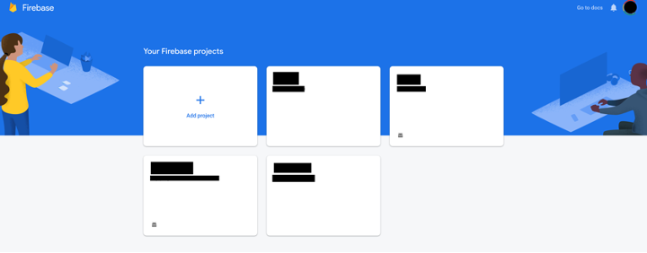{: caption="Figure 3. Firebase Console" caption-side="bottom"}

1. Select the project that you are using for {{site.data.keyword.mobilepushshort}}. 

   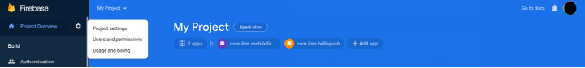{: caption="Figure 4. Select project" caption-side="bottom"}

1. In the navigation panel, select the **Settings** icon next to the **Project Overview** and select **Settings > Project settings**. Scroll down to locate **Your apps**.

   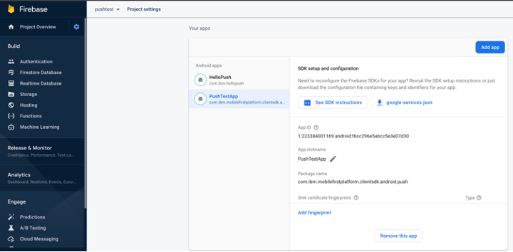{: caption="Figure 5. Project setting" caption-side="bottom"}

1. Find an app with package name `com.ibm.mobilefirstplatform.clientsdk.android.push` and click **Remove this app**. 

1. Click **Add app > Choose Android**

1. Enter `com.ibm.cloud.eventnotifications.destination.android` as the package name and click **Register App**. 

   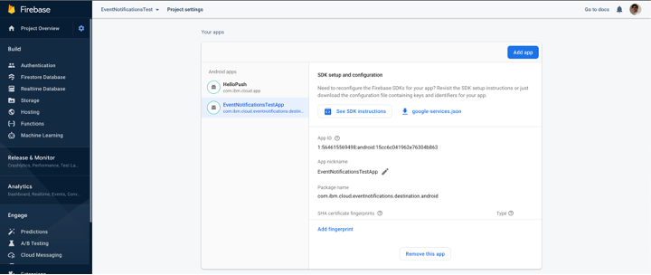{: caption="Figure 6. Register app" caption-side="bottom"}

1. Download `google-services.json`. You use this file later when you modify the app.


### Edit the Android app
{: #en-migrate-edit-andriod-app}

1. Add the Firebase `google-services.json` in the app module.

1. Change the Module’s `build.gradlefile`to include the new SDKs.

```groovy
// Replace the below section   
 
dependencies {  
    ........  
    implementation 'com.google.firebase:firebase-messaging:20.0.0'  
    Implementation 'com.ibm.mobilefirstplatform.clientsdk.android:core:3.+'  
    .......  
}  
  
// with this  
   
dependencies {  
    ........  
    implementation platform('com.google.firebase:firebase-bom:29.0.0')  
    implementation 'com.google.firebase:firebase-messaging'  
    implementation 'com.ibm.cloud:sdk-core:9.15.0'  
    implementation 'com.ibm.cloud:eventnotifications-destination-android:0.0.1'  
    .......  
} 
```
   <!-- 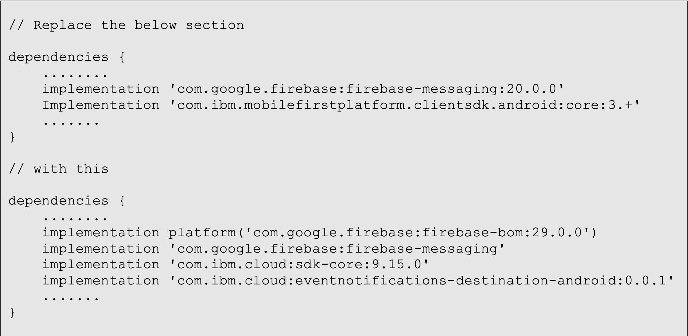{: caption="Figure 7. Modify build" caption-side="bottom"} -->

1. Open `AndroidManifest.xml` and change the following elements:

   - Change the `<service>` section to refer to the new service

      ```groovy

      // Replace the below section   
  
      <service android:name="com.ibm.mobilefirstplatform.clientsdk.android.push.api.MFPPushIntentService" android:exported="true" > 
         <intent-filter> 
            <action android:name="com.google.firebase.MESSAGING_EVENT" /> 
         </intent-filter> 
      </service> 
      
      <service 
      android:name="com.ibm.mobilefirstplatform.clientsdk.android.push.api.MFPPush" android:exported="true" > 
         <intent-filter> 
            <action android:name="com.google.firebase.INSTANCE_ID_EVENT" /> 
         </intent-filter> 
      </service> 
      
      // with this 
      
      <service  android:name="com.ibm.cloud.eventnotifications.destination.android.ENPushIntentService” android:exported="true"> 
         <intent-filter> 
            <action android:name="com.google.firebase.MESSAGING_EVENT" /> 
         </intent-filter> 
      </service> 
      
      <service android:name="com.ibm.cloud.eventnotifications.destination.android.ENPush" android:exported="true" > 
         <intent-filter> 
            <action android:name="com.google.firebase.INSTANCE_ID_EVENT" /> 
         </intent-filter> 
      </service> 
      
      ```

<!-- 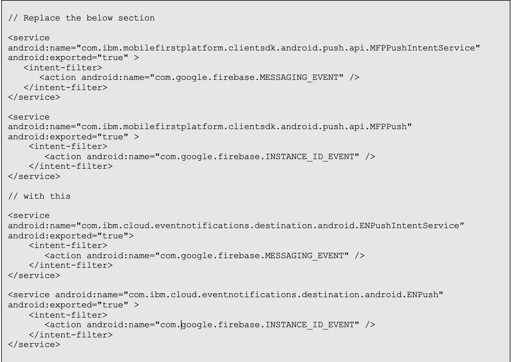{: caption="Figure 8. Modify manifest" caption-side="bottom"} -->

   - Change the `<activity>` section to point to the new class

      ```groovy
      // Replace the below section   
  
      <activity  android:name="com.ibm.mobilefirstplatform.clientsdk.android.push.api.    MFPPushNotificationHandler" android:theme="@android:style/Theme.NoDisplay"/> 

      // with this 

      <activity   android:name="com.ibm.cloud.eventnotifications.destination.android.     ENPushNotificationHandler" android:theme="@android:style/Theme.NoDisplay"/> 
      ```

   <!-- 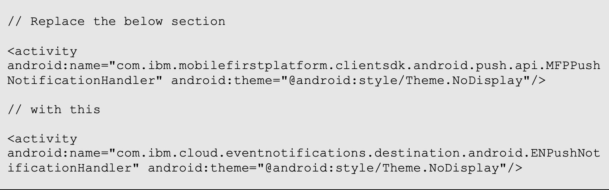{: caption="Figure 9. Modify activity" caption-side="bottom"} -->

1. Change the import statements in the code. The new package name is `com.ibm.cloud.eventnotifications.destination.android.*`. Replace the old push import as shown:

   ```java
   // Replace the below section   
   
   import com.ibm.mobilefirstplatform.clientsdk.android.push.api.MFPPush; 
   
   // with this 
   
   import com.ibm.cloud.eventnotifications.destination.android.ENPush; 
   ```
   <!-- 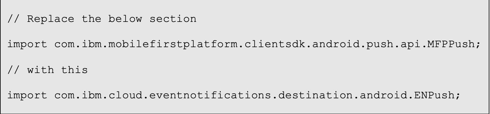{: caption="Figure 10. Modify import" caption-side="bottom"} -->

1. Initialize the new SDK  

   ```java
   // Replace the below section   
   
   BMSClient.getInstance().initialize(this, "ibmCloudRegionSuffix"); 
   MFPPush push = MFPPush.getInstance(); 
   push.initialize(getApplicationContext(), "appGUID", "clientSecret"); 
   
   // with this 
   
   String instanceGUID = "<instance_guid>>"; 
   String destinationID = "<instance_destination_id>"; 
   String apiKey = "<instance_apikey>"; 
   
   ENPush enPush = ENPush.getInstance(); 
   push.setCloudRegion(ENPush.REGION_US_SOUTH); // Set your region 
   
   push.initialize(getApplicationContext(),instanceGUID,destinationID, apiKey); 
   ```
   <!-- 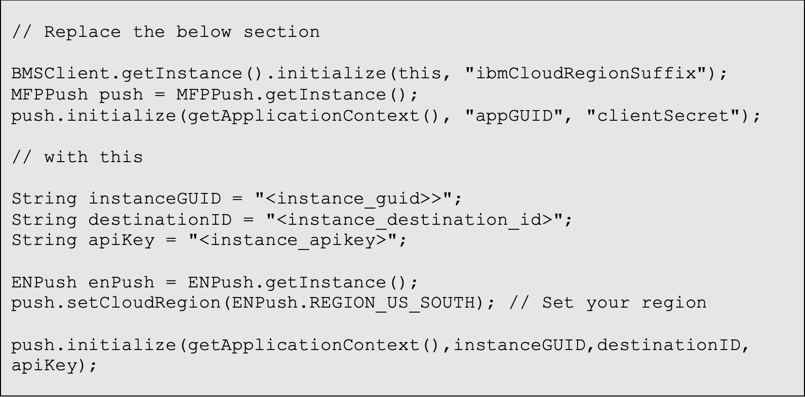{: caption="Figure 11. Initialize SDK" caption-side="bottom"} -->

   There are additional fields like `destinationID` and `apikey` in the new `initialize()` method.

   For more information, on getting the `apikey` for client SDK see [Managing service access](/docs/event-notifications?topic=event-notifications-service-access-management). 

1. The callback class in the new SDK has changes. Make these changes in the listener.

   ```java
   // Replace the below section   
   
   MFPPushNotificationListener notificationListener = new MFPPushNotificationListener() { 
      
      @Override 
      public void onReceive (final MFPSimplePushNotification message){ 
         // Handle Push Notification 
      }	 
   }; 
   
   push.listen(notificationListener) 
   
   // with this 
   
   ENPushNotificationListener notificationListener = new ENPushNotificationListener() { 
               
         @Override 
         public void onReceive (final ENSimplePushNotification message){ 
            // Handle Push Notification 
         }	 
   }; 
   
   push.listen(notificationListener)
   ```
   <!-- {: caption="Figure 12. Change listener" caption-side="bottom"} -->

1. Make changes to the device registration step.

   - If you are registering without `userID`
      ```java
         // Replace the below section   

      push.registerDevice(new MFPPushResponseListener<String>() { 

           @Override 
           public void onSuccess(String response) { 
               //handle successful device registration here 
           } 

           @Override 
           public void onFailure(MFPPushException ex) { 
               //handle failure in device registration here 
               } 
      }); 

      // with this 

      push.registerDevice(new ENPushResponseListener<String>() {  

           @Override  
           public void onSuccess(String deviceId) {  
                //handle successful device registration here  
           } 

           @Override  
           public void onFailure(ENPushException ex) {  
                //handle failure in device registration here  
           }  
      }); 
      ```

   <!-- 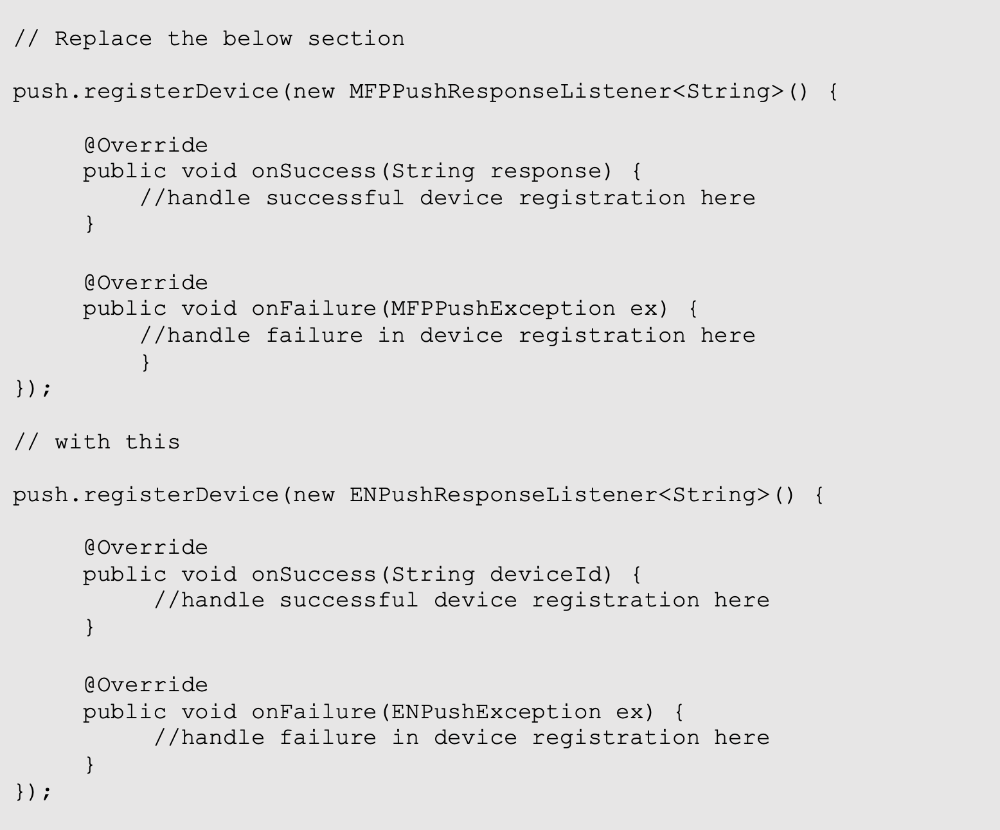{: caption="Figure 13. Register without id" caption-side="bottom"} -->

   - If you are using `registerDeviceWithUserId`
      ```java
      // Replace the below section   

      push.registerDeviceWithUserId("userId", new MFPPushResponseListener<String>() {  

           @Override  
           public void onSuccess(String response) {  
               //handle successful device registration here  
           }  

           @Override  
           public void onFailure(MFPPushException ex) {  
               //handle failure in device registration here  
           }  
      });  

      // with this  

      push.registerDeviceWithUserId("userId",new ENPushResponseListener<String>() {  

            @Override  
            public void onSuccess(String deviceId) {  
                //handle successful device registration here  
            }  

            @Override  
            public void onFailure(ENPushException ex) {  
                //handle failure in device registration here  
            }  
      }); 
      ```

   <!-- 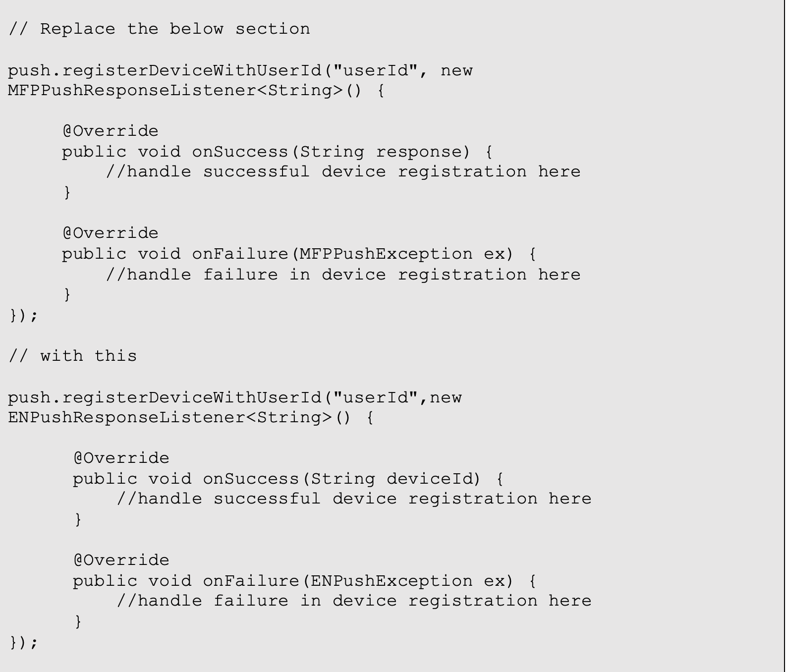{: caption="Figure 14. Register with id" caption-side="bottom"} -->

1. Make changes to the unregister API call.

      ```java
      // Replace the below section   
      
      push.unregister(new MFPPushResponseListener<String>() { 
               
         @Override 
         public void onSuccess(String s) { 
               // Handle success 
         } 
               
         @Override 
         public void onFailure(MFPPushException e) { 
               // Handle Failure 
         } 
      }); 
         
      // with this  
         
      push.unregister(new ENPushResponseListener<String>() { 
               
            @Override 
            public void onSuccess(String s) { 
               // Handle success 
            } 
      
            @Override 
            public void onFailure(ENPushException e) { 
               // Handle Failure 
            } 
      }); 
      ```

   <!-- 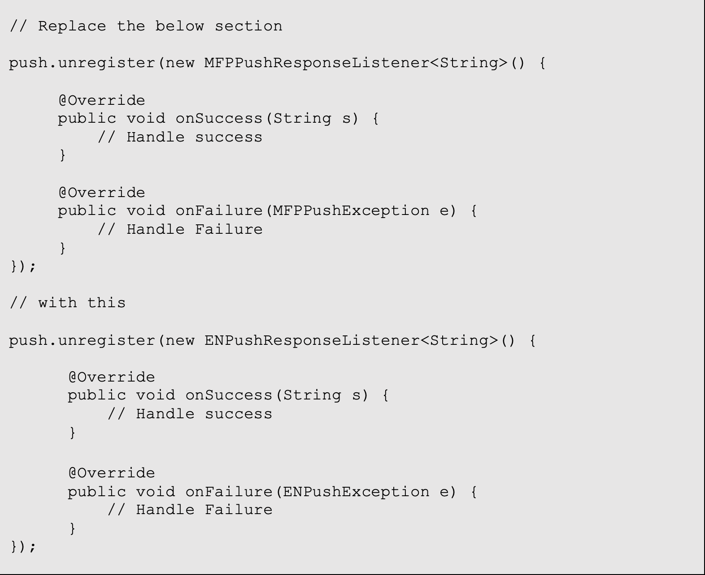{: caption="Figure 15. Modify unregister API" caption-side="bottom"} -->

1. Optionally, if you are using tags

   - Change the tag subscriptions as follows:

      ```java
      // Replace the below section   
      
      push.subscribe("tagName", new MFPPushResponseListener<String>() { 
      
            @Override 
            public void onSuccess(String arg) { 
               System.out.println("Succesfully Subscribed to: "+ arg); 
            } 
      
            @Override 
            public void onFailure(MFPPushException ex) { 
               String message = ex.getMessage(); 
               System.out.println("Error subscribing to Tag " + message); 
            } 
      }); 
         
      // with this  
         
      push.subscribe("tagName", new ENPushResponseListener<String>() { 
      
            @Override 
            public void onSuccess(String arg) { 
               System.out.println("Succesfully Subscribed to: "+ arg); 
            } 
               
            @Override 
            public void onFailure(ENPushException ex) { 
               String message = ex.getMessage(); 
               System.out.println("Error subscribing to Tag " + message); 
            } 
      }); 
      ```
   <!-- 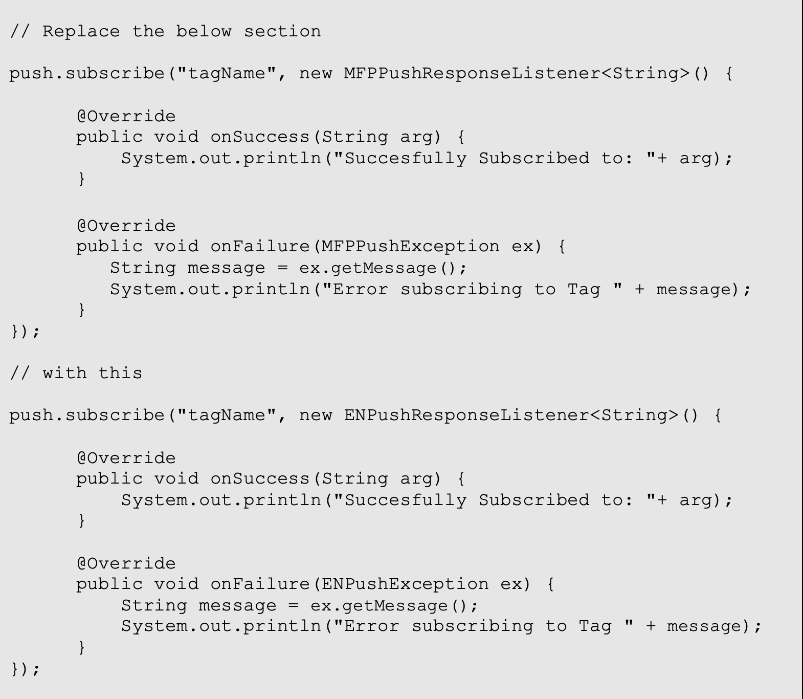{: caption="Figure 16. Modify tag subscriptions" caption-side="bottom"} -->

   - Changes to get all the tag subscription for the device
      ```java
      // Replace the below section   
      
      push.getSubscriptions(new MFPPushResponseListener<List<String>>() { 
      
            @Override 
            public void onSuccess(List<String> tags) { 
               System.out.println("Subscribed tags are: "+tags); 
            } 
               
            @Override 
            public void onFailure(MFPPushException ex) { 
               String message = ex.getMessage(); 
               System.out.println("Error getting subscriptions " + message); 
            } 
      }) 
         
      // with this  
         
      push.getSubscriptions(new ENPushResponseListener<List<String>>() { 
      
            @Override 
            public void onSuccess(List<String> tags) { 
               System.out.println("Subscribed tags are: "+tags); 
            } 
               
            @Override 
            public void onFailure(ENPushException ex) { 
               String message = ex.getMessage(); 
               System.out.println("Error getting subscriptions " +message ); 
            } 
      }) 
      ```

   <!-- 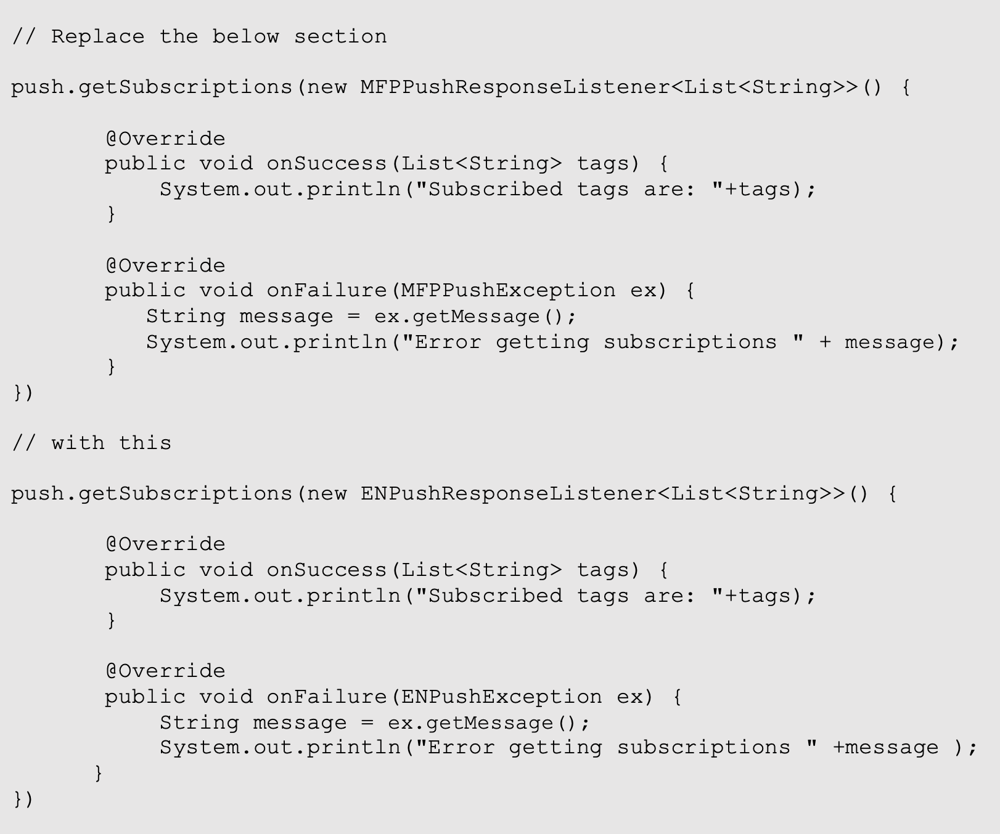{: caption="Figure 17. Modify get all tag" caption-side="bottom"} -->

   - Make changes to tag unsubscribe
      ```java
      // Replace the below section   
      
      push.unsubscribe("tagName", new MFPPushResponseListener<String>() { 
      
         @Override 
         public void onSuccess(String s) { 
            System.out.println("Successfully unsubscribed from " + tag); 
         } 
      
         @Override 
         public void onFailure(MFPPushException ex) { 
            String message = ex.getMessage(); 
            System.out.println("Error while unsubscribing from tag "+ message); 
         }	 
      }); 
         
      // with this  
      
      push.unsubscribe("tagName", new ENPushResponseListener<String>() { 
      
            @Override 
            public void onSuccess(String s) { 
               System.out.println("Successfully unsubscribed from tag . "+ tag); 
            } 
               
            @Override 
            public void onFailure(ENPushException ex) { 
               String message = ex.getMessage(); 
               System.out.println("Error while unsubscribing from "+ message); 
            }	 
      }); 
      ```

   <!-- 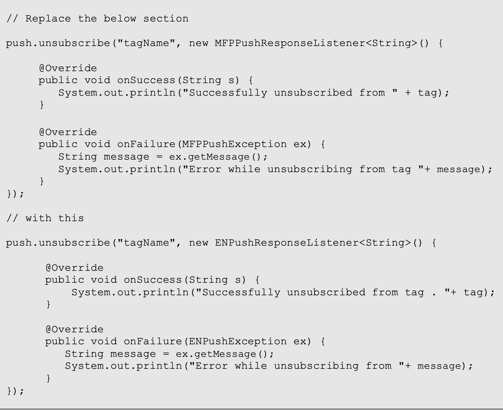{: caption="Figure 18. Modify tag unsubscribe" caption-side="bottom"} -->

1. Optionally, if you are using Notification options, make the following changes:

   - Initializing the class
   ```java
   // Replace the below section   
  
      MFPPushNotificationOptions options = new MFPPushNotificationOptions(); 
      push = MFPPush.getInstance(); 
      push.initialize(getApplicationContext(),"appGUID", "clientSecret",options); 
         
      // with this  
      
      ENPushNotificationOptions options = new ENPushNotificationOptions(); 
      ENPush push = ENPush.getInstance(); 
      push.initialize(getApplicationContext(),instanceGUID,destinationID, apiKey, options); 
   ```

   <!-- 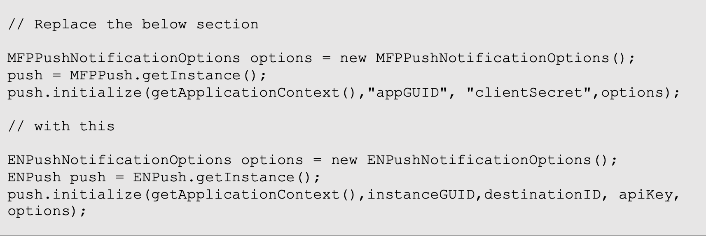{: caption="Figure 19. Initialize class" caption-side="bottom"} -->

   - Changes to Notification button

      ```java
      // Replace the below section   
      
      MFPPushNotificationButton acceptButton = new MFPPushNotificationButton.Builder("Accept Button") 
         .setIcon("check_circle_icon") 
         .setLabel("Accept") 
         .build(); 
         
      // with this  
      
      ENPushNotificationButton acceptButton = new ENPushNotificationButton.Builder("Accept Button") 
         .setIcon("check_circle_icon") 
         .setLabel("Accept") 
         .build(); 
      ```
   <!-- 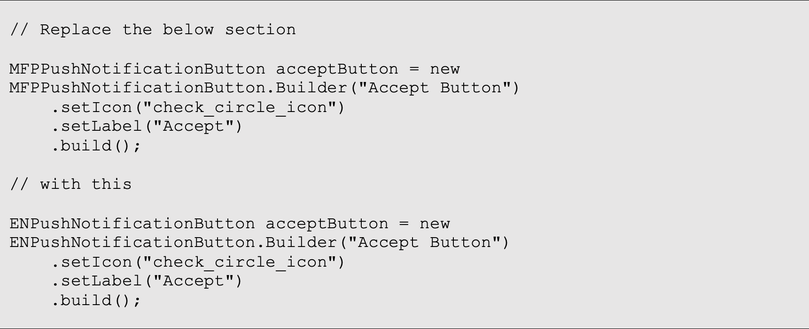{: caption="Figure 20. Modify notification button" caption-side="bottom"} -->

   - Changes to Notification category 
      ```java
      // Replace the below section   
      
      MFPPushNotificationCategory category = new MFPPushNotificationCategory.Builder("First_Button_Group1") 
                                 .setButtons(buttonGroup_1).build(); 
      
      // with this  
      
      ENPushNotificationCategory category = new ENPushNotificationCategory 
      .Builder("First_Button_Group1") 
                              .setButtons(buttonGroup_1).build(); 
      ```
   <!-- 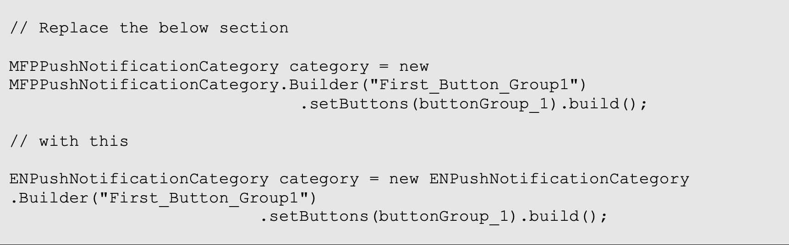{: caption="Figure 21. Modify category" caption-side="bottom"} -->

1. Changes to the Notification actions listener
      ```java
      // Replace the below section   
      
      notificationListener = new MFPPushNotificationListener() { 
         @Override 
         public void onReceive(final MFPSimplePushNotification message) { 
            if (message.actionName.equals("Accept Button")){ 
               System.out.print("Clicked Accept Action"); 
            } else if (message.actionName.equals("Decline Button")){ 
               System.out.print("Clicked Decline Action"); 
            } else if (message.actionName.equals("View Button")){ 
               System.out.print("Clicked View Action"); 
            } 
         } 
      }; 
         
      // with this  
      
      notificationListener = new ENPushNotificationListener() { 
      
         @Override 
         public void onReceive(final ENSimplePushNotification message) { 
            if (message.getActionName().equals("Accept Button")){ 
                  System.out.print("Clicked Accept Action"); 
            }else if (message.getActionName().equals("Decline Button")){ 
                  System.out.print("Clicked Decline Action"); 
            }else if (message.getActionName().equals("View Button")){ 
                  System.out.print("Clicked View Action"); 
            } 
         } 
      }; 
      ```

   <!-- 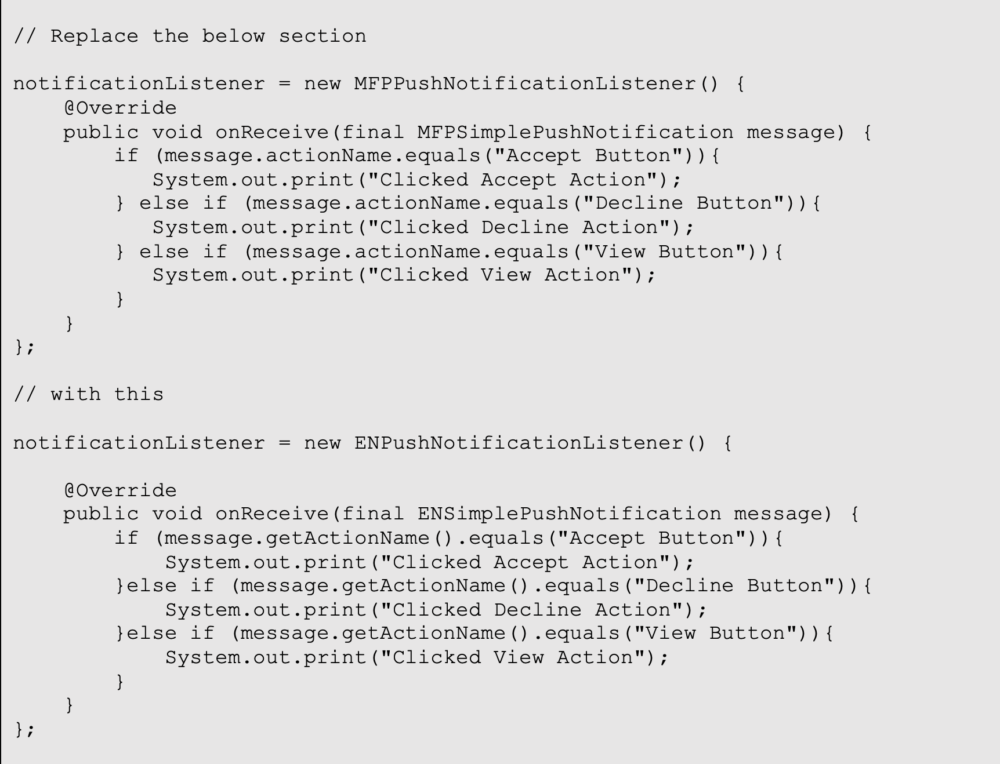{: caption="Figure 22. Modify action listener" caption-side="bottom"} -->

Your Android mobile app is ready to work with your new instance of {{site.data.keyword.en_full}}.

## Modify an iOS mobile application
{: #en-migrate-modify-ios}
{: step}

Modify the mobile app source code to use the new {{site.data.keyword.en_short}} SDKs. You will replace the existing {{site.data.keyword.mobilepushshort}} service SDK with the {{site.data.keyword.en_short}} FCM SDK.

### Create an iOS destination
{: #en-migrate-create-ios-destination}

Create a destination of type Apple Push Notification (APNs) for the iOS app. Provide the P12 or P8 and their configurations.

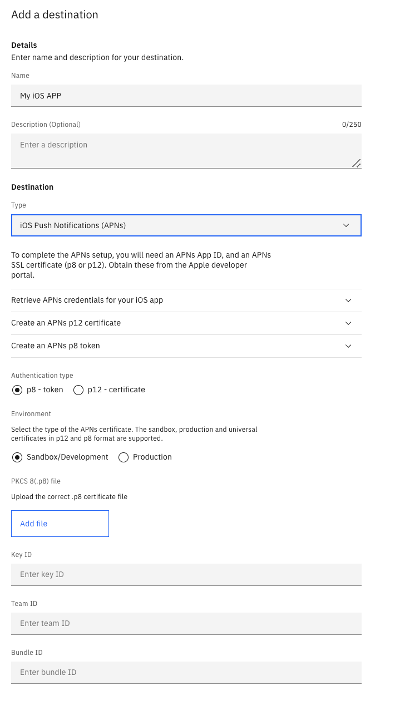{: caption="Figure 23. Create iOS destination" caption-side="bottom"}

### Edit the iOS application
{: #en-migrate-edit-ios-app}

Follow these steps to migrate from BMPush to ENPushDestination:

1. Change the import statement

   ```swift
   // Replace this 
   
   import BMSCore 
   import BMSPush 
   
   // with this 
   
   import ENPushDestination 
   ```
   <!-- {: caption="Figure 24. Change import" caption-side="bottom"} -->

1. Replace SDK Initialization code

      ```swift
      // Replace this 
      
      let push = BMSClient.sharedInstance 
      
      push.initialize(bluemixRegion: "<IBM cloud region>") 
      
      push.initializeWithAppGUID( 
                     appGUID: "<IBM Cloud Push Instance GUID>", 
                     clientSecret:"<IBM Cloud Push Instance ClientSecret>" 
                  ) 
      
      // with this 
      
      let instanceGUID = "<IBM-Cloud-en-instance_guid>>"; 
      let destinationID = "<IBM-Cloud-en-instance-destination-id>"; 
      let apiKey = "<IBM-Cloud-en-instance-apikey>"; 
      
      let push = ENPush.sharedInstance 
      
      push.setCloudRegion(region: "<IBM cloud region>") 
      
      push.initialize(instanceGUID, destinationID, apiKey) 
      ```

   <!-- 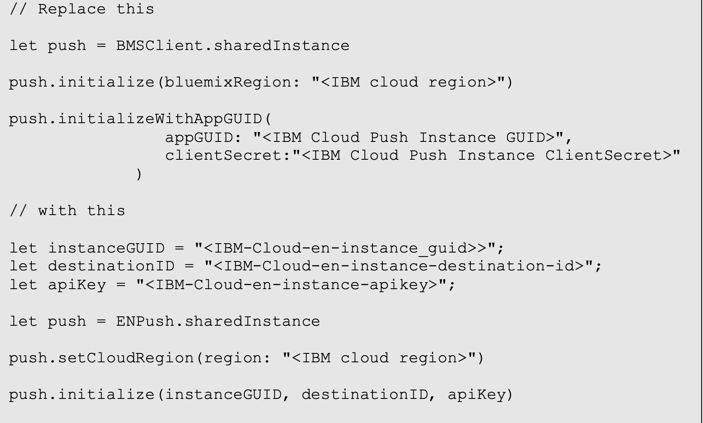{: caption="Figure 25. Replace SDK initialize" caption-side="bottom"} -->

   There are extra fields like `destinationID` and `apikey` in new `initialize()` method. For more information, on getting the `apikey` for client SDK see [Managing service access](/docs/event-notifications?topic=event-notifications-service-access-management). 

1. Change the device registration step

   - If you are registering without `userID`

      ```swift
      // Replace this 
         
         push.registerWithDeviceToken(deviceToken: "<apns-device-token>") {  
            (response, statusCode, error) -> Void in 
         
               print(response) 
         
         } 
         
         // with this 
         
         push.registerWithDeviceToken(deviceToken: "<apns-device-token>") {  
               response, statusCode, error in 
         
                  print(response?.id ?? "") 
         } 
      ```

   <!-- 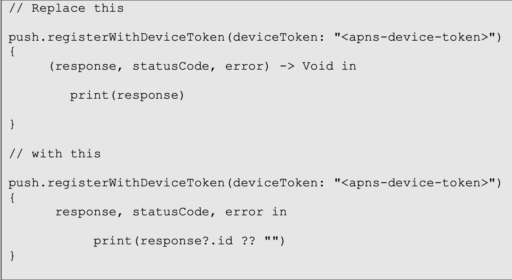{: caption="Figure 26. Register withoutid" caption-side="bottom"} -->

   - If you are using user ID for registration

      ```swift
      // Replace this 
      
      push.registerWithDeviceToken(deviceToken:("<apns-device-token>",                                                         WithUserId: "<your-user-id>") { 
         (response, statusCode, error) -> Void in 
            
            print(response) 
      } 
      
      // with this 
      
      push.registerWithDeviceToken(deviceToken: "<apns-device-token>", 
                                    withUserId: "<your-user-id>") { 
         response, statusCode, error in 
      
         print(response) 
      } 
      ```
   <!-- 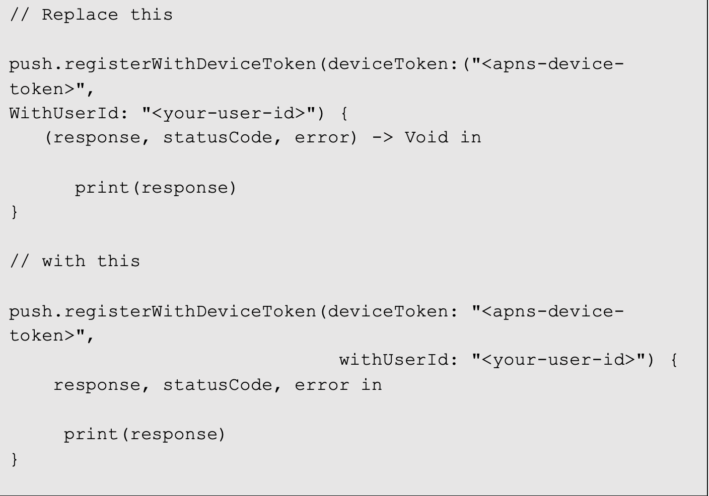{: caption="Figure 27. Register with id" caption-side="bottom"} -->

1. Change the unregister API call

   ```swift
   // Replace this 
   
   push.unregisterDevice(completionHandler: {  
      (response, statusCode, error) -> Void in 
   
      print(response) 
   } 
   
   // with this 
   
   push.unregisterDevice { response, statusCode, error in 
      print(response) 
   } 
   ```

   <!-- 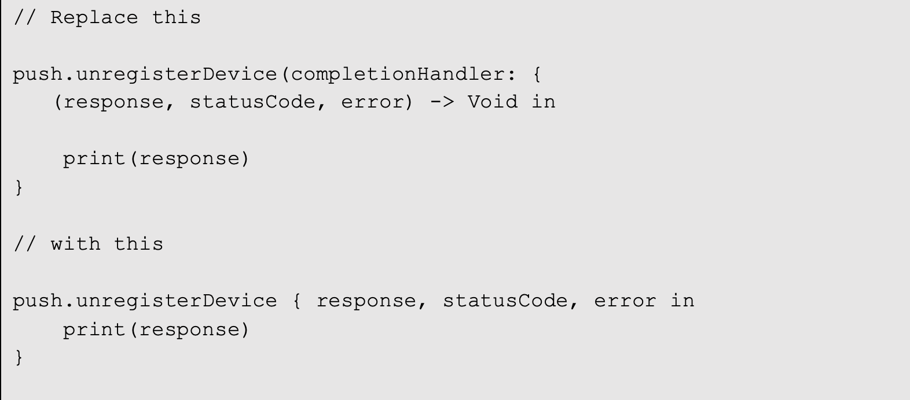{: caption="Figure 28. Change unregister" caption-side="bottom"} -->


1. Optionally, if you are using tags:

   - Change the tag subscriptions as follows:

      ```swift
      // Replace this 
      
      push.subscribeToTags(tagsArray: ["<tag_name>"], completionHandler: { (response, statusCode, error) -> Void in 
         
         /**.....*/  
      } 
      
      
      // with this 
      push.subscribeToTags(tagName: "<tag_name>") { 
         response, statusCode, error in 
         
         /**.....*/  
      }); 
      ```
   <!-- 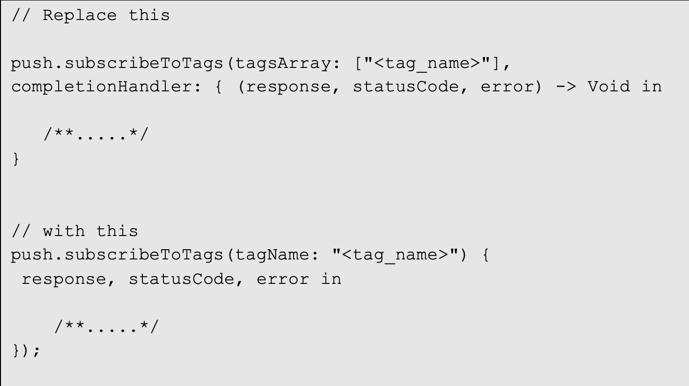{: caption="Figure 29. Change tag subscription" caption-side="bottom"} -->

   - Changes to the get all tag subscription for the device

      ```swift
      // Replace this 
      
      push.retrieveSubscriptionsWithCompletionHandler(completionHandler: { (response, statusCode, error) -> Void in 
      
         /**.....*/ 
      } 
      
      // with this 
      
      push.retrieveSubscriptionsWithCompletionHandler {  
         response, statusCode, error in 
         
         /**.....*/  
      } 
      ```

   <!-- 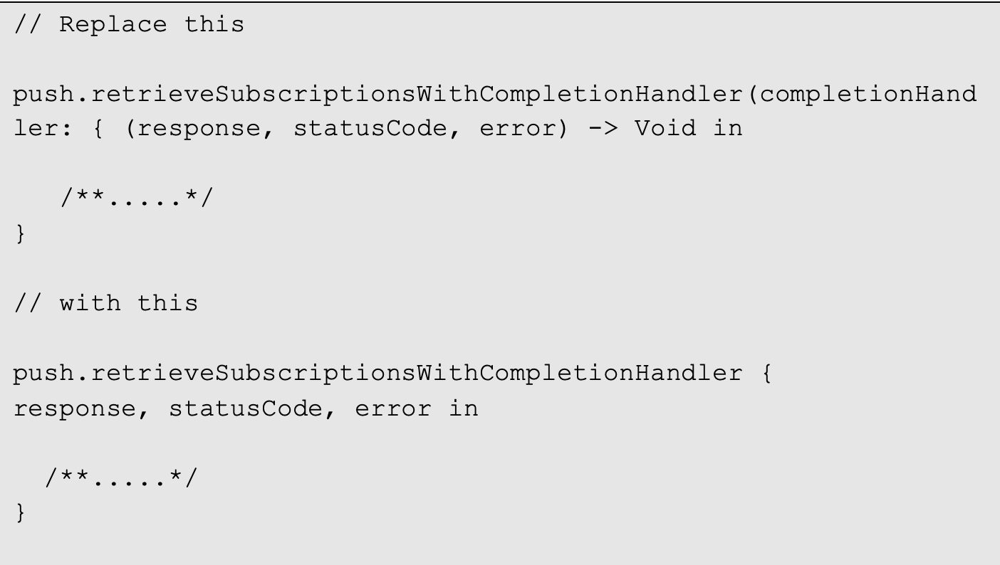{: caption="Figure 30. Change get all" caption-side="bottom"} -->

   - Changes to the tag unsubscribe

      ```swift
      // Replace this 
      
      
      push.unsubscribeFromTags(tagsArray: ["<tag_name>"], completionHandler: {  
      (response, statusCode, error) -> Void in 
         
         /**.....*/  
      } 
      
      
      // with this 
      
      push.unsubscribeFromTags(tagName: "<tag_name>") {  
         response, statusCode, error in 
         
         /**.....*/  
      } 
      ```
   <!-- 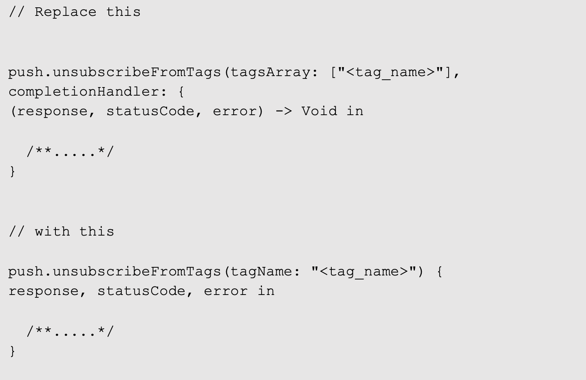{: caption="Figure 31. Change tag unsubscribe" caption-side="bottom"} -->

1. Optionally, if you are using **Notification options**, make the following changes:

   - Initialize the class

      ```swift
      // Replace this 
      
      let notificationOptions = BMSPushClientOptions() 
      notificationOptions.setInteractiveNotificationCategories( 
                           categoryName: [category]) 
      push.initializeWithAppGUID( 
            appGUID: "<IBM Cloud Push Instance GUID>", 
            clientSecret:"<IBM Cloud Push Instance ClientSecret>", 
            options: notificationOptions) 
      
      
      // with this 
      
      let notificationOptions = ENPushClientOptions() 
      notificationOptions.setInteractiveNotificationCategories( 
                           categoryName: [category]) 
      enPush.initialize("<instance_guid>",  
                        "<instance_destination_id>", 
                        "<instance_apikey>",  
                        notificationOptions) 
      ```
   <!-- 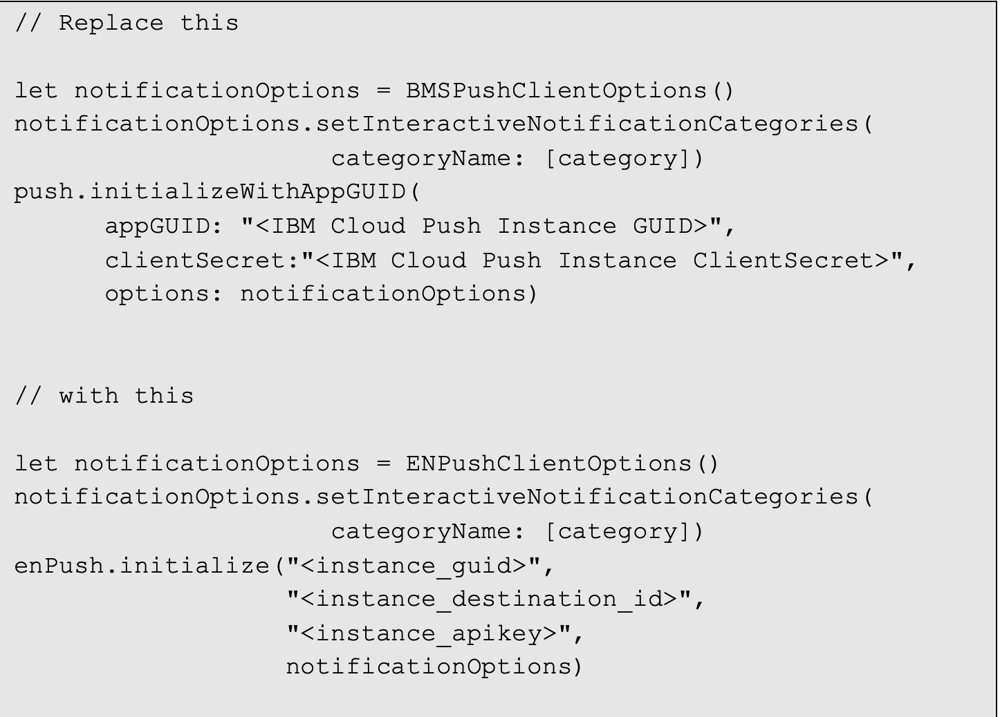{: caption="Figure 32. Class initialization" caption-side="bottom"} -->

   - Change the Notification button

      ```swift
      // Replace this 
      
      let acceptButton = BMSPushNotificationAction( 
                        identifierName: "Accept", 
                        buttonTitle: "Accept", 
                        isAuthenticationRequired: false, 
                        defineActivationMode:.background) 
      
      let rejectButton = BMSPushNotificationAction( 
                        identifierName: "Reject", 
                        buttonTitle: "Reject", 
                        isAuthenticationRequired: false, 
                        defineActivationMode: .background) 
      
      // with this 
      
      
      let actionOne = ENPushNotificationAction( 
                     identifierName: "Accept", 
                     buttonTitle: "Accept", 
                     isAuthenticationRequired: false, 
                     defineActivationMode: .foreground) 
      
      let actionTwo = ENPushNotificationAction( 
                     identifierName: "Reject", 
                     buttonTitle: "Reject", 
                     isAuthenticationRequired: false, 
                     defineActivationMode: .destructive) 
      ```
   <!-- {: caption="Figure 33. Change notification button" caption-side="bottom"} -->

   - Change the Notification category

      ```swift
         // Replace this 
      
      let category = BMSPushNotificationActionCategory( 
                     identifierName: "category",  
                     buttonActions: [acceptButton, rejectButton]) 
      
      // with this 
      
      let category = ENPushNotificationActionCategory( 
                     identifierName: "category", 
                     buttonActions: [actionOne, actionTwo]) 
      ```

   <!-- 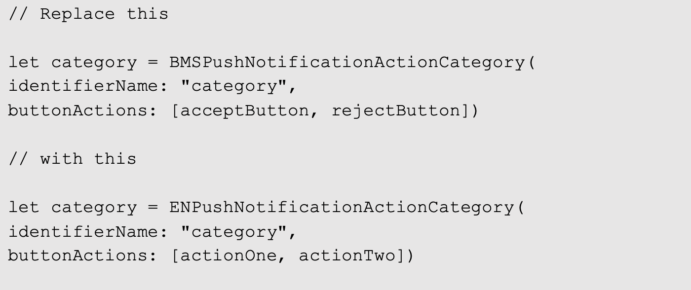{: caption="Figure 34. Change notification category" caption-side="bottom"} -->

Your iOS mobile app is ready to work with your new instance of {{site.data.keyword.en_full}}.

## Modify the back end
{: #en-migrate-modify-backend}
{: step}

This section contains the steps that you perform in the back end. The send notification API is changed and therefore all the SDKs change also. 

### If you are using the `Node.js` SDK 
{: #en-migrate-using-nodejs}

Migrate the existing Node SDK to the new {{site.data.keyword.en_full}} SDK. Follow this link for the new Node Admin SDK documentation. 

1. Changes to importing the SDK

```js
// Replace the below section   
  
var PushNotifications = require('ibm-push-notifications').PushNotifications; 
var Notification = require('ibm-push-notifications').Notification; 
var PushMessageBuilder = require('ibm-push-notifications').PushMessageBuilder; 
var PushNotificationsApiKey = require('ibm-push-notifications').PushNotificationsWithApiKey; 
  
// with this  
  
var IamAuthenticator = require('@ibm-cloud/event-notifications-node-admin-sdk/auth').IamAuthenticator 
var EventNotificationsV1 = require('@ibm-cloud/event-notifications-node-admin-sdk/event-notifications/v1') 
```
<!-- 
   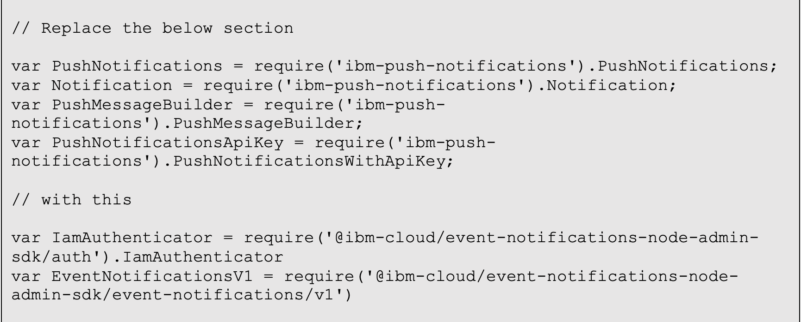{: caption="Figure 35. Import SDK" caption-side="bottom"} -->


2. Changes to initializing the SDK

```js
// Replace the below section   
  
var myPushNotifications = new PushNotificationsApiKey(PushNotifications.Region.US_SOUTH, "appGUID","apikey"); 
  
myPushNotifications.getAuthToken(function(hastoken,token){ 
     console.log(hastoken, token); 
} 
  
// with this  
  
const authenticator = new IamAuthenticator({ 
  apikey: <apikey>,  // Event notifications service instance APIKey 
}); 
  
const eventNotificationsService = EventNotificationsV1.newInstance({ 
  authenticator, 
  serviceUrl: "https://" + region + ".event-notifications.cloud.ibm.com/event-notifications" 
}); 
```
<!-- 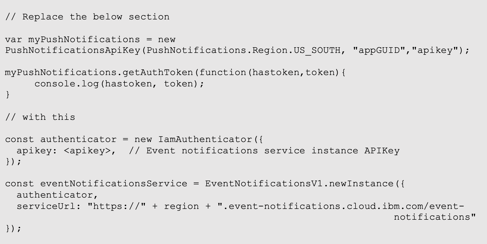{: caption="Figure 36. Initialize SDK" caption-side="bottom"} -->


3. Changes to creating notification targets

```js
// Replace the below section   
  
var target = PushMessageBuilder.Target 
  .deviceIds(["deviceID1", "deviceID2"]) 
  .userIds( ["userID1", "userID2"]) 
  .platforms([Notification.Platform.Apple, 
            Notification.Platform.Google, 
            Notification.Platform.WebChrome, 
            Notification.Platform.WebFirefox, 
            Notification.Platform.WebSafari, 
            Notification.Platform.AppExtChrome]) 
  .tagNames(["tag1", "tag2"]) 
  .build(); 
  
// with this  
  
const notificationDevicesModel = { 
    user_ids: ['userID1', 'userID2'], 
    fcm_devices: ['deviceID1', 'deviceID2'], 
    tags: ['tag1', 'tag2'], 
    platforms: ['G'], 
}; 
```
<!-- 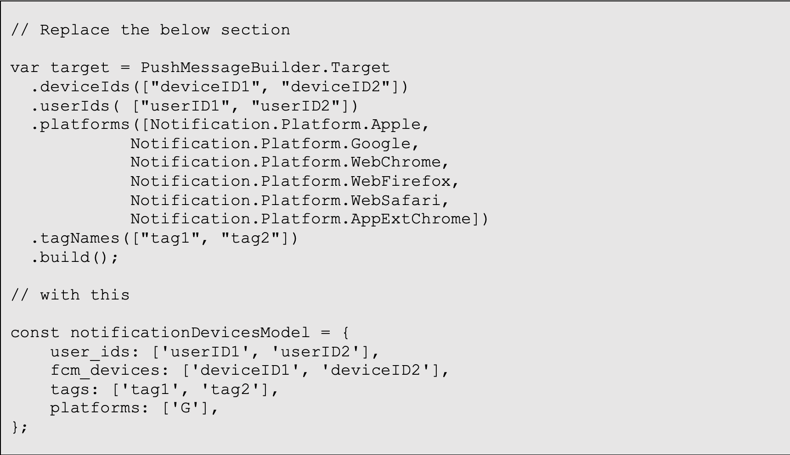{: caption="Figure 37. Create targets" caption-side="bottom"} -->

4. Changes to the FCM style payload

```js
// Replace the below section   
  
var style = PushMessageBuilder.FCMStyle 
    .type(Notification.FCMStyleTypes 
    .BIGTEXT_NOTIFICATION) 
    .text("IBM Push") 
    .title("Big Text Notification") 
    .url(" https://upload.wikimedia.org/wikipedia/commons/2/24/IBM_Cloud_logo.png ") 
    .lines(["IBM", "IBM Cloud", "Big Text Notification"]) 
    .build(); 
  
var lights = PushMessageBuilder.FCMLights 
    .ledArgb(Notification.FCMLED.RED) 
    .ledOffMs(1.0) 
    .ledOnMs("1.0") 
    .build(); 
  
// with this  
  
// Style 
const styleModel = { 
    type: 'bigtext_notification', 
    title: 'Big Text Notification', 
    url: ' https://upload.wikimedia.org/wikipedia/commons/2/24/IBM_Cloud_logo.png ', 
}; 
 
// Lights 
const lightsModel = { 
    led_argb: 'red', 
    led_on_ms: 1.0, 
    led_off_ms: '1.0', 
}; 
```

<!-- 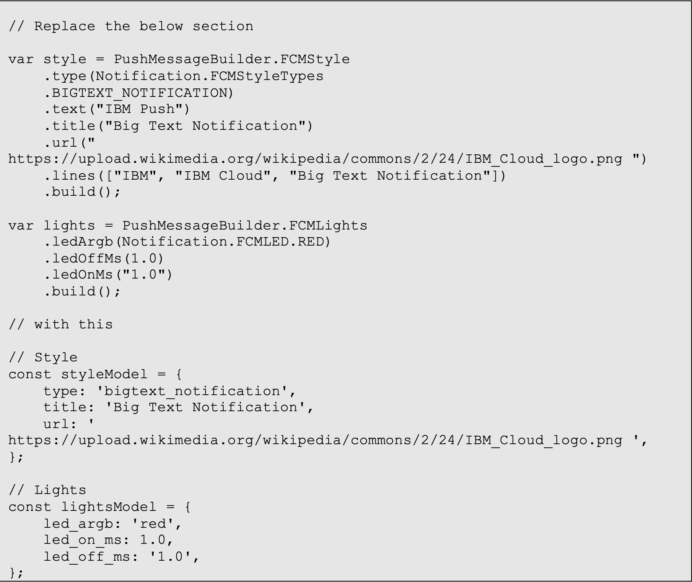{: caption="Figure 38. Change FCM Style" caption-side="bottom"} -->

5. Changes to FCM message body

```js
// Replace the below section   
  
var fcm = PushMessageBuilder.FCM 
   .collapseKey("ping") 
   .interactiveCategory("Accept") 
   .delayWhileIdle(true) 
   .payload({ "alert" : "20% Off for you" }) 
   .androidTitle("Title for Android") 
   .priority(Notification.FCMPriority.DEFAULT) 
   .sound("sound.mp3") 
   .timeToLive(1.0) 
   .icon("http://www.iconsdb.com/icons/preview/purple/message-2-xxl.png") 
   .sync(true) 
   .visibility(Notification.Visibility.PUBLIC) 
   .style(style) 
   .lights(lights) 
   .build(); 
  
// with this  
  
const notificationFcmBodyMessageDataModel = { 
  alert: '20% Off for you', 
  collapse_key: 'ping', 
  interactive_category: 'Accept', 
  icon: 'http://www.iconsdb.com/icons/preview/purple/message-2-xxl.png', 
  delay_while_idle: true, 
  sync: true, 
  visibility: 'PUBLIC', 
  payload: { "alert" : "20% Off for you" }, 
  priority: 'DEFAULT', 
  sound: 'sound.mp3', 
  time_to_live: 1.0, 
  lights: lightsModel, 
  android_title: 'Title for Android', 
  style: styleModel, 
  type: 'DEFAULT', 
}; 
  
// NotificationBodyMessage 
const notificationBodyMessageModel = { 
  en_data: notificationFcmBodyMessageDataModel, 
}; 
```
<!-- 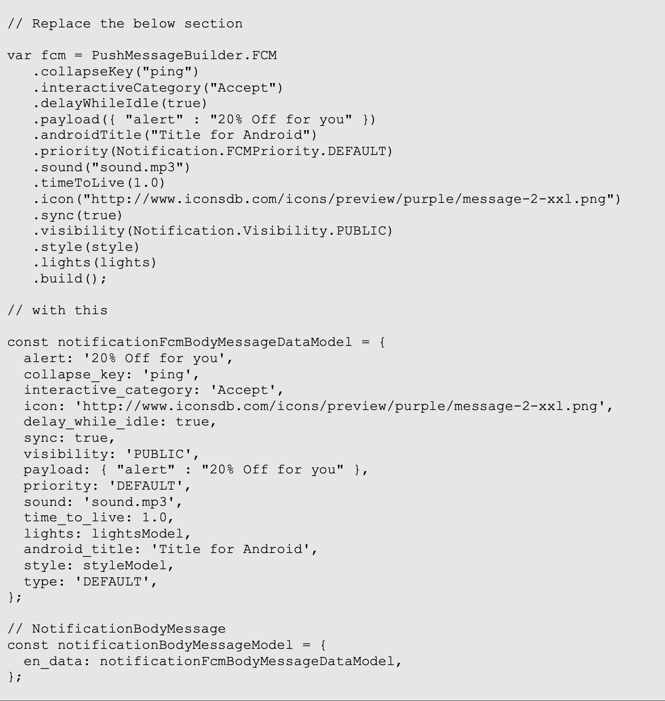{: caption="Figure 39. Change FCM message body" caption-side="bottom"} -->

6. Changes to Send notification method

```js
// Replace the below section   
  
var settings = PushMessageBuilder.Settings 
    .fcm(fcm) 
    .build(); 
     
var notificationExample = Notification.message(message) 
    .target(target) 
    .settings(settings) 
    .build(); 
  
myPushNotifications.send(notificationExample, function(error, response, body) { 
    console.log("Error: " + error); 
    console.log("Response: " + JSON.stringify(response)); 
    console.log("Body: " + body); 
}); 
  
// with this  
  
const params = { 
  instanceId: instanceId, 
  ceIbmenseverity: notificationSeverity, 
  ceId: notificationID, 
  ceSource: notificationsSource, 
  ceIbmensourceid: sourceId, 
  ceType: typeValue, 
  ceTime: date, 
  ceIbmenpushto: JSON.stringify(notificationFcmDevicesModel), 
  ceIbmenfcmbody: JSON.stringify(notificationFcmBodyModel), 
  ceIbmenapnsbody: JSON.stringify(notificationApnsBodyModel), 
  ceIbmenapnsheaders: JSON.stringify(apnsHeaders), 
  ceSpecversion: '1.0', 
}; 
  
let res; 
try { 
  res = await eventNotificationsService.sendNotifications(params); 
  console.log(JSON.stringify(res.result, null, 2)); 
} catch (err) { 
  console.warn(err); 
} 
```

<!-- 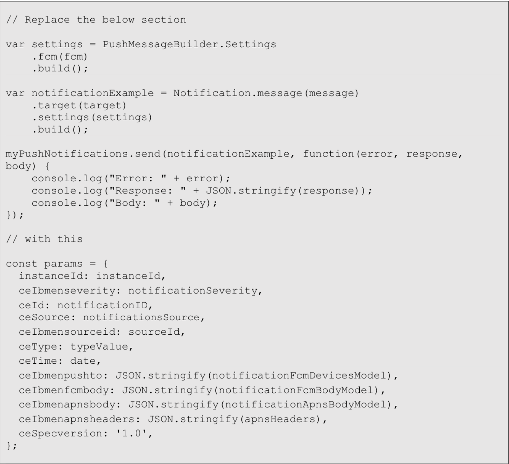{: caption="Figure 40. Change send method" caption-side="bottom"} -->


### If you are using REST API
{: #en-migrate-using-restapi}

This section contains the details about the modifications that are required for Send Notifications API. The new API has extra parameters in the request body. The required parameters for Android push notifications are as follows:

```js
{ 
   "specversion": "1.0", 
   "type": "com.acme.flightbooking.complete" 
   "source": "com.acme.flightbooking", 
   "id": "1234-1234-sdfs-234", 
   "ibmensourceid": "00bb34e5-b8c1-4159-af15-8bc6980c3ab2:api", 
   "ibmenfcmbody": "{\"en_data\":{\"alert\":\" Your flight is booked\"}}", 
   "ibmenpushto": "{\"fcm_devices\": [\"9c75975a-3898-905d-3bd7c172\"]]}", 
  } 
```
<!-- 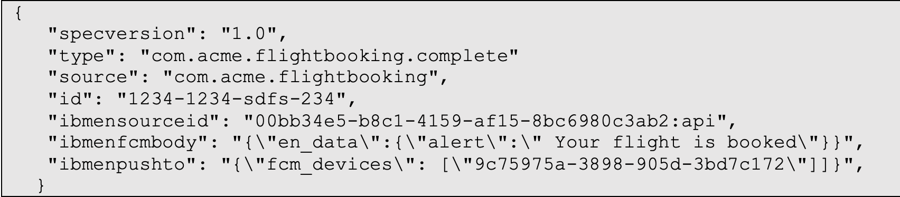{: caption="Figure 41. Modification to REST API1" caption-side="bottom"} -->

For a detailed description of the event attributes, see the {{site.data.keyword.en_full}} event attribute definition.

```js
// Replace this  
 
{ 
 "message": { 
    "alert": "Your flight is booked" 
  }, 
  "target": { 
     "tags": ["ibm_tag_1"] 
  }, 
  "settings": { 
     "gcm": { 
        "interactiveCategory": "view info", 
        "androidTitle": "Booking Info", 
        "payload": "{\"nid\": \"1234-1234-sdfs-234\"}" 
      } 
  } 
} 
 
// with this 
{  
  "id": "1234-1234-sdfs-234",  
  "ibmenfcmbody": "{\"en_data\":{\"alert\":\"Your flight is booked\",  
                    \"android_title\":"Booking Info",  
                    \"interactiveCategory\":\"view info\"}}",  
  "ibmenpushto": "{\"tags\": [\"ibm_tag_1\"]}",  
  "source": "234-rwekj-55bbc6-980c3ab2:scc",  
  "ibmensourceid": "91f18cee-7d23-4895-a3ba-0c26696d9d96:api",  
  "specversion": "1.0",  
  "type": "com.acme.flightbooking.complete"  
} 
```
<!-- 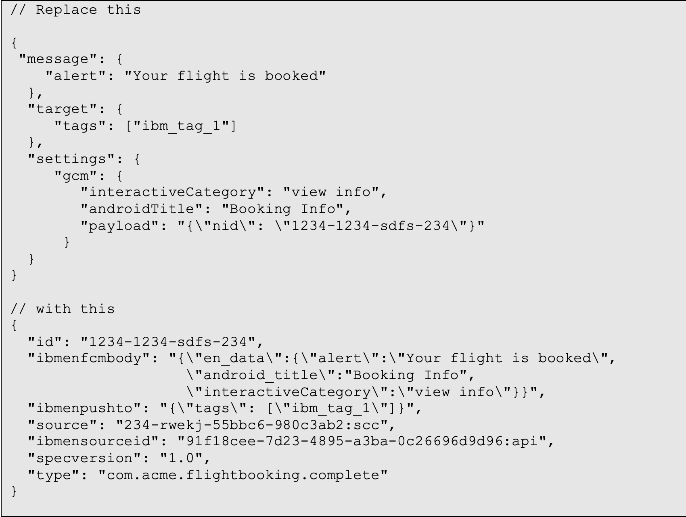{: caption="Figure 42. Modification to REST API2" caption-side="bottom"} -->

* `target` field is replaced by `ibmenpushto`
* `message` field is removed. The `alert`, `url` fields are part of the `ibmenfcmbody`
* `settings->gcm` is replaced by `ibmenfcmbody`

The `ibmenpushto` fields can take four values same as `target` of push API

1. tags –array of tag names
1. user_ids –array of user ids 
1. fcm_devices –array of device Ids
1. platforms –the target device platform 

The `ibmenfcmbody` field contains every field in the **settings-> gcmfield** of  service, but with the following changes:

1. All fields are in snake case instead of camel case. For example, `interactiveCategory` is `interactive_category`. 
1. Channels and channel groups {{site.data.keyword.mobilepushshort}}are not supported. 

## Migrate the data from {{site.data.keyword.mobilepushshort}} service to {{site.data.keyword.en_full}} service
{: #en-migrate-final}
{: step}

You can use the [push-en-migration-tool](https://github.com/Event-Notifications/push-en-migration-tool) to migrate the devices and tag subscriptions data from {{site.data.keyword.mobilepushshort}} service to the {{site.data.keyword.en_full}} service.

## Release a new version of the app
{: #en-migrate-release-app}
{: step}

After the integration is complete, release the new version of the app. In the new version, ask the user's permission to send a notification and register the device again. In the overlapping window when the user population is migrating from the old version of the app to the new version, the notifications might have to be sent to the existing {{site.data.keyword.mobilepushshort}} environment and the new {{site.data.keyword.en_full}} environment.
