---

copyright:
  years: 2022
lastupdated: "2022-04-22"

keywords: event-notifications, event notifications, about event notifications, destinations, push

subcollection: event-notifications

content-type: tutorial
account-plan: lite
completion-time: 10m

---

{{site.data.keyword.attribute-definition-list}}

# Create and send push notifications to iOS mobile using {{site.data.keyword.en_full}}
{: #en-push-apns}
{: toc-content-type="tutorial"}
{: toc-completion-time="10m"}

Create an {{site.data.keyword.en_short}} service, add a push destination for Apple Push Notification service (APNs), and send messages to iOS devices.
{: shortdesc}

## What is {{site.data.keyword.en_short}}?
{: #en-what-is}

{{site.data.keyword.en_short}} is an event notification routing service that notifies you of critical events that occur in your {{site.data.keyword.Bluemix_notm}} account or triggers automated actions by using webhooks. You can filter and route event notifications from {{site.data.keyword.Bluemix_notm}} services like {{site.data.keyword.prf_hubshort}}, to email, SMS, push notifications (FCM/APNs), and webhooks.

## How do clients use iOS Push Notifications?
{: #en-how-clients-send}

The following diagram shows you how clients use iOS Push Notifications.

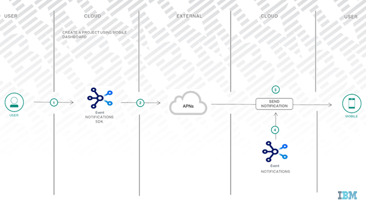{: caption="Figure 1. How clients use push notifications" caption-side="bottom"}

## Objectives
{: #en-objectives}

This tutorial shows you how to send push notifications as follows:

* Create a mobile app with {{site.data.keyword.en_short}}.
* Get APNs credentials.
* Download the code and complete the notifications setup.
* Configure and send iOS Push Notifications to a mobile device.

## Before you begin
{: #en-before-begin}

You must have the following prerequisites in place:

* An [IBM Cloud][ibm-cloud-onboarding] account.
* An Event Notifications Instance
* An IAM API key to allow the SDK to access your account. Create one [here](https://cloud.ibm.com/iam/apikeys).
* Xcode 9.3+
* Swift 4.2+
* iOS 10.0+

## Create an {{site.data.keyword.en_short}} service instance
{: #en-create-event}
{: step}

* Log in to your [{{site.data.keyword.Bluemix_notm}} account](https://cloud.ibm.com/).
* In the [{{site.data.keyword.Bluemix_notm}} catalog](https://cloud.ibm.com/catalog#services), search `Event Notifications > Event Notifications`.
* Select a `Region` from the list of supported regions and select a `pricing plan`.
* Provide a `Service name`.
* Select a `resource group`.
* Click `Create`.

## Get APNs credentials
{: #en-get-apns-credentials}
{: step}

For iOS devices and applications, Apple Push Notification Service (APNs) allows application developers to send remote notifications from {{site.data.keyword.en_short}} service instance on IBM Cloud (the provider) to iOS devices and applications. Messages are sent to a target application on the device.

You need to obtain and configure your APNs credentials. The APNs certificates are securely managed by {{site.data.keyword.en_short}} service and used to connect to APNs server as a provider.

### Registering an App ID
{: #en-get-apns-app-id}

The App ID (the bundle identifier) is a unique identifier that identifies a specific application. Each application requires an App ID. Services like the Push Notifications service are configured to the App ID.


* Go to the [Apple developer portal](https://developer.apple.com/) and select Certificates, Identifiers & Profiles.

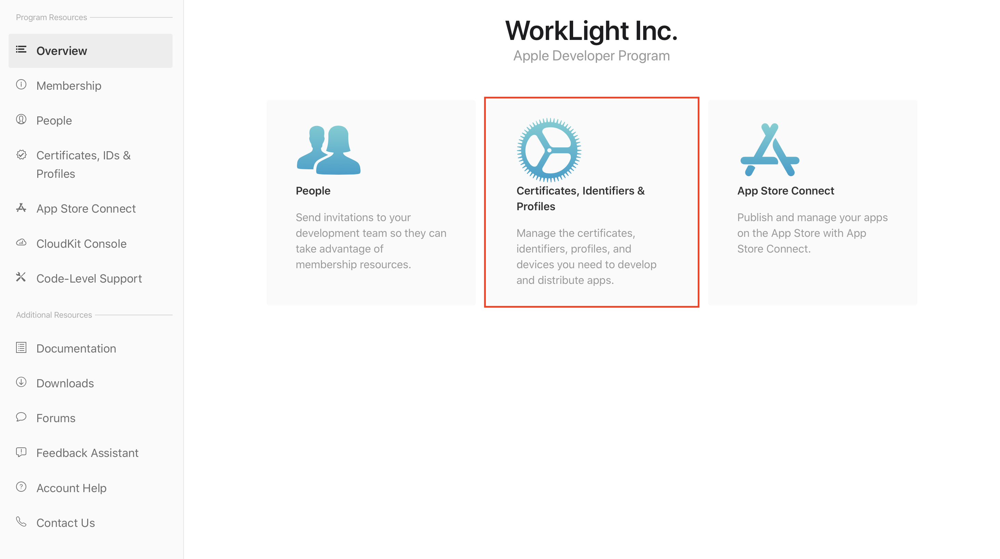{: caption="Figure 1. Certificates, Identifiers & Profiles" caption-side="bottom"}
* Go to `Identifiers > Add identifier button`.

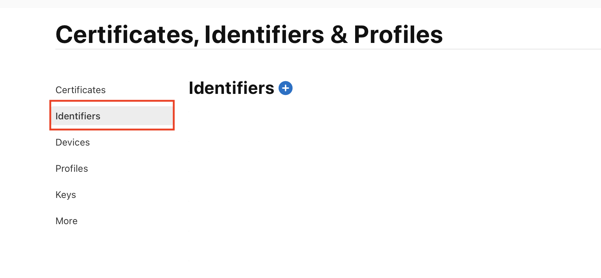{: caption="Figure 2. Identifier Button" caption-side="bottom"}
* Click on add a new Identifier button.

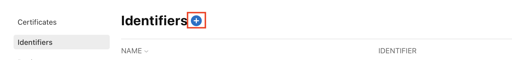{: caption="Figure 3. Add new Identifier button" caption-side="bottom"}
* Select the App IDs option.

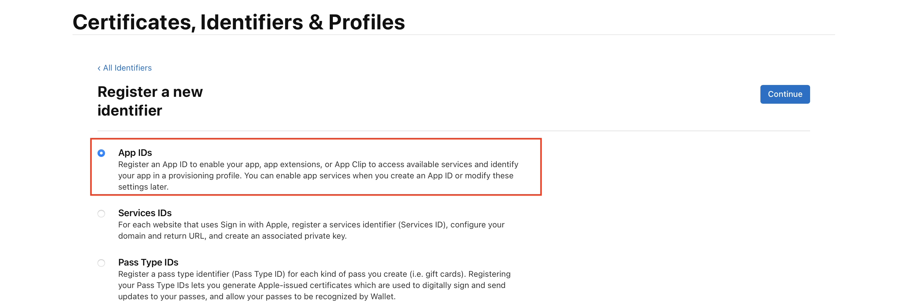{: caption="Figure 4. App IDs option" caption-side="bottom"}
* Select a type and click `Continue`.

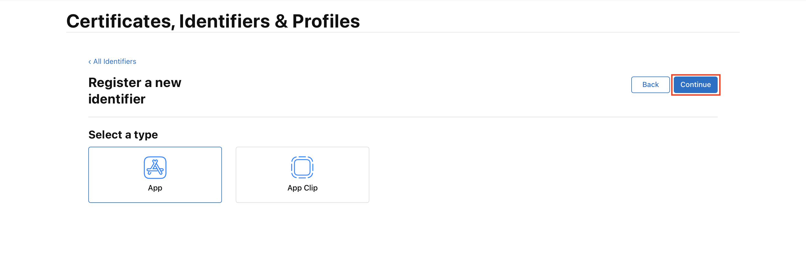{: caption="Figure 5. App ID type" caption-side="bottom"}
* Provide a string for the App ID Prefix. Provide the App name in the Description field. For example, Event Notifications iOS application.
* For the Bundle ID, choose Explicit and provide a Bundle ID value. It is recommended that you provide a reverse domain-name style string. For example, `com.ibm.cloud.en.app`.

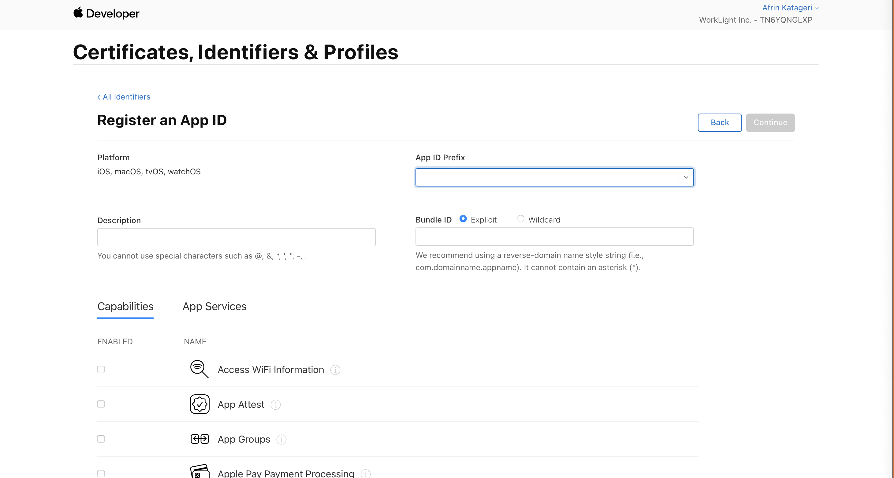{: caption="Figure 6. Create new App ID details" caption-side="bottom"}
* Select the `Push Notifications` check-box from the Capabilities and click `Continue`.

{: caption="Figure 7. Enable Push Notifications" caption-side="bottom"}
* Go through your settings and click `Register > Done`.

Your App ID is now registered.

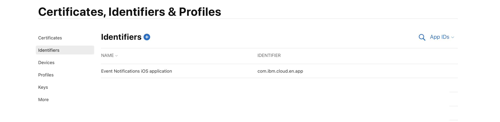{: caption="Figure 8. Newly created App ID" caption-side="bottom"}

### Create a development and distribution APNs SSL certificate
{: #en-get-apns-certificate}

Before you obtain an APNs certificate, you must first generate a certificate signing request (CSR) and submit it to Apple, the certificate authority (CA). The CSR contains information that identifies your company and your public and private key that you use to sign for your Apple push notifications. Then, generate the SSL certificate on the iOS Developer Portal. The certificate, along with its public and private key, is stored in Keychain Access.

You can use APNs in two modes:

* Sandbox mode for development and testing.
* Production mode when distributing applications through the App Store (or other enterprise distribution mechanisms).

You must obtain separate certificates for your development and distribution environments. The certificates are associated with an App ID for the app that is the recipient of remote notifications. For production, you can create up to two certificates. IBM Cloud uses the certificates to establish an SSL connection with APNs.

#### Create an APNs p12 certificate
{: #en-p12}

* Go to the [Apple developer portal](https://developer.apple.com/) and select Certificates, Identifiers & Profiles.

{: caption="Figure 9. Certificates, Identifiers & Profiles" caption-side="bottom"}
* In the `Identifiers area`, select your App ID.

{: caption="Figure 10. Identifiers tab" caption-side="bottom"}
* Select the `Push Notifications` check-box OR select the `Edit` option.

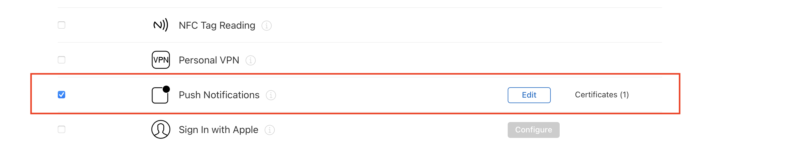{: caption="Figure 11. Push Notifications check-box" caption-side="bottom"}

    * On Development SSL certificate pane, click Create Certificate...
    * On Production SSL certificate pane, click Create Certificate...

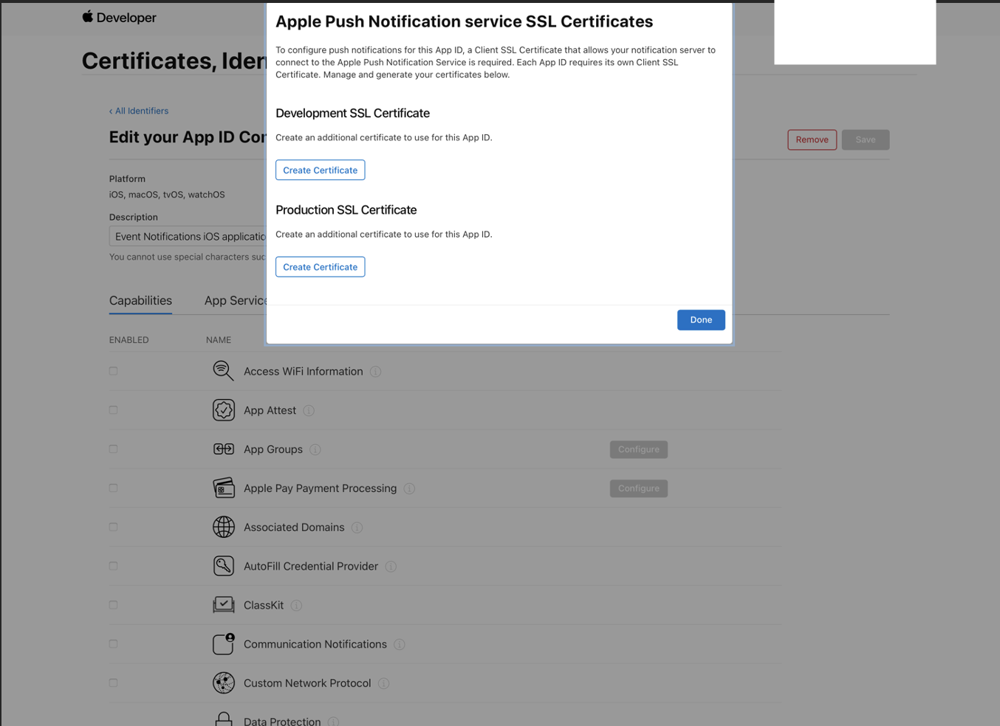{: caption="Figure 12. Certificate type" caption-side="bottom"}
* Use Keychain Access application on your Mac to create a Certificate Signing Request (CSR).
* From the menu, select `Keychain Access > Certificate Assistant > Request a Certificate From a Certificate Authority…`

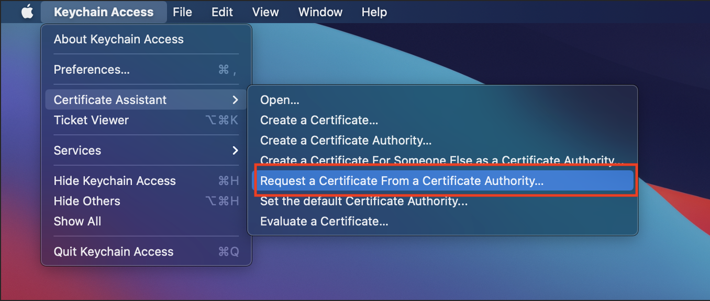{: caption="Figure 13. Request new certificate type" caption-side="bottom"}
* In Certificate Information, enter the email address that is associated with your App Developer account and a common name. Give a meaningful name that helps you identify whether it is a certificate for development (sandbox) or distribution (production); for example, _sandbox-apns-certificate_ or _production-apns-certificate_.
* Select `Saved to disk` to download the `.certSigningRequest` file to your Mac, then click `Continue`.

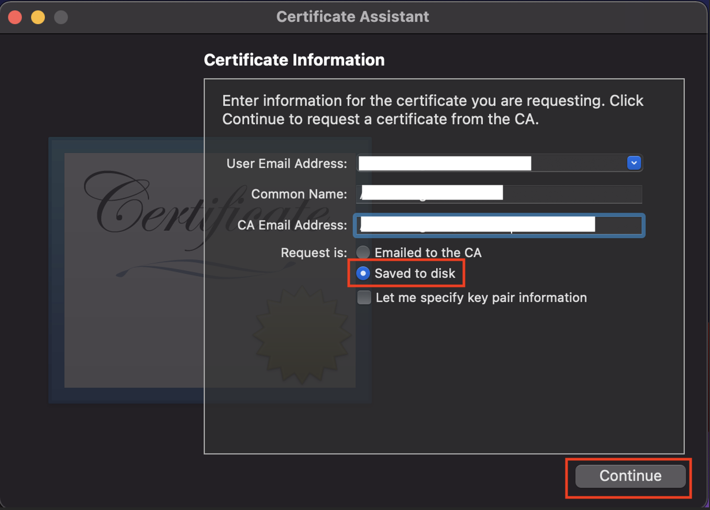{: caption="Figure 14. Certificate details" caption-side="bottom"}
* In the `Save As` menu option, name the `.certSigningRequest` file, select the location where the file has to be saved and click `Save`.

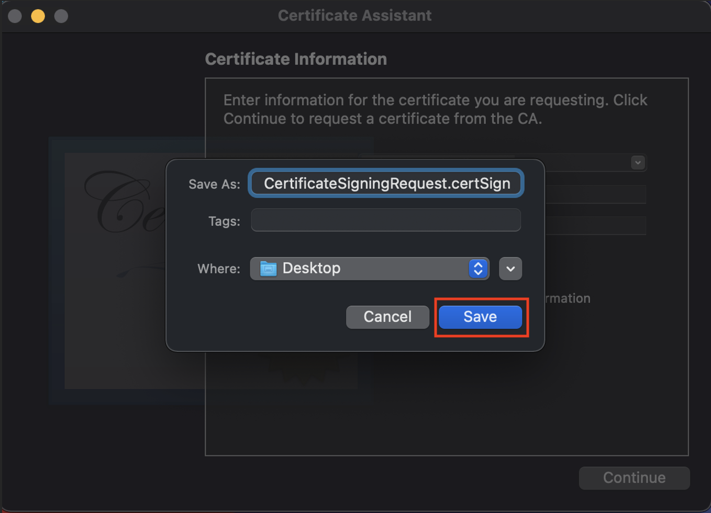{: caption="Figure 15. Save CSR file" caption-side="bottom"}
* Click `Done`. You now have a CSR.

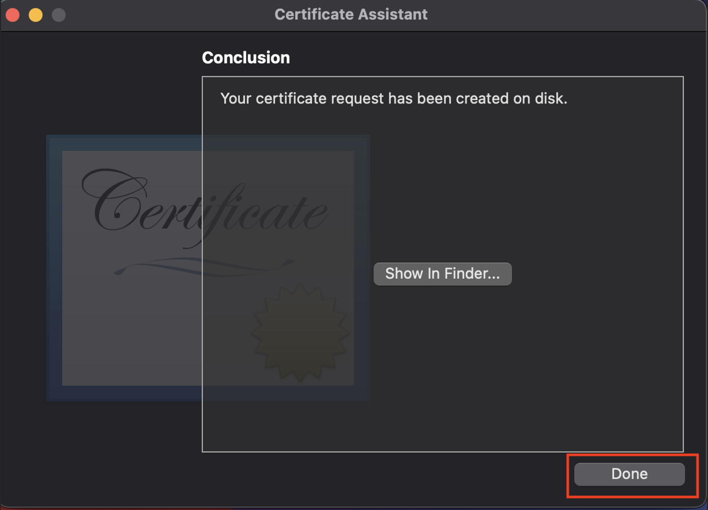{: caption="Figure 16. CSR created" caption-side="bottom"}
* Go back to the Apple developer portal , for the Upload CSR file option, click Choose File, and select file `CertificateSigningRequest.certSigningRequest`. Click `Continue`.

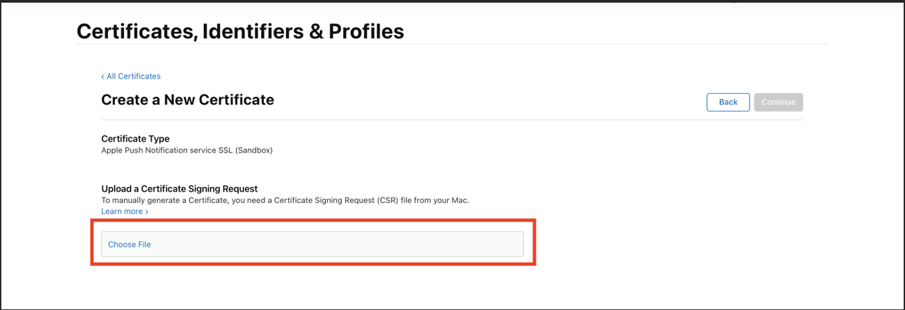{: caption="Figure 17. Upload CSR file" caption-side="bottom"}
* Click `Download` . The `aps_development.cer` file is downloaded.

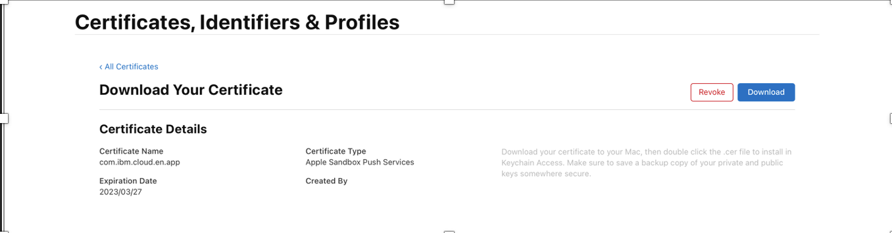{: caption="Figure 18. Download certificate" caption-side="bottom"}
* Locate your newly installed certificate. Double-click the certificate to install it into the Keychain Access.
* On your Mac, go to `Keychain Access > My Certificates`.
* Select the certificate and private key, and then select `Export` to convert the certificate into the personal information exchange format (`.p12` format).

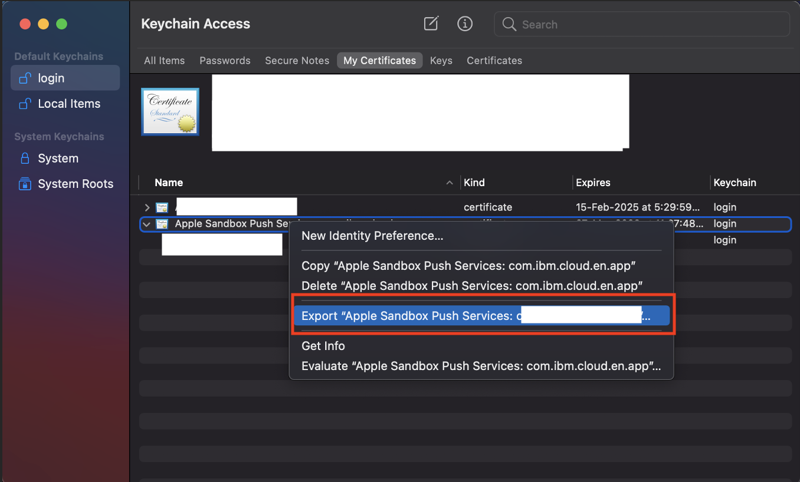{: caption="Figure 19. Export certificate" caption-side="bottom"}
* In the `Save As` field, provide the certificate a meaningful name. For example, _sandbox-apns.p12_ or _production-apns.p12_, then click `Save`.

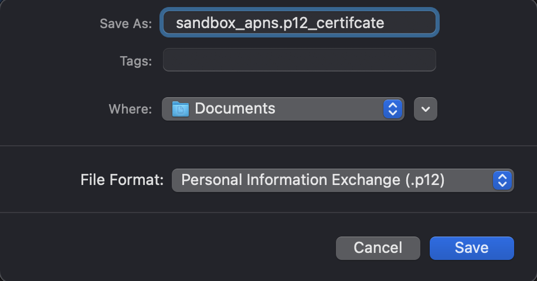{: caption="Figure 20. Save certificate" caption-side="bottom"}
* In the `Enter a password` field, enter a password to protect the exported items, then click `OK`. You can use this password to configure your APNs settings on the Event Notifications service console.

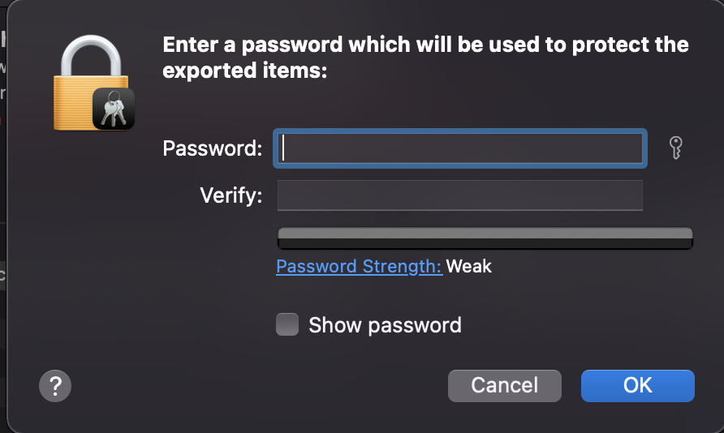{: caption="Figure 21. Protect certificate" caption-side="bottom"}
* The Key Access app prompts you to export your key from the Keychain screen. Enter your administrative password for your Mac to allow your system to export these items, and then select the Always Allow option. A .p12 certificate is generated on your selected location.
  
#### Create an APNs p8 token
{: #en-p8}

* Go to the [Apple developer portal](https://developer.apple.com/) and select Certificates, Identifiers & Profiles.

{: caption="Figure 22. Certificates, Identifiers & Profiles" caption-side="bottom"}
* Navigate to `Keys` tab on Left Nav.

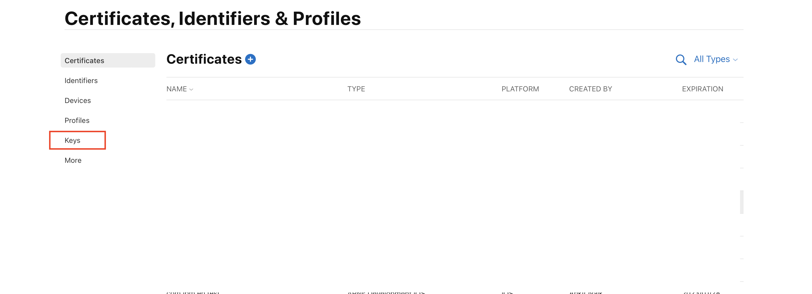{: caption="Figure 23. Keys tab" caption-side="bottom"}
* Enter `Key Name` and enable APNs, click on `continue`.

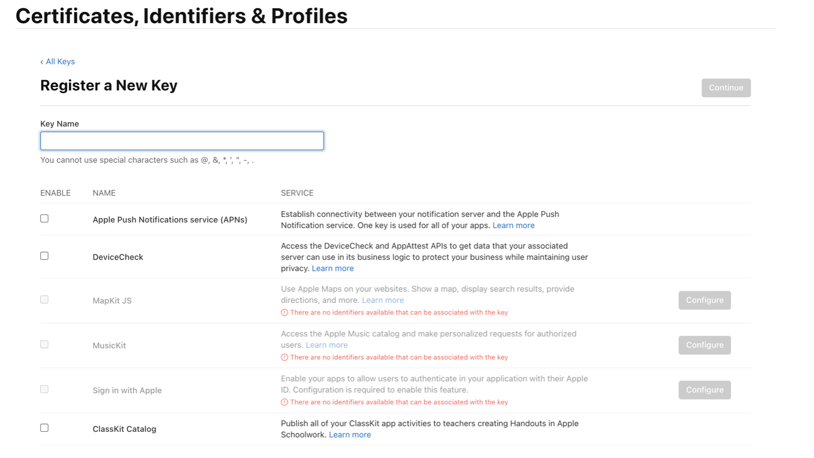{: caption="Figure 24. P8 token details" caption-side="bottom"}
* Click `Register`.

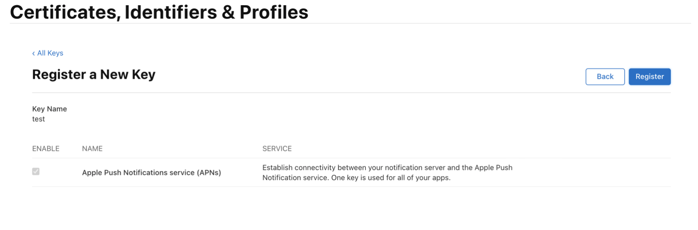{: caption="Figure 25. Register p8 token" caption-side="bottom"}
* Make sure to download Keys in new redirected page after registration as it is a one time activity.

`KeyID` will be visible as part of the file and displayed in the UI, this `KeyID` will be used for registering APNS certificate. `TeamID` is provided by apple for the developer account, can be seen next to the Team Name. `TeamID` will be used for registering APNS certificate. `BundleID` can be registered same as P12 certificate.
{:note: .note}

## Add a generic API source
{: #en-add-gen-api}
{: step}

Take the following steps:

* Go to the `Sources` section of the {{site.data.keyword.en_short}} dashboard.
* Click `Add` and select an API Source.
* Type a name and an optional description and click `Add`.

## Create a {{site.data.keyword.en_short}} destination
{: #en-create-dest}
{: step}

Click `Destinations` in the {{site.data.keyword.en_short}} console and add the following destination details:

* `Destination name`: add a name for the Destination.
* `Destination description`: add an optional description for the destination.
* `Destination type`: select iOS Push Notifications type from the dropdown list.
* Update the iOS Push Credentials with the details based on `Authentication Type` and select `Environment`
	* if certificate type is  `p8` , upload .p8 file and provide `KeyID`, `TeamID` and `BundleID`
	* if certificate type is `p12`, upload p12 certificate and provide certificate `password`

## Create an {{site.data.keyword.en_short}} topic
{: #en-create-topic}
{: step}

Select `Topics` in the Event Notifications console and click `Create`. Enter the following topic details:
* `Name`: enter a name for the topic.
* `Description`: add an optional description for the topic.
* `Source`: select a source from the dropdown list.
* `Event type`: select event type from the dropdown list.
* `Event sub type` select event sub type from the event sub type dropdown list.
* `Severity`: select severity from the severity dropdown list.
* `Advanced conditions`: write your own custom conditions, which must follow [jsonpath specifications](https://jsonpath.com/).

## Create an {{site.data.keyword.en_short}} subscription
{: #en-create-sub}
{: step}

Click `Subscriptions` in the {{site.data.keyword.en_short}} console. Enter the following subscription details:

* `Click` Create to display subscription wizard.
* Complete the following subscription details: 
    * `Subscription name`: name of the subscription.
    * `Subscription description`: add an optional description.
* Under the `Subscribe to a topic` section, select a topic from the drop-down list and select a destination from the destination drop-down list.
* `Destination type`: select type under `Destination` and click `Add`.

## Set up {{site.data.keyword.en_short}} IOS SDK
{: #en-setup-ios-sdk}
{: step}

The iOS SDK enables iOS apps to receive push notifications. Complete the following steps to install {{site.data.keyword.en_short}} iOS SDK, initialize the SDK, and register for notifications for your iOS app.

## Installation
{: #en-install}

The current version of this SDK is: 0.0.1

To use the Event Notifications iOS destination SDK, define a dependency that contains the artifact coordinates (group id, artifact id and version) for the service, like this:


### Cocoapods
{: #en-cocapods}

```ruby
use_frameworks!

target 'MyApp' do
    pod 'ENPushDestination', '~> 0.0.1'
end
```

### Carthage
{: #en-carthage}

To install `ENPushDestination` using Carthage, add the following to your Cartfile.

```ruby
  github "IBM/event-notifications-destination-ios-sdk" ~> 0.0.1
```

Then run the following command to build the dependencies and frameworks:

```ruby
 carthage update --platform iOS
```

### Swift Package Manager
{: #en-spm}

Add the following to your `Package.swift` file to identify ENPushDestination as a dependency. The package manager will clone ENPushDestination when you build your project with swift build.
```ruby
dependencies: [
    .package(url: "https://github.com/IBM/event-notifications-destination-ios-sdk", from: "0.0.1")
]
```

## Installation - Initialize SDK
{: #en-inst-int-sdk}

Complete the following steps to enable iOS applications to receive notifications.

1. Add the `import` statements in your `.swift` file.
		
   ```swift
   import ENPushDestination
   ```

2. Initialize the ENPushDestination SDK

	```swift

	let instanceGUID = "<instance_guid>>";
	let destinationID = "<instance_destination_id>";
	let apiKey = "<instance_apikey>";

	let enPush = ENPush.sharedInstance
	enPush.setCloudRegion(region: .usSouth)
	enPush.initialize(instanceGUID, destinationID, apiKey)
	```

	- region : Region of the Event Notifications Instance. eg; `Region.usSouth`

## Register for notifications
{: #en-reg-nots}

Use the `ENPush.registerDevice()` API to register the device with iOS destination in Event Notifications service. 

The following options are supported:

- Register without userId:
	
	```swift
	/**Register iOS devices*/
    enPush.registerWithDeviceToken(deviceToken: "<apns-device-token>") { response, statusCode, error in

        print(response?.id ?? "")

    }
	```

- Register with UserId. For `userId` based notification, the register method will accept one more parameter - `userId`.

	```swift
	/**Register iOS devices*/
    enPush.registerWithDeviceToken(deviceToken: "<apns-device-token>", withUserId: "userId") { response, statusCode, error in
            
        print(response?.id ?? "")

    }
	```
The userId is used to pass the unique userId value for registering for Event notifications.

### Unregistering from notifications
{: #en-unreg-nots}

Use the following code snippets to un-register from Event Notifications.

```swift
enPush.unregisterDevice { response, statusCode, error in
    /**.....*/  
}
```
>**Note**: To unregister from the `UserId` based registration, you have to call the registration method. See the `Register without userId option` in [Register for notifications](#register-for-notifications).

## Event Notifications destination tags subscriptions
{: #en-dest-tag}

### Subscribe to tags
{: #en-sub-tags}

The `subscribe` API will subscribe the device for a given tag. After the device is subscribed to a particular tag, the device can receive notifications that are sent for that tag. 

Add the following code snippet to your iOS mobile application to subscribe to a list of tags.

```swift
// Subscribe to the given tag
enPush.subscribeToTags(tagName: "<tag_name>") { response, statusCode, error in
	/**.....*/  
});
```

### Retrieve subscribed tags
{: #en-ret-sub-tags}

The `retrieveSubscriptionsWithCompletionHandler` API will return the list of tags to which the device is subscribed. Use the following code snippets in the mobile application to get the subscription list.

```swift
// Get a list of tags that to which the device is subscribed.
enPush.retrieveSubscriptionsWithCompletionHandler { response, statusCode, error in
    /**.....*/   
}
```

### Unsubscribe from tags
{: #en-unsub-tags}

The `unsubscribeFromTags` API will remove the device subscription from the list tags. Use the following code snippets to allow your devices to get unsubscribe from a tag.

```swift
// unsubscibe from the given tag ,that to which the device is subscribed.
enPush.unsubscribeFromTags(tagName: "<tag_name>") { response, statusCode, error in
  /**.....*/   
}
```

### Receiving push notifications on iOS devices
{: #en-pn-ios}

To receive push notifications on iOS devices, add the following Swift method to the appDelegate.swift of your application:

```swift
 func application(_ application: UIApplication, didReceiveRemoteNotification userInfo: [AnyHashable : Any], fetchCompletionHandler completionHandler: @escaping (UIBackgroundFetchResult) -> Void) {

	//UserInfo dictionary will contain data sent from the server
 }
```

## Notification options
{: #en-not-opts}

The following notification options are supported.


### Interactive notifications
{: #en-inter-nots}

1. To enable interactive push notifications, the notification action parameters must be passed in as part of the notification object. The following is a sample code to enable interactive notifications:

```swift
let actionOne = ENPushNotificationAction(identifierName: "FIRST", buttonTitle: "Accept", isAuthenticationRequired: false, defineActivationMode: .foreground)
    
let actionTwo = ENPushNotificationAction(identifierName: "SECOND", buttonTitle: "Reject", isAuthenticationRequired: false, defineActivationMode: .destructive)
    
let category = ENPushNotificationActionCategory(identifierName: "category", buttonActions: [actionOne, actionTwo])

let notificationOptions = ENPushClientOptions()
notificationOptions.setInteractiveNotificationCategories(categoryName: [category])
enPush.initialize(instanceGUID, destinationID, apiKey, notificationOptions)

```

1. Implement the callback method on AppDelegate.swift:

```swift
func userNotificationCenter(_ center: UNUserNotificationCenter, didReceive response: UNNotificationResponse, withCompletionHandler completionHandler: @escaping () -> Void) {
	switch response.actionIdentifier {
		case "Accept":
		print("Clicked Accept")
		case "Reject":
		print("Clicked Reject")
		default:
	}
	completionHandler()
 }
```
	
This callback method is invoked when user clicks the action button. The implementation of this method must perform tasks associated with the specified identifier and execute the block in the completionHandler parameter.

### Adding custom DeviceId for registration
{: #en-add-cust-devid}

To send `DeviceId` use the `setDeviceId` method of `ENPushClientOptions` class.

```swift
	let options = ENPushClientOptions();
	options.setDeviceId(deviceId: "YOUR_DEVICE_ID");
```

>**Note**: Remember to keep custom DeviceId `unique` for each device.


### Enabling rich media notifications
{: #en-en-rich-nots}

Rich media notifications are supported on iOS 10 or later. To receive rich media notifications, implement UNNotificationServiceExtension. The extension will intercept and handle the rich media notification.

In the didReceive() method of your service extension, add the following code to retrieve the rich push notification content.

```swift
override func didReceive(_ request: UNNotificationRequest, withContentHandler contentHandler: @escaping (UNNotificationContent) -> Void) {
	self.contentHandler = contentHandler
	bestAttemptContent = (request.content.mutableCopy() as? UNMutableNotificationContent)
    ENPushRichPushNotificationOptions.didReceive(request, withContentHandler: contentHandler)
}
```

## Send notifications to the iOS device
{: #en-send-notifications}
{: step}

Use the [Send Notification API](https://cloud.ibm.com/apidocs/event-notifications/event-notifications#send-notifications) to send the push notification for the iOS device. You can use the [Node](mailto:https://github.com/IBM/event-notifications-node-admin-sdk#send-notifications) or [Go](https://github.com/IBM/event-notifications-go-admin-sdk#send-notifications) admin SDK instead of calling the API directly.

{: caption="Figure 6. Send notifications" caption-side="bottom"}

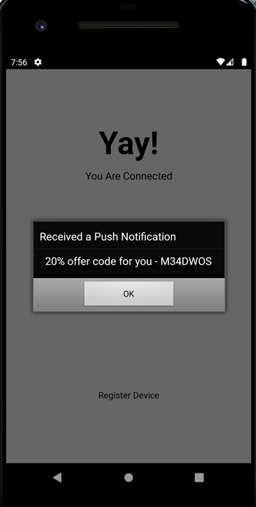{: caption="Figure 7. Receive notifications" caption-side="bottom"}
