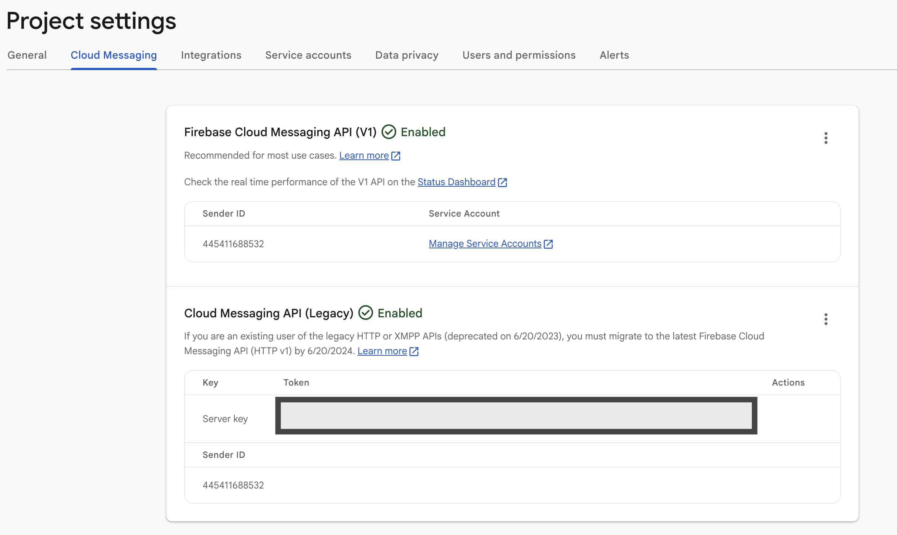
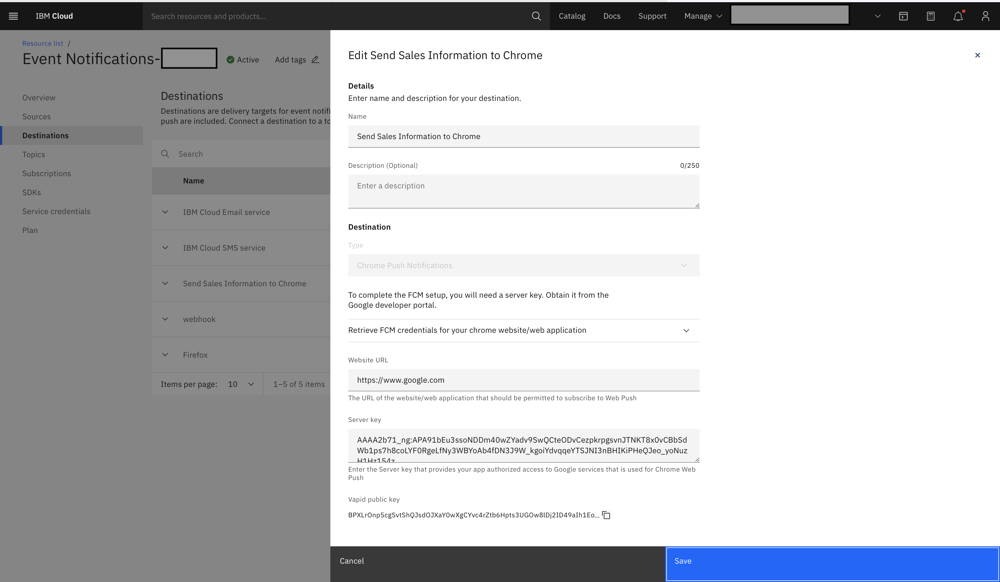
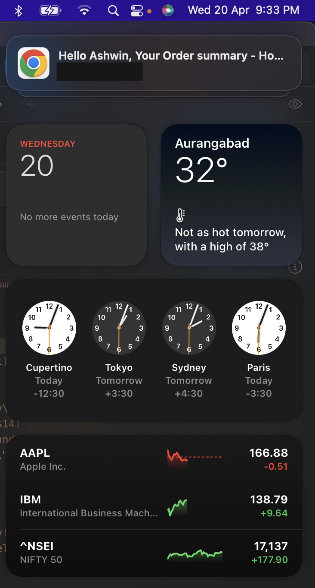

---

copyright:
  years: 2022
lastupdated: "2022-07-13"
keywords: event-notifications, event notifications, about event notifications, destinations, push, chrome
subcollection: event-notifications
content-type: tutorial
services:
account-plan: lite
completion-time: 10m
---
{{site.data.keyword.attribute-definition-list}}

# Create and send push notifications to Chrome web by using {{site.data.keyword.en_full}}
{: #en-push-chrome}
{: toc-content-type="tutorial"}
{: toc-services=""}
{: toc-completion-time="10m"}

Create an {{site.data.keyword.en_short}} service, add a push destination for Chrome Push Notifications, and send messages to Chrome web devices.
{: shortdesc}

## What is {{site.data.keyword.en_short}}?
{: #en-what-is-chrome}

{{site.data.keyword.en_short}} is an event notification routing service that tells you about critical events that occur in your {{site.data.keyword.cloud_notm}} account or triggers automated actions by using webhooks. You can filter and route event notifications from {{site.data.keyword.cloud_notm}} services like {{site.data.keyword.prf_hubshort}}, to email, SMS, push notifications, and webhooks.

## How do clients use Chrome web Push Notifications?
{: #en-how-clients-send-chrome}

The following diagram shows you how clients use Chrome web Push Notifications.

{: caption="Figure 1. How clients use push notifications" caption-side="bottom"}

## Objectives
{: #en-objectives-chrome}

This tutorial shows you how to send push notifications as follows:

* Create a website with {{site.data.keyword.en_short}}.
* Get Chrome web credentials.
* Download the SDK and complete the notifications setup.
* Configure and send Chrome web Push Notifications to a browser.

## Before you begin
{: #en-before-begin-chrome}

You must have the following prerequisites in place:

* Download and install any code editor to right website code by using HTML, CSS and js.
* A Google account to log in to Firebase console to get your Sender ID and Server API Key.
* An {{site.data.keyword.cloud_notm}} account. If you do not have one, [create an IBM Cloud account](https://cloud.ibm.com/).

## Create an {{site.data.keyword.en_short}} service instance
{: #en-create-event-chrome}
{: step}

* Log in to your [{{site.data.keyword.cloud_notm}} account](https://cloud.ibm.com/).
* In the [{{site.data.keyword.cloud_notm}} catalog](https://cloud.ibm.com/catalog#services), search `Event Notifications > Event Notifications`.
* Select a `Region` from the list of supported regions and select a `pricing plan`.
* Provide a `Service name`.
* Select a `resource group`.
* Click `Create`.

## Get FCM credentials
{: #en-get-fcm-chrome}
{: step}

Firebase Cloud Messaging (FCM) is the gateway that delivers push notifications to Chrome web devices. To set up the Chrome web Push destination on the console, you must get your FCM credentials (Server key). The server key is stored securely and used by the {{site.data.keyword.en_short}} service to connect to the FCM server

* Go to the [Firebase Console](https://console.firebase.google.com/?pli=1). A Google user account is required.
* Click `Create a project`. If you are already having a project, then click `Add Project`.
* In the `Create a project window`, enter a project name, and accept the terms and enable or disable Google analytics (optional) by selecting the toggle switch and click `Continue`.
* If Google analytics is enabled, then in the `Configure Google Analytics` window, choose the `Analytics location`, and accept the terms.
* Click `Create Project`.
* Click `Continue` when the new project is ready.
* In the navigation panel, select the `settings` icon next to the `Project Overview` and select `Settings > Project settings`.
* Click the `Cloud Messaging` tab to view your project credentials: `Server Key`

{: caption="Figure 2. FCM credentials" caption-side="bottom"}

## Add a generic API source
{: #en-add-gen-api-chrome}
{: step}

Take the following steps:

* Go to the `Sources` section of the {{site.data.keyword.en_short}} dashboard.
* Click `Add` and select an API Source.
* Type a name and an optional description and click `Add`.

## Create an {{site.data.keyword.en_short}} destination
{: #en-create-dest-chrome}
{: step}

Click `Destinations` in the {{site.data.keyword.en_short}} console and add the following destination details:

* `Destination name`: add a name for the Destination.
* `Destination description`: add an optional description for the destination.
* `Destination type`: select Chrome Push Notifications type from the dropdown list.
* Add your website URL to get it allow listed.
* Add the `Server Key`, which you got from `Get FCM credentials` section.
* When Chrome destination is created. Edit the created destination to get public vapId key required for web sdk.

{: caption="Figure 7. Receive notifications" caption-side="bottom"}

{: caption="Figure 7. Receive notifications" caption-side="bottom"}

## Create an {{site.data.keyword.en_short}} topic
{: #en-create-topic-chrome}
{: step}

Select `Topics` in the {{site.data.keyword.en_short}} console and click `Create`. Enter the following topic details:

* `Name`: enter a name for the topic.
* `Description`: add an optional description for the topic.
* `Source`: select a source from the dropdown list.
* `Event type`: select event type from the dropdown list.
* `Event sub type` select event sub type from the event sub type dropdown list.
* `Severity`: select severity from the severity dropdown list.
* `Advanced conditions`: write your own custom conditions, which must follow [jsonpath specifications](https://jsonpath.com/).

## Create an {{site.data.keyword.en_short}} subscription
{: #en-create-sub-chrome}
{: step}

Click `Subscriptions` in the {{site.data.keyword.en_short}} console. Enter the following subscription details:

* `Click` Create to display subscription wizard.
* Complete the following subscription details:
   * `Subscription name`: name of the subscription.
   * `Subscription description`: add an optional description.
* Under the `Subscribe to a topic` section, select a topic from the drop-down list and select a destination from the destination drop-down list.
* `Destination type`: select type under `Destination` and click `Add`.

## Set up {{site.data.keyword.en_short}} Chrome web SDK
{: #en-setup-chrome-sdk}
{: step}

The Chrome web SDK enables Chrome websites to receive push notifications. Complete the following steps to install {{site.data.keyword.en_short}} Chrome web SDK, initialize the SDK, and register for notifications for your website.

* To include the SDK in your project, add the `ENPushSDK.js`,`ENPushServiceWorker.js` and `manifest_Website.json` files to your project root folder.

* Edit the manifest_Website.json file.

  ```js
   {
     "name": "YOUR_WEBSITE_NAME"
    }
   ```

* Change the `manifest_Website.json` file name to `manifest.json`.

* Include the manifest.json in `<head>` tag of your html file.

```html
    <link rel="manifest" href="manifest.json">
```

* Include IBM Cloud Web push SDK to the script.

```html
   <script src="ENPushSDK.js" async></script>
```

* Complete the following steps to enable website to initialize the SDK

```js
  var enPush = new ENPush()

  function callback(response) {
    alert(response.response)
  }

  var initParams = {
    "instanceGUID": "<instance_guid>",
    "apikey": "<instance_apikey>",
    "region": "<region>",
    "deviceId": "<YOUR_DEVICE_ID>",
    "chromeDestinationId": "<chrome_destination_id>",
    "chromeApplicationServerKey": "<Chrome_VapId_public_key>"
  }

  enPush.initialize(initParams, callback)
```

    * region: Region of the {{site.data.keyword.en_short}} Instance. For example, `us-south`,`eu-gb`, `au-syd` or `eu-de`

    * deviceId: Optional deviceId for device registration.

* To register for notifications, use the `register()` or `registerWithUserId()` API to register the device with {{site.data.keyword.en_short}} service. Choose either of the following options:

    * Register without `UserId`:

```js
    enPush.register(function(response) {
      alert(response.response)
    })
```

* Register with user ID. For `userId` based notification, the register method accepts one more parameter - `userId`

```js
    bmsPush.registerWithUserId("UserId",function(response) {
      alert(response.response)
    })
```

`UserId` is the user identifier value with which you want to register devices in the push service instance.

* The `subscribe` API subscribes the device for a tag. After the device is subscribed to a particular tag, the device can receive notifications that are sent for that tag. Add the following code snippet to your web application to subscribe to a list of tags.

```js
    enPush.subscribe(tagName, function(response) {
      alert(response.response)
    })
```

* When the setup is complete, run your application and register for push notifications.

## Send notifications to the Chrome web device
{: #en-send-notifications-chrome}
{: step}

Use the [Send Notification API](https://cloud.ibm.com/apidocs/event-notifications/event-notifications#send-notifications) to send the push notification for the Chrome web device. You can use the [Node](https://github.com/IBM/event-notifications-node-admin-sdk#send-notifications) or [Go](https://github.com/IBM/event-notifications-go-admin-sdk#send-notifications) admin SDK instead of calling the API directly.

Received Notification on the chrome website in MacOS.

{: caption="Figure 3. Receive notifications" caption-side="bottom"}
