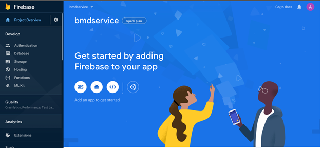
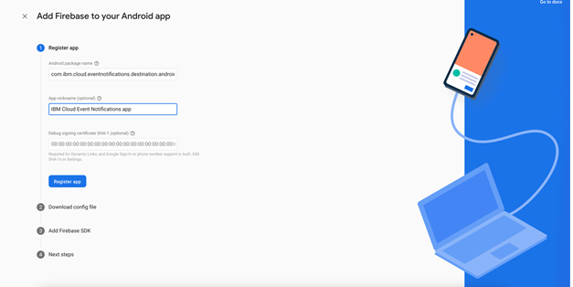

---

copyright:
  years: 2022
lastupdated: "2022-02-16"

keywords: event-notifications, event notifications, about event notifications, destinations, push

subcollection: event-notifications

content-type: tutorial
account-plan: lite
completion-time: 10m

---

{{site.data.keyword.attribute-definition-list}}
{:codeblock: .codeblock}
{:external: target="_blank" .external}
{:important: .important}
{:note: .note}
{:pre: .pre}
{:screen: .screen}
{:shortdesc: .shortdesc}
{:tip: .tip}
{:download: .download}
{:term: .term}
{:external: target="_blank" .external}
{:step: data-tutorial-type='step'}
{:codeblock: .codeblock}

# Create and send push notifications to Android mobile using {{site.data.keyword.en_full}}
{: #en-push-fcm}
{: toc-content-type="tutorial"}
{: toc-completion-time="10m"}

Create an {{site.data.keyword.en_short}} service, add a push destination for Firebase Cloud Messaging (FCM), and send messages to Android devices.
{: shortdesc}

## What is {{site.data.keyword.en_short}}?
{: #en-what-is}

{{site.data.keyword.en_short}} is an event notification routing service that notifies you of critical events that occur in your {{site.data.keyword.Bluemix_notm}} account or triggers automated actions by using webhooks. You can filter and route event notifications from {{site.data.keyword.Bluemix_notm}} services like {{site.data.keyword.prf_hubshort}}, to email, SMS, push notifications, and webhooks.

## How do clients use Android Push Notifications?
{: #en-how-clients-send}

The following diagram shows you how clients use Android Push Notifications.

{: caption="Figure 1. How clients use push notifications" caption-side="bottom"}

## Objectives
{: #en-objectives}

This tutorial shows you how to send push notifications as follows:

* Create a mobile app with {{site.data.keyword.en_short}}.
* Get FCM credentials.
* Download the code and complete the notifications setup.
* Configure and send Android Push Notifications to a mobile device.

## Before you begin
{: #en-before-begin}

You must have the following prerequisites in place:

* Download and install [Android Studio](https://developer.android.com/studio/index.html) so that you can import and enhance your code.
* A Google account to log in to Firebase console to get your Sender ID and Server API Key.
* An {{site.data.keyword.Bluemix_notm}} account. If you do not have one, [create an IBM Cloud account](https://cloud.ibm.com/).

## Create an {{site.data.keyword.en_short}} service instance
{: #en-create-event}
{: step}

* Log in to your [{{site.data.keyword.Bluemix_notm}} account](https://cloud.ibm.com/).
* In the [{{site.data.keyword.Bluemix_notm}} catalog](https://cloud.ibm.com/catalog#services), search `Event Notifications > Event Notifications`.
* Select a `Region` from the list of supported regions and select a `pricing plan`.
* Provide a `Service name`.
* Select a `resource group`.
* Click `Create`.

## Get FCM credentials
{: #en-get-fcm}
{: step}

Firebase Cloud Messaging (FCM) is the gateway that delivers push notifications to Android devices. To set up the Android Push destination on the console, you must get your FCM credentials (Sender ID and API key). The API key is stored securely and used by the {{site.data.keyword.en_short}} service to connect to the FCM server. The sender ID (project number) is used by the Android SDK on the client side.

* Go to the [Firebase Console](https://console.firebase.google.com/?pli=1). A Google user account is required.
* Click `Create a project`. If you are already having a project, then click `Add Project`.
* In the `Create a project window`, enter a project name, and accept the terms and enable or disable Google analytics (optional) by selecting the toggle switch and click `Continue`.
* If Google analytics is enabled, then in the `Configure Google Analytics` window, choose the `Analytics location`, and accept the terms. 
* Click `Create Project`.
* Click `Continue` when the new project is ready.
* In the navigation panel, select the `settings` icon next to the `Project Overview` and select `Settings > Project settings`.
* Click the `Cloud Messaging` tab to view your project credentials: `Server Key` and `Sender ID`.

{: caption="Figure 2. FCM credentials" caption-side="bottom"}

##  Generate `google-services.json`
{: #en-gen-google-services}
{: step}

You also need to generate the `google-services.json` file. Complete the following steps:

* In the Firebase console Project overview section, under `Get started by adding Firebase to your app` section click the `Android` icon.

{: caption="Figure 3. Firebase getting started" caption-side="bottom"}

* In the `Add Firebase to your Android app` window, add `com.ibm.cloud.eventnotifications.destination.android` as the Package Name. The `App nickname` field is optional. 
* Click Register app.

{: caption="Figure 4. Add Firebase to your Android app" caption-side="bottom"}

* Include the package name of your application. Enter the package name in `Add Firebase to your Android app` window. The `App nickname` field is optional. 

* Click `Register app`. See the following example:

{: caption="Figure 5. Register Android app" caption-side="bottom"}

* *The `google-services.json` file is generated.
* Download the latest config file `google-services.json` under Your apps.

## Add a generic API source
{: #en-add-gen-api}
{: step}

Take the following steps:

* Go to the `Sources` section of the {{site.data.keyword.en_short}} dashboard.
* Click `Add` and select an API Source.
* Type a name and an optional description and click `Add`.

## Create an {{site.data.keyword.en_short}} destination
{: #en-create-dest}
{: step}

Click `Destinations` in the {{site.data.keyword.en_short}} console and add the following destination details:

* `Destination name`: add a name for the Destination.
* `Destination description`: add an optional description for the destination.
* `Destination type`: select Android Push Notifications type from the dropdown list.
* Update the FCM Push Credentials with the `Sender ID/Project number` and `Server Key`. You can get these details from your `Firebase Console Project Settings > Cloud Messaging` section.

## Create an {{site.data.keyword.en_short}} topic
{: #en-create-topic}
{: step}

Select `Topics` in the Event Notifications console and click `Create`. Enter the following topic details:
* `Name`: enter a name for the topic.
* `Description`: add an optional description for the topic.
* `Source`: select a source from the dropdown list.
* `Event type`: select event type from the dropdown list.
* `Event sub type` select event sub type from the event sub type dropdown list.
* `Severity`: select severity from the severity dropdown list.
* `Advanced conditions`: write your own custom conditions, which must follow [jsonpath specifications](https://jsonpath.com/).

## Create an {{site.data.keyword.en_short}} subscription
{: #en-create-sub}
{: step}

Click `Subscriptions` in the {{site.data.keyword.en_short}} console. Enter the following subscription details:

* `Click` Create to display subscription wizard.
* Complete the following subscription details: 
   * `Subscription name`: name of the subscription.
   * `Subscription description`: add an optional description.
* Under the `Subscribe to a topic` section, select a topic from the drop-down list and select a destination from the destination drop-down list.
* `Destination type`: select type under `Destination` and click `Add`.

## Set up {{site.data.keyword.en_short}} Android SDK
{: #en-setup-android-sdk}
{: step}

The Android SDK enables Android apps to receive push notifications. Complete the following steps to install {{site.data.keyword.en_short}} Android SDK, initialize the SDK, and register for notifications for your Android app.

* Install {{site.data.keyword.en_short}} by using Gradle.

```gradle
compile 'com.ibm.cloud:eventnotifications-destination-android:0.0.1'
```
 {: codeblock}

* Follow [event-notifications-destination-android-sdk](https://github.com/IBM/event-notifications-destination-android-sdk) to install the SDK.

* When Gradle is installed, [import and initialize](https://github.com/IBM/event-notifications-destination-android-sdk#initialize-sdk) the SDK.


```java
import com.ibm.cloud.eventnotifications.destination.android.ENPush;

String instanceGUID = "<instance_guid>>";
String destinationID = "<instance_destination_id>";
String apiKey = "<instance_apikey>";

ENPush enPush = ENPush.getInstance();
enPush.setCloudRegion(ENPush.REGION_US_SOUTH); // Set your region

enPush.initialize(getApplicationContext(),instanceGUID,destinationID, apiKey);
```
 {: codeblock}

* When the SDK is initialized, [register](https://github.com/IBM/event-notifications-destination-android-sdk#register-for-notifications) for push notifications.

```java
	// Register the device to Event Notifications
	enPush.registerDeviceWithUserId("userId",new ENPushResponseListener<String>() {
		
		@Override	
		public void onSuccess(String deviceId) {
			//handle successful device registration here
		}

		@Override	
		public void onFailure(ENPushException ex) {
			//handle failure in device registration here
		}
	});
```
 {: codeblock}

* Add the Notifications listener for receiving the notification in your application.

```java
//Handles the notification when it arrives
ENPushNotificationListener notificationListener = new ENPushNotificationListener() {
	
	@Override
	public void onReceive (final ENSimplePushNotification message){
      // Handle Push Notification
    }	
};
```
 {: codeblock}

```java
    if(enPush != null) {
      enPush.listen(notificationListener);
    }
```
 {: codeblock}
 
* When the setup is complete, run your application and register for push notifications.

## Send notifications to the Android device
{: #en-send-notifications}
{: step}

Use the [Send Notification API](https://cloud.ibm.com/apidocs/event-notifications/event-notifications#send-notifications) to send the push notification for the Android device. You can use the [Node](mailto:https://github.com/IBM/event-notifications-node-admin-sdk#send-notifications) or [Go](https://github.com/IBM/event-notifications-go-admin-sdk#send-notifications) admin SDK instead of calling the API directly.

{: caption="Figure 6. Send notifications" caption-side="bottom"}

{: caption="Figure 7. Receive notifications" caption-side="bottom"}
