---

copyright:
  years: 2022
lastupdated: "2022-07-29"

keywords: event-notifications, event notifications, about event notifications, destinations, push

subcollection: event-notifications

content-type: tutorial
account-plan: lite, standard
completion-time: 10m

---

{{site.data.keyword.attribute-definition-list}}

# Create and send push notifications to Safari web using {{site.data.keyword.en_full}}
{: #en-push-safari}
{: toc-content-type="tutorial"}
{: toc-completion-time="10m"}

Create an {{site.data.keyword.en_short}} service, add a push destination for Apple Push Notification service (Safari), and send messages to iOS devices.
{: shortdesc}

## What is {{site.data.keyword.en_short}}?
{: #en-what-is-safari}

{{site.data.keyword.en_short}} is an event notification routing service that notifies you of critical events that occur in your {{site.data.keyword.cloud_notm}} account or triggers automated actions by using webhooks. You can filter and route event notifications from {{site.data.keyword.cloud_notm}} services like {{site.data.keyword.prf_hubshort}}, to email, SMS, push notifications (FCM/APNs), and webhooks.

## How do clients use Safari Push Notifications?
{: #en-how-clients-send-safari}

The following diagram shows you how clients use iOS Push Notifications.

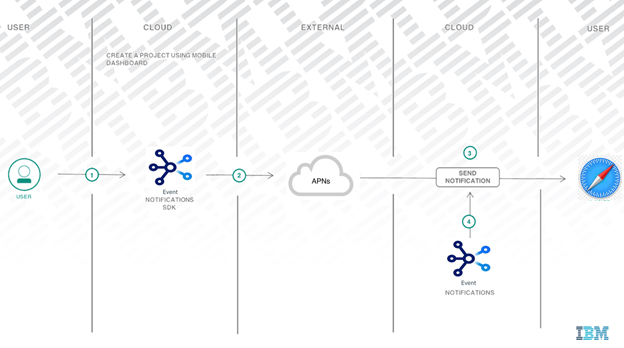{: caption="Figure 1. How clients use push notifications" caption-side="bottom"}

## Objectives
{: #en-objectives-safari}

This tutorial shows you how to send push notifications as follows:

* Create a Web app with {{site.data.keyword.en_short}}.
* Get Safari credentials.
* Download the code and complete the notifications setup.
* Configure and send Safari Push Notifications to a Safari Web.

## Before you begin
{: #en-before-begin-safari}

You must have the following prerequisites in place:

* An [IBM Cloud][ibm-cloud-onboarding] account.
* An Event Notifications Instance
* An IAM API key to allow the SDK to access your account. Create one [here](https://cloud.ibm.com/iam/apikeys).

## Create an {{site.data.keyword.en_short}} service instance
{: #en-create-event-safari}
{: step}

* Log in to your [{{site.data.keyword.cloud_notm}} account](https://cloud.ibm.com/).
* In the [{{site.data.keyword.cloud_notm}} catalog](https://cloud.ibm.com/catalog#services), search `Event Notifications > Event Notifications`.
* Select a `Region` from the list of supported regions and select a `pricing plan`.
* Provide a `Service name`.
* Select a `resource group`.
* Click `Create`.

## Get Safari credentials
{: #en-get-safari-credentials}
{: step}

* Add Apple World wide intermediate certificate to your Key Chain, you can find the certificate [here](https://www.apple.com/certificateauthority/)

{: caption="Figure 2. Certificates, Identifiers & Profiles" caption-side="bottom"}

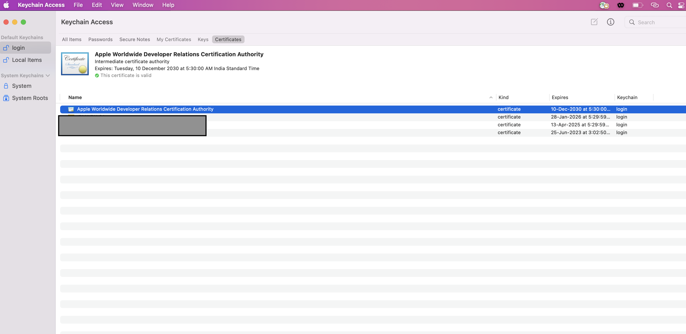{: caption="Figure 3. Certificates, Identifiers & Profiles" caption-side="bottom"}

* Create Web Push ID in your [Apple Developer account](https://developer.apple.com/account/)

The Web Push ID (the bundle identifier) is a unique identifier that identifies a specific application. Each application requires an Web Push ID. 

* Go to the [Apple developer portal](https://developer.apple.com/) and select Certificates, Identifiers & Profiles.

{: caption="Figure 4. Certificates, Identifiers & Profiles" caption-side="bottom"}

* Go to `Identifiers > Add identifier button`.

{: caption="Figure 5. Identifier Button" caption-side="bottom"}
* Click on add a new Identifier button.

{: caption="Figure 6. Add new Identifier button" caption-side="bottom"}
* Select the Web Push IDs option.

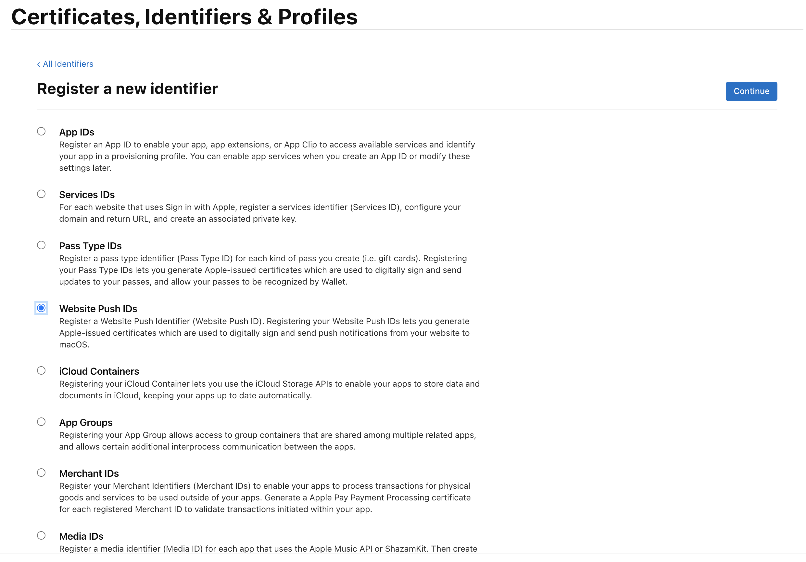{: caption="Figure 7. Web Push IDs option" caption-side="bottom"}
* Provide Identifier and description for your Web Push ID, identifier is unique reverse-domain string for your Web Push ID such as **web.com.example.domain** (the string must start with **web**). If your website is yourwebsite.com add the identifier as **web.com.yourwebsite**.

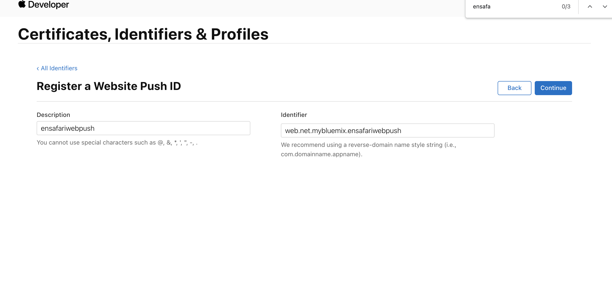{: caption="Figure 8. Web Push IDs" 
* Continue and then click on Create certificate on the next page.

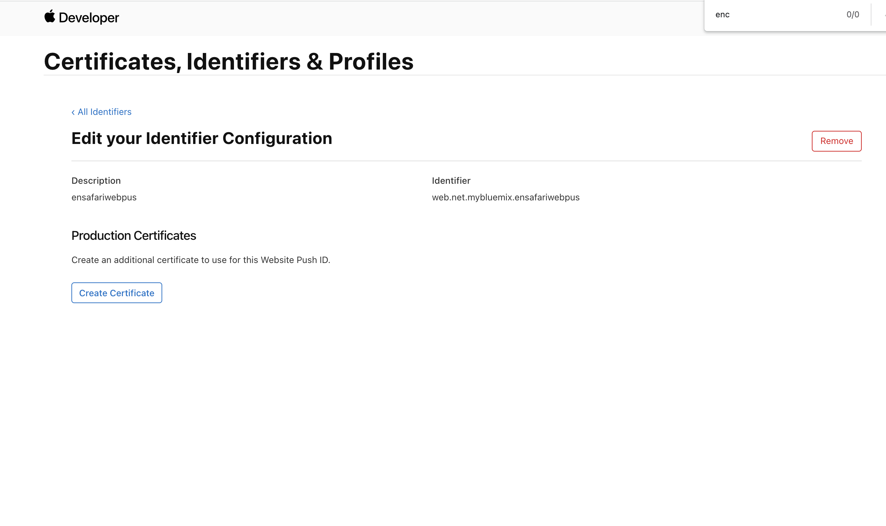{: caption="Figure 9. Create Certificate Button" 
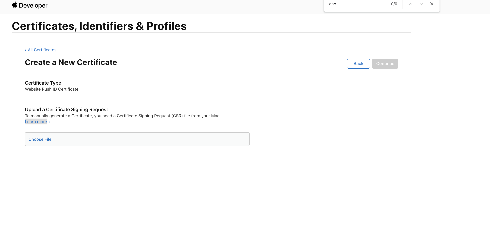{: caption="Figure 10. Create Certificate Page" 
* Create a Certificate Signing Request using KeyChain and save it to disk. More  information you can find [here](https://help.apple.com/developer-account/#/devbfa00fef7)

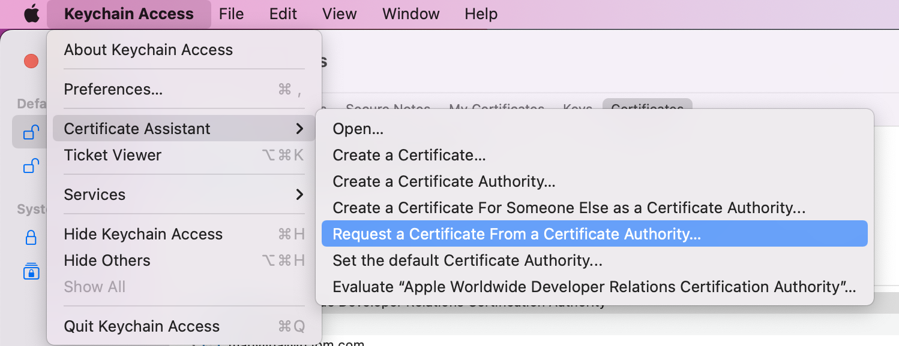{: caption="Figure 11. Create Certificate Signing"

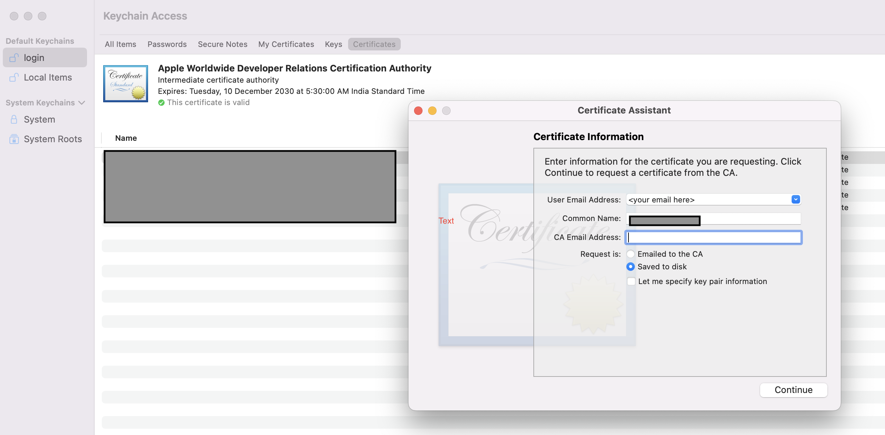{: caption="Figure 12. Create Certificate Signing"
* Upload the **CertificateSigningRequest.certSigningRequest** and click on **Continue**

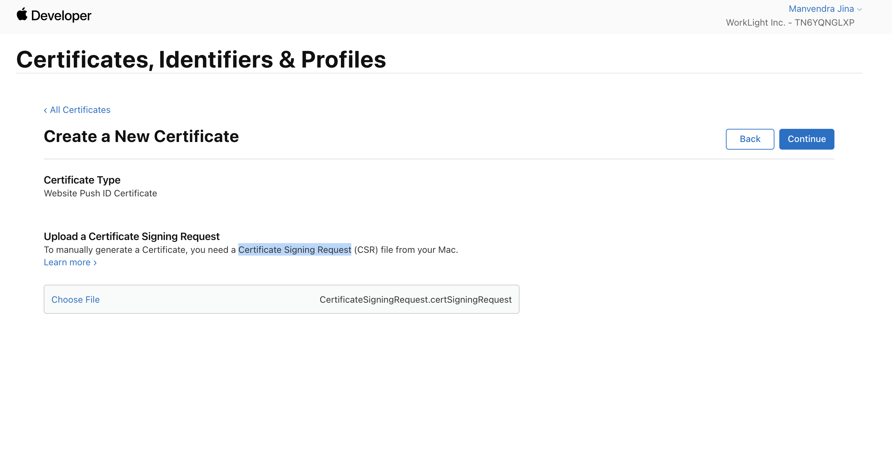{: caption="Figure 13. Upload Certificate Signing"

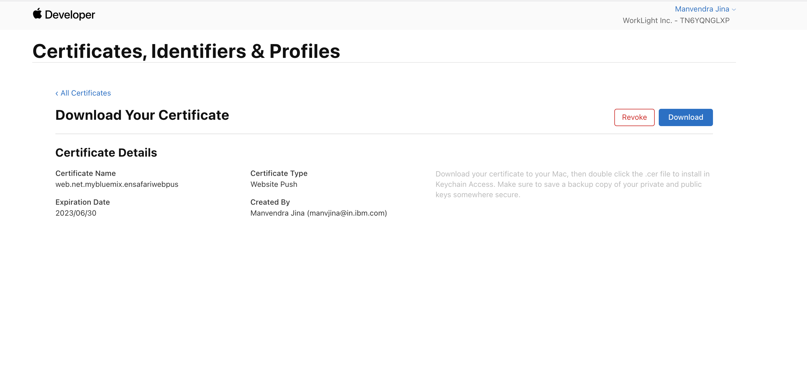{: caption="Figure 14. Upload Certificate Signing"
* Download the certificate with `.cer` extension and double click on it. It will add it to **Keychain Access → My Certificates**

* Got to your **Keychain Access→ My Certificate** , select your certificate export it.

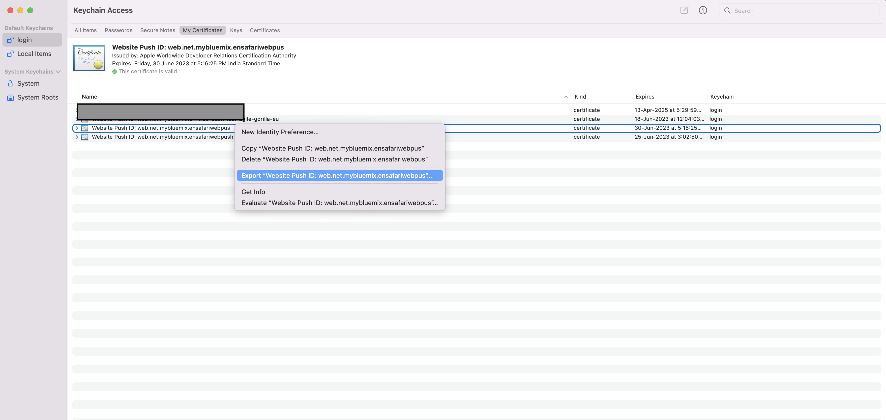{: caption="Figure 15. Upload Certificate Signing"

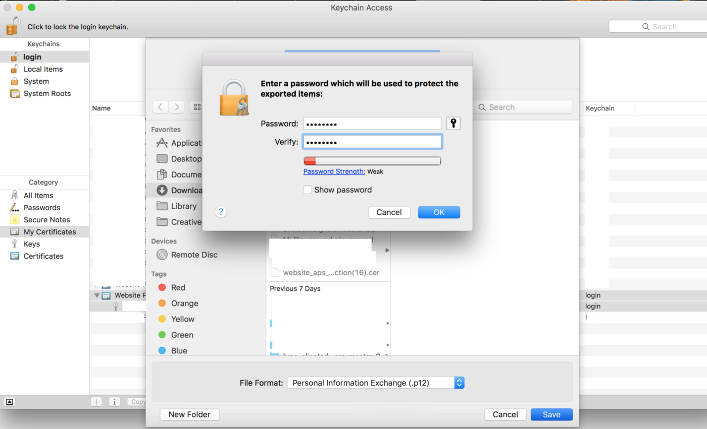{: caption="Figure 13. Upload Certificate Signing"
* add a password (Don't Forget it) and save as p12 certificate.


## Add a generic API source
{: #en-add-gen-api-safari}
{: step}

Take the following steps:

* Go to the `Sources` section of the {{site.data.keyword.en_short}} dashboard.
* Click `Add` and select an API Source.
* Type a name and an optional description and click `Add`.

## Create a {{site.data.keyword.en_short}} destination
{: #en-create-dest-safari}
{: step}

Click `Destinations` in the {{site.data.keyword.en_short}} console and add the following destination details:

* `Name`: add a name for the Destination.
* `Description`: add an optional description for the destination.
* `Type`: select Safari Push Notifications type from the dropdown list.
* Select a destination plan: Pre-production destination or Production destination.
   - `Pre-production destination` - select this destination as low-cost push destination, for your development and test environments.
   - `Production destination` - utilize the full capability of this destination. Unlimited devices and outbound messages allowed.

* Update the Safari Push Credentials with the details
    * `Website Name`: The website name. This is the heading used in Notification Center
    * `Website push ID`: Unique reverse-domain string for your Website Push ID such as web.com.example.domain (the string must start with web).
    * `Website URL`: The URL of the website that should be permitted to subscribe to Safari Push Notifications.
    * `URL format string`: he URL to go to when the notification is clicked. Use %@ as a placeholder for arguments you fill in when delivering your notification. This URL must use the http or https scheme; otherwise, it is invalid.
    * upload p12 certificate and provide certificate `password`

## Create an {{site.data.keyword.en_short}} topic
{: #en-create-topic-safari}
{: step}

Select `Topics` in the Event Notifications console and click `Create`. Enter the following topic details:
* `Name`: enter a name for the topic.
* `Description`: add an optional description for the topic.
* `Source`: select a source from the dropdown list.
* `Event type`: select event type from the dropdown list.
* `Event sub type` select event sub type from the event sub type dropdown list.
* `Severity`: select severity from the severity dropdown list.
* `Advanced conditions`: write your own custom conditions, which must follow [jsonpath specifications](https://jsonpath.com/).

## Create an {{site.data.keyword.en_short}} subscription
{: #en-create-sub-safari}
{: step}

Click `Subscriptions` in the {{site.data.keyword.en_short}} console. Enter the following subscription details:

* `Click` Create to display subscription wizard.

* Complete the following subscription details: 
    * `Subscription name`: name of the subscription.
    * `Subscription description`: add an optional description.

* Under the `Subscribe to a topic` section, select a topic from the drop-down list and select a destination from the destination drop-down list.
* `Destination type`: select type under `Destination` and click `Add`.

## Set up {{site.data.keyword.en_short}} Safari web SDK
{: #en-setup-safari-sdk}
{: step}

The Safari web SDK enables Safari websites to receive push notifications. Complete the following steps to install {{site.data.keyword.en_short}} Firefox web SDK, initialize the SDK, and register for notifications for your website.

* To include the SDK in your project, add the `ENPushSDK.js`,`ENPushServiceWorker.js` and `manifest_Website.json` files to your project root folder.

* Edit the manifest_Website.json file.

    ```js
    {
        "name": "YOUR_WEBSITE_NAME"
    }
    ```

* Change the `manifest_Website.json` file name to `manifest.json`.

* Include the manifest.json in the `<head>` tag of your html file.

    ```html
    <link rel="manifest" href="manifest.json">
    ```

* Include IBM Cloud web push SDK to the script.

    ```html
   <script src="ENPushSDK.js" async></script>
    ```

* Complete the following steps to enable the website to initialize the SDK

    ```js
    var enPush = new ENPush()

    function callback(response) {
        alert(response.response)
    }

    var initParams = {
        "instanceGUID": "<instance_guid>",
        "apikey": "<instance_apikey>",
        "region": "<region>",
        "deviceId": "<YOUR_DEVICE_ID>",
        "safariDestinationId": "<safari_destination_id>",
        "websitePushIdSafari": "<Safari Web Push Id Identifier>"
    }

    enPush.initialize(initParams, callback)
    ```

    * region: Region of the {{site.data.keyword.en_short}} instance. eg; `us-south`,`eu-gb`, `au-syd` and `eu-de`

    * deviceId: Optional deviceId for device registration.

* To register for notifications, se the `register()` or `registerWithUserId()` API to register the device with IBM Cloud Event Notifications service. Choose either of the following options:

    * Register without `UserId`:

    ```js
    enPush.register(function(response) {
      alert(response.response)
    })
    ```

    * Register with UserId. For `userId` based notification, the register method will accept one more parameter - `userId`

    ```js
    bmsPush.registerWithUserId("UserId",function(response) {
      alert(response.response)
    })
    ```

    `UserId` is the user identifier value with which you want to register devices in the push service instance.

* The `subscribe` API subscribes the device for a tag. After the device is subscribed to a particular tag, the device can receive notifications that are sent for that tag. Add the following code snippet to your web application to subscribe to a list of tags.

    ```js
    enPush.subscribe(tagName, function(response) {
      alert(response.response)
    })
    ```

* When the setup is complete, run your application and register for push notifications.

## Send notifications to the Safari Web device
{: #en-send-notifications-safari}
{: step}

Use the [Send Notification API](https://cloud.ibm.com/apidocs/event-notifications/event-notifications#send-notifications) to send the push notification for the Firefox device. You can use the [Node](https://github.com/IBM/event-notifications-node-admin-sdk#send-notifications) or [Go](https://github.com/IBM/event-notifications-go-admin-sdk#send-notifications) admin SDK instead of calling the API directly.

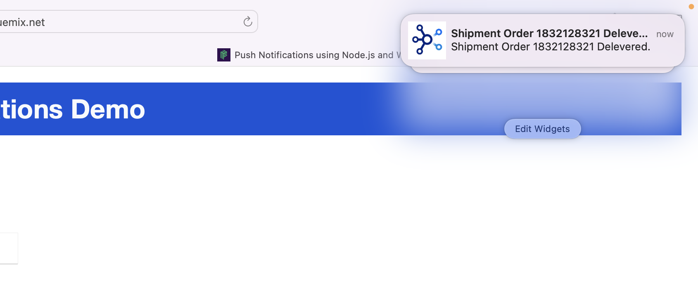{: caption="Figure 16. Receive notifications" caption-side="bottom"}
