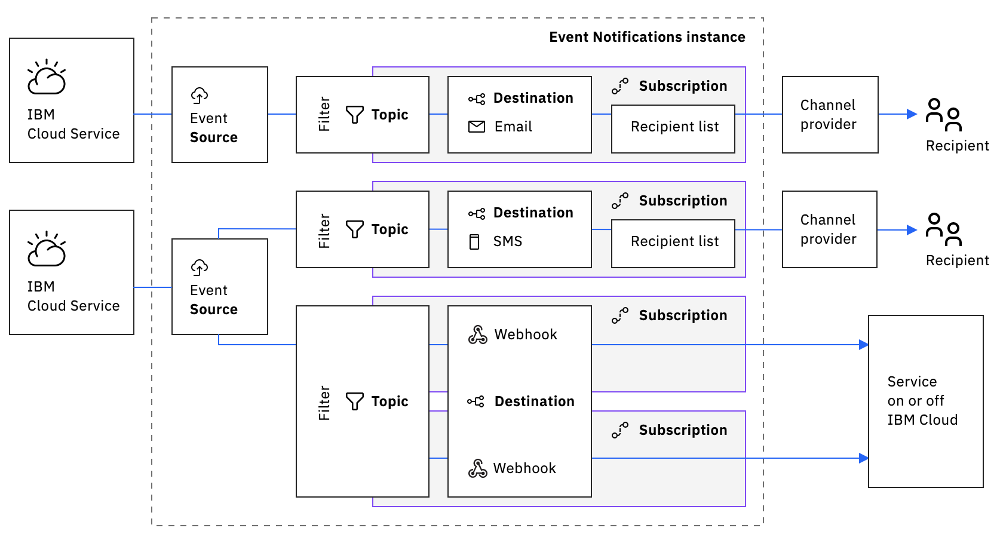

---

copyright:
  years: 2020, 2021, 2022
lastupdated: "2022-01-25"

keywords: event-notifications, event notifications, about event notifications

subcollection: event-notifications

---

{:codeblock: .codeblock}
{:external: target="_blank" .external}
{:important: .important}
{:note: .note}
{:pre: .pre}
{:screen: .screen}
{:shortdesc: .shortdesc}
{:tip: .tip}

# Event Notifications relationship model
{: #en-relation}

The relationship between {{site.data.keyword.en_short}} sources, filters, topics, destinations, and subscriptions is shown Figure 1 below.  Topics have associated filters the determine which source events are published.  Topics can have multiple sources, each with their own filter.  Topics isolate events of interest from various sources and aggregate them into one entity.  Subscriptions tie topics to destinations.  While a single topic or destination can be associated with multiple subscriptions, a subscription is on-to-one, meaning it ties one topic to one destination.   For service-to-human channels, one subscription can contain multiple recipients.  For example, a subscription to an email destination is not restricted to just one email address but instead has a recipient list that may hold many addresses.
{: shortdesc}

{: caption="Figure 1. {{site.data.keyword.en_short}} relationship model" caption-side="bottom"}

## Event notification flow
{: #en-flow}

When an event occurs in a registered source, the source sends an event notification to the {{site.data.keyword.en_short}} service.  Based on the filters or conditions that are defined on the source, this incoming notification is targeted to one or several topics. The notification is delivered to all destinations, which are subscribed to the targeted topics. 

## Event notification format
{: #en-format}

A notification sent to the Event Notifications service must conform to the [CNCF](https://www.cncf.io/) [CloudEvents](https://cloudevents.io/) format.  

## More about filters
{: #en-more-filter}

A filter is a conditional statement, which connects a source to a topic.  Filters are written to route notifications of interest to a particular topic.  All notifications that pass through the filters into a topic are then routed to the topic subscribers.  Filtering is absent between topic and destination.

To simplify filtering, a source might include **event categories** in their notifications. Event categories are standard filter keys with hierarchy; Event Category -> Event Type -> Severity.  Event categories simplify filtering because they appear as dropdown selection boxes when you are creating topics and filters in the {{site.data.keyword.en_short}} UI. For more advance filtering, use [JSONPath](https://jsonpath.com/) in the <uicontrol>Custom Filter</uicontrol> field. More on JSONPath [here](https://restfulapi.net/json-jsonpath/).
