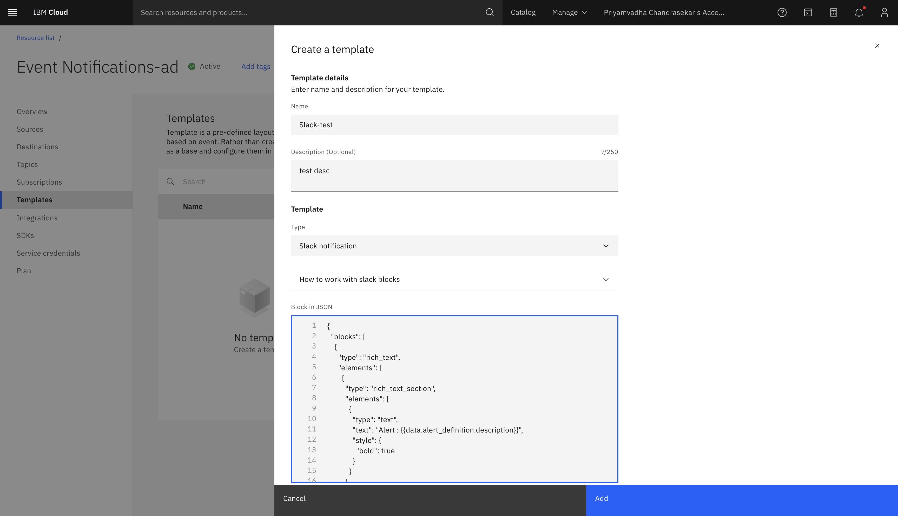

---

copyright:
  years: 2025
lastupdated: "2025-01-02"

keywords: event-notifications, event notifications, about event notifications, templates, slack

subcollection: event-notifications

---

{{site.data.keyword.attribute-definition-list}}


# Slack Notification Template
{: #en-slack-notification-template}

Slack is a messaging platform that helps teams to connect and collaborate. When you select slack as a service destination, any subscribed notification about an event can be sent as a message to slack channels.
{: shortdesc}

For more information about the Slack destination, see [here](/docs/event-notifications?topic=event-notifications-en-destinations-slack).

## How to create a Slack Notification Template
{: #en-create-slack-template}

Construct stacks of blocks. For more details, see the [Slack Block Kit](https://api.slack.com/block-kit){: external}.

Users can generate/validate a static JSON using the [block kit builders]( https://app.slack.com/block-kit-builder/T07002MUJDU#%7B%22blocks%22:%5B%5D%7D).
This is added as a slack template in Event Notifications.

### Example Create Template Usage:
{: #en-slack-template}

#### Input API for Templates

The Input API for Templates provides a mechanism for users to define notification message templates programmatically. Users can generate JSON blocks representing Block Kit layouts using the Block Kit Builder and encode them in base64 format to include in their templates.

#### JSON Blocks

JSON blocks represent the layout and structure of notification messages using the Slack Block Kit format. Users can create rich and interactive message layouts by defining various block types such as sections, actions, and buttons. Handlebars can be used with json blocks for powerful integration.You can design your json blocks via following builder - https://app.slack.com/block-kit-builder

##### Usage:

```json
{
   "blocks": [
      {
         "type": "section",
         "text": {
            "type": "mrkdwn",
            "text": "This is a notification message."
         }
      },
      {
         "type": "divider"
      },
      {
         "type": "actions",
         "elements": [
            {
               "type": "button",
               "text": {
                  "type": "plain_text",
                  "text": "View Details",
                  "emoji": true
               },
               "url": "https://example.com/details"
            }
         ]
      }
   ]
}
```

#### Base64 Encoding

To include JSON blocks in the template, they need to be encoded in base64 format. This ensures that the data is transmitted safely and can be decoded accurately when rendering the notification message.

##### Example Create Template Usage:

```plaintext
{
	"name": "Template for",
	"params": {
		"body": "eyJibG9ja3MiOlt7InR5cGUiOiJzZWN0aW9uIiwidGV4dCI6eyJ0eXBlIjoibXJrZG93biIsInRleHQiOiJUaGlzIGlzIGEgbm90aWZ5aW5nIG1lc3NhZ2UuIn19LHsidHlwZSI6ImRpdmlkZXIiLCJ0ZXh0Ijp7InR5cGUiOiJtbmF2IiwidGV4dCI6IlRoaXMgaXMgYSBuZXcgbm90aWZ5aW5nIG1lc3NhZ2UuIiwiZW1vamkiOnRydWV9fV0seyJ0eXBlIjoiYWN0aW9ucyIsImVsZW1lbnRzIjpbeyJ0eXBlIjoicGxhaW5fdGV4dCIsInRleHQiOnsic2VsZWN0aW9yIjp7InR5cGUiOiJwbGFpbl90ZXh0IiwidGV4dCI6IlZpZXcgRGV0YWlscyIsImVtb2ppIjp0cnVlfX19XX0="
	},
	"type": "slack.notification"
}
```
{: caption="Create Slack Template" caption-side:"bottom"}
