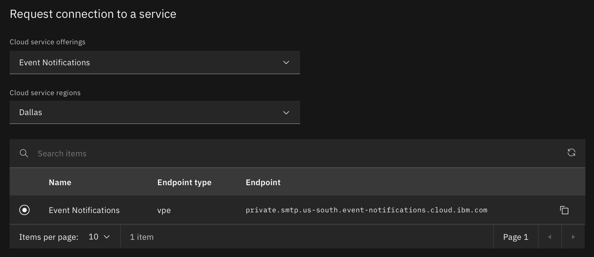

---
copyright:
  years: 2021, 2024
lastupdated: "2024-10-07"

keywords: event-notifications, event notifications, about event notifications, destinations, email, smtp

subcollection: event-notifications
---

{{site.data.keyword.attribute-definition-list}}

# Using the {{site.data.keyword.en_short}} SMTP Interface
{: #en-smtp-configurations}

IBM Cloud Event Notifications supports SMTP, the most common email protocol on the internet. You can send email using a variety of clients, software, or programming languages that support SMTP by connecting to the IBM Cloud Event Notifications SMTP interface. This document explains how to set up SMTP configuration, obtain user credentials, and setup a CBR rule to access the SMTP server.

## Domain name verification
{: #en-smtp-configurations-verify}

After creating a SMTP configuration in an IBM Cloud Event Notifications instance, you need to perform three types of verifications to get the required parameters to send email via the SMTP Interface. These verifications are located under the 'Verify' tab, accessible by clicking the `⋮` menu.

1. Create Sender Policy Framework (SPF), which is used to authenticate the sender of an email. SPF specifies the mail servers that are allowed to send email for your domain.
    * Make sure the domain already exists as an A record in the DNS records.
    * Open your DNS hosting provider for the domain name configured
    * Create a new TXT record with your domain name registerer with the name and value provided in the configure screen for SPF
2. Create DomainKeys Identified Mail (DKIM), which allows an organization to take responsibility for transmitting a message by signing it. DKIM allows the receiver to check the email that claimed to have come from a specific domain, is authorized by the owner of that domain.
    * Open your DNS hosting provider for the domain name configured
    * Create a new TXT record with your domain name registerer with the name and value provided in the configure screen for DKIM
3. For the enhanced security we do manual verification about the SMTP interface requirement using following questionnaire:

    ```text
    1. Will the nature of the email content be Marketing or Transactional?

    2. What is your website's URL?

    3. Explain how you plan to use IBM Cloud Event Notifications to send email. To help us process your request, you should answer the following questions:

    a. What is your strategy for creating or obtaining your email subscriber list?

    b. What is your approach to managing bounced emails and handling recipient complaints?

    c. What methods do you have in place for recipients to unsubscribe from your email communications?

    d. How did you determine the sending rate or quota specified in your request?

    e. Are you regularly cleaning your email list to remove invalid or outdated email addresses?

    4. Indicate the email addresses where you wish to receive account-related communications. You can provide a list of up to four email addresses, separated by commas.

    5. In the Event Notifications subscription, you are asked to provide a Reply-To field. Confirm that this is a valid email-id with a mailbox.

    6. Include a statement affirming your commitment to sending emails only to individuals who have explicitly requested them, and verify that you have established a procedure for managing bounce and complaint notifications.

    7. Whether you have a manual or automated process in place for handling unsubscribes, it's important to provide an "unsubscribe" link in the email payload you send. When recipients decide not to receive further emails, they can simply click on the 'unsubscribe' link and remove their email address from your mailing list. Add a statement that you agree to have an “unsubscribe” link in the email payload that you send.

    8. If you send the html content in the notification payload, do you have a process to validate this content is well formatted? Ill formatted HTML content may descrese the server reputation.
    ```
    {: codeblock}

    While many questions are self-explanatory, we have provided explanations for a few to ensure clarity.

    * Provide the Nature of Email: Marketing or Transactional.
        * Marketing Email: These emails are distributed to a broad audience, targeting a list of prospects or customers with marketing and promotional content, such as encouraging a purchase or downloading information.
        * Transactional Email: These emails are individualized for each recipient, typically triggered by specific user actions, such as making a website purchase or requesting a password reset.

    * A Website URL is required to gain a clearer understanding of the type of content you intend to send.
    * A valid Reply-To email ID is required to receive information about rejected or bounced emails.
    * Well-formatted Email content is required to prevent emails from being classified as Spam at the recipient's end. Emails that are not well-formatted (i.e., not in HTML) can result in Email Service Providers classifying the emails as Spam.

    Upon filling out answers to the aforementioned questions, users have to request for the enablement of SMTP interface Event Notifications verification via Support Ticket:

    1. From the {{site.data.keyword.cloud_notm}} console menu bar, click the **Help** icon > **Support center**.
    1. From the Contact support section, click **Create a case**.
    1. Select under `Category`, `Topic` as Event Notifications and `Subtopic` as Others
    1. Under `Subject` add **Requesting for the Authorization to Enable SMTP Interface for Event Notifications**
    1. In the 'Description' section firstly provide IBM Cloud Event Notifications `instance id`, `region` in which instance is created, and a `DKIM Name` which is in the format of `{{uuid}}._domainkey.{{domain}}`
    1. Later, please include responses to the aforementioned questionnaire.
    1. Add **Attachments** if you want to provide more evidences supporting your answers
    1. Add required email Ids in the **Watchlist** section. And to know more about other options while creating a support case refer [here](https://{DomainName}/docs/get-support?topic=get-support-open-case){: external}.

Some of the common verification issues could be:

1. Ensure that the domain name is spelled correctly.
2. Verify that the DNS record for the domain is updated correctly, including SPF/DKIM values.
3. DNS propagation may take up to 72 hours to be updated across the internet.

It's worth noting that we perform periodic checks on the SPF and DKIM TXT records of the domain provided. To ensure uninterrupted email delivery, we recommend keeping the records inserted in the DNS even after verifying them once. If the SPF or DKIM fails in the periodic check, we will suspend email sending.
{: note}

## Enabling context-based restrictions to access the SMTP interface
{: #en-smtp-configurations-cbr}

The legacy IP-based allowlisting for the SMTP interface is now deprecated. It is mandatory to migrate to context-based restrictions when connecting to the SMTP interface. Current allowlisted IPs will remain functional for the next six months, allowing time for this transition.
{: note}

By default access to the SMTP interface is restricted from any IP addresses. To allow access to the SMTP interface, you must enable [context-based restrictions](/docs/event-notifications?topic=event-notifications-en-access-control-cbr). Specifically to access the SMTP interface, you must select the [API type as SMTP Configuration](/docs/event-notifications?topic=event-notifications-en-access-control-cbr#en-manage-cbr-apis) while setting up the CBR rule.

All the set of IPs associated in the network zone selected while setting up the CBR rule will be automatically allowlisted to connect to the SMTP server.

It is mandatory to setup CBR rules for the IBM Cloud Event Notifications instances you intend to use for SMTP interface feature
{: note}

## Requirements to send email over SMTP Interface
{: #en-smtp-configurations-requirements}

After successful verification of a SMTP configuration in an IBM Cloud Event Notifications instance, to send email using SMTP Interface you need following parameters:

1. The list of IBM Cloud Event Notifications SMTP endpoints for each region is mentioned in below table:
    
    | Event Notifications Instance Region | SMTP Public Endpoint                                   | SMTP Private Endpoint
    |-------------------------------------|-------------------------------------------------|---------------------------------------------------------|
    | us-south (Dallas)                   | smtp.us-south.event-notifications.cloud.ibm.com | private.smtp.us-south.event-notifications.cloud.ibm.com |
    | au-syd (Sydney)                     | smtp.us-south.event-notifications.cloud.ibm.com | private.smtp.us-south.event-notifications.cloud.ibm.com |
    | eu-gb (London)                      | smtp.us-south.event-notifications.cloud.ibm.com | private.smtp.us-south.event-notifications.cloud.ibm.com |
    | eu-de (Frankfurt)                   | smtp.eu-de.event-notifications.cloud.ibm.com    | private.smtp.eu-de.event-notifications.cloud.ibm.com    |
    | eu-es (Madrid)                      | smtp.eu-de.event-notifications.cloud.ibm.com    | private.smtp.eu-de.event-notifications.cloud.ibm.com    |
    {: caption="IBM Cloud Event Notifications SMTP endpoints" caption-side="bottom"}

    The SMTP Endpoints are available in following regions: `us-south` and `eu-de`. For example, it can be seen as instances created in London and Sydney also connect to the Dallas SMTP endpoint, and instances created in Madrid also connect to the Frankfurt SMTP endpoint.
    {: note}

2. The SMTP interface port number. Currently supported port 587.

3. The SMTP username and password. Usernames and passwords are unique across SMTP configurations and passwords are encrypted using single-way hashing. A maximum of 5 users can be created in a single SMTP configuration. We are currently supporting `Login` and `Plain` authentication methods from the SMTP protocol.

4. IBM Cloud Event Notifications SMTP interface currently supports connection over `StartTLS` method for secure data transmission over networks.

5. Client software or program can communicate strictly using Transport Layer Security (TLS).

6. Valid IP addresses or subnets can be provided from which the client is connecting to the SMTP interface.

7. When accessing IBM Cloud Event Notifications through the SMTP interface, your SMTP client application assembles the message. The information you need to provide may vary depending on the application you are using. The following are the minimum requirements for an SMTP exchange between a client and a server:
   * Source address: The source address must belong to the configured domain; otherwise, the sender address will be rejected.
   * Destination address: The destination address can be any valid email address or set of email addresses
   * Message data: Ensure that the message data is spam-free, clean, and sensible.

8. The outgoing IP address list based on the SMTP endpoint is mentioned below. These IPs will be listed on the receiver's email clients:

    | SMTP Endpoint                                   | Outgoing IP addresses                                                                         |
    |-------------------------------------------------|-----------------------------------------------------------------------------------------------|
    | smtp.us-south.event-notifications.cloud.ibm.com | 150.240.68.207, 52.118.103.220, 169.47.95.114, 169.59.33.169, 150.239.167.120, 52.118.185.176 |
    | smtp.eu-de.event-notifications.cloud.ibm.com    | 149.81.218.203, 158.177.6.24, 149.81.39.14, 158.176.12.194, 149.81.164.10, 161.156.160.31     |
    {: caption="IBM Cloud Event Notifications OUtgoing IP addresses" caption-side="bottom"}

9. As per the current configurations, attachments are not supported in Event Notifications SMTP interface.

## Using SMTP interface for sending emails
{: #en-smtp-configurations-send-emails}

1. Configure SMTP-enabled software, including ServiceNow, Jira, blogging platforms, RSS aggregators, list management software, and workflow systems, using the provided SMTP endpoint, port, and valid username-password credentials.
2. To send an email using the SMTP interface, you can use an SMTP-enabled programming language, email server, or application. Ensure that you complete all the required steps mentioned above and have the correct SMTP endpoint, port, and credentials to connect to the IBM Cloud Event Notifications SMTP interface.
3. If you currently administer your own email server, you can use the IBM Cloud SMTP endpoint, port, and credentials to send all your outgoing email through the Event Notifications SMTP configuration, without modifying your existing email clients and applications.
4. To interact with the IBM Cloud Event Notifications SMTP interface using the command line, follow the example below:

    ```sh
    openssl s_client -starttls smtp -connect {{smtp_endpoint}}:587
    ...
    ...
    ...
    auth login
    334 VXNlcm5hbWU6
    dXNlcm5hbWU=
    334 UGFzc3dvcmQ6
    cGFzc3dvcmQ=
    235 2.7.0 Authentication successful
    mail from: mailer@example.com
    250 2.1.0 Ok
    rcpt to: recipient@test.com
    250 2.1.5 Ok
    data
    354 End data with <CR><LF>.<CR><LF>
    from: Mailer <mailer@example.com>
    to: Recipient <recipent@test.com>
    Subject: IBM Cloud Event Notifications SMTP interface
    Get the all events securely from IBM EN SMTP Interface
    .
    ```
    {: codeblock}

### **Using SMTP Private Endpoint for sending emails**
{: #en-smtp-configurations-send-emails-using-private-endpoint}

1. To send emails via the SMTP Private Endpoint, you need to create or attach a Virtual Private Endpoint (VPE) to your IBM Cloud Virtual Private Cloud (VPC).
2. Make sure to attach the VPE gateway to the same VPC where your IKS (IBM Kubernetes Service) clusters or VSI (Virtual Service Instance) are deployed.
3. While creating VPE:
   
   1. Select the required Region and VPC, from where you want to connect to the SMTP Private Endpoint.
   2. Under "Request connection to a service", select "Event Notifications".
   3. Enable the endpoint: `private.smtp.<region>.event-notifications.cloud.ibm.com`
   4. Select the required subnet for the Reserved IP(Note: You can bind only one IP address per VPC zone to an endpoint gateway).
   
    {: caption="SMTP Private Endpoint VPE" caption-side="bottom"}

4. Create a **Network Zone** in **Context-Based-Restrictions(CBR)** for your VPC.
5. Create **CBR Rule** for **Event-Notifications Instance** and add above created **Network zone** (OR) Add above **Network Zone** to existing **CBR Rule** that you already created for **Event-Notifications Instance**.
6. Try using the respective SMTP Private Endpoint listed [here](/docs/event-notifications?topic=event-notifications-en-smtp-configurations#en-smtp-configurations-requirements).


## Tracking Email Status
{: #en-destinations-smtp-configurations-tracking-status}

* After sending emails from any of the above methods, you will receive a Queue ID, which will be beneficial for debugging purposes.
* This capability allows users to monitor the delivery status of emails sent through a Custom Email destination, ensuring transparency and enhancing the overall user experience. For more information, follow [these steps](/docs/event-notifications?topic=event-notifications-en-destination-email-custom-domain-status).
