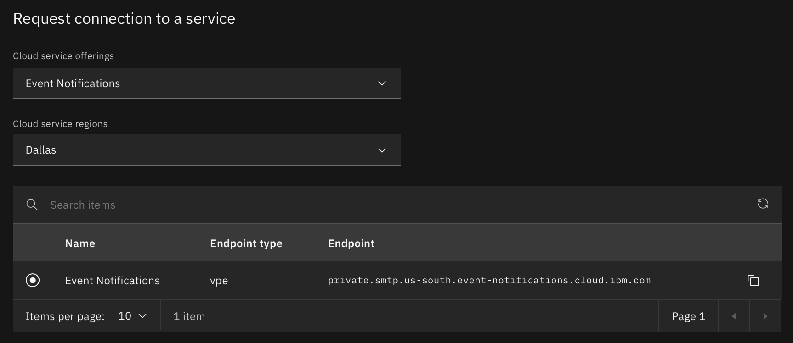

---
copyright:
  years: 2021, 2026
lastupdated: "2026-05-11"

keywords: event-notifications, event notifications, about event notifications, destinations, email, smtp

subcollection: event-notifications
---

{{site.data.keyword.attribute-definition-list}}


# Using the {{site.data.keyword.en_short}} SMTP Interface
{: #en-smtp-configurations}

IBM Cloud Event Notifications supports SMTP, the most common email protocol on the internet. You can send email using a variety of clients, software, or programming languages that support SMTP by connecting to the IBM Cloud Event Notifications SMTP interface. This document explains how to set up SMTP configuration, obtain user credentials, and set up a CBR rule to access the SMTP server.

## Creating a SMTP Configuration
{: #en-smtp-configuration-create}

1. Create an {{site.data.keyword.en_short}} instance. To learn the process of creating an instance, see [Getting Started](/docs/event-notifications?topic=event-notifications-getting-started).

2. Navigate to the instance dashboard and click **SMTP Configurations** in the left navigation pane.

3. Click **Add+**.

4. Provide the name, an optional description and the domain name.

5. Click **Add**.

## Domain name verification
{: #en-smtp-configurations-verify}

After creating a SMTP configuration in an IBM Cloud Event Notifications instance, you need to perform three types of verifications to get the required parameters to send email via the SMTP Interface. These verifications are located under the 'Verify' tab, accessible by clicking the `⋮` menu.

1. Create Sender Policy Framework (SPF), which is used to authenticate the sender of an email. SPF specifies the mail servers that are allowed to send email for your domain.
    * Make sure the domain already exists as an A record in the DNS records.
    * Open your DNS hosting provider for the domain name configured
    * Create a new TXT record with your domain name registerer with the name and value provided in the configure screen for SPF
2. Create DomainKeys Identified Mail (DKIM), which allows an organization to take responsibility for transmitting a message by signing it. DKIM allows the receiver to check the email that claimed to have come from a specific domain, is authorized by the owner of that domain.
    * Open your DNS hosting provider for the domain name configured
    * Create a new TXT record with your domain name registerer with the name and value provided in the configure screen for DKIM
3. For the enhanced security we perform manual verification about the SMTP interface requirement using following questionnaire:

    ```text
    1. Will the nature of the email content be Marketing or Transactional?

    2. What is your website's URL?

    3. Explain how you plan to use IBM Cloud Event Notifications to send email. To help us process your request, you should answer the following questions:

    a. What is your strategy for creating or obtaining your email subscriber list?

    b. What is your approach to managing bounced emails and handling recipient complaints?

    c. What methods do you have in place for recipients to unsubscribe from your email communications?

    d. How did you determine the sending rate or quota specified in your request?

    e. Are you regularly cleaning your email list to remove invalid or outdated email addresses?

    4. Indicate the email addresses where you wish to receive account-related communications. You can provide a list of up to four email addresses, separated by commas.

    5. In the Event Notifications subscription, you are asked to provide a Reply-To field. Confirm that this is a valid email-id with a mailbox.

    6. Include a statement affirming your commitment to sending emails only to individuals who have explicitly requested them, and verify that you have established a procedure for managing bounce and complaint notifications.

    7. Whether you have a manual or automated process in place for handling unsubscribes, it's important to provide an "unsubscribe" link in the email payload you send. When recipients decide not to receive further emails, they can simply click on the 'unsubscribe' link and remove their email address from your mailing list. Add a statement that you agree to have an “unsubscribe” link in the email payload that you send.

    8. If you send the html content in the notification payload, do you have a process to validate this content is well formatted? Poorly formatted HTML content may decrease the server reputation.
    ```
    {: codeblock}

    While many questions are self-explanatory, we have provided explanations for a few to ensure clarity.

    * Provide the Nature of Email: Marketing or Transactional.
        * Marketing Email: These emails are distributed to a broad audience, targeting a list of prospects or customers with marketing and promotional content, such as encouraging a purchase or downloading information.
        * Transactional Email: These emails are individualized for each recipient, typically triggered by specific user actions, such as making a website purchase or requesting a password reset.

    * A Website URL is required to gain a clearer understanding of the type of content you intend to send.
    * A valid Reply-To email ID is required to receive information about rejected or bounced emails.
    * Well-formatted Email content is required to prevent emails from being classified as Spam at the recipient's end. Emails that are not well-formatted (i.e., not in HTML) can result in Email Service Providers classifying the emails as Spam.

    Upon filling out answers to the aforementioned questions, users must request the enablement of SMTP interface Event Notifications verification via Support Ticket:

    1. From the {{site.data.keyword.cloud_notm}} console menu bar, click the **Help** icon > **Support center**.
    1. From the Contact support section, click **Create a case**.
    1. Select under `Category`, `Topic` as Event Notifications and `Subtopic` as Others
    1. Under `Subject` add **Requesting for the Authorization to Enable SMTP Interface for Event Notifications**
    1. In the 'Description' section first provide IBM Cloud Event Notifications `instance id`, `region` in which instance is created, and a `DKIM Name` which is in the format of `{{uuid}}._domainkey.{{domain}}`
    1. Later, please include responses to the aforementioned questionnaire.
    1. Add **Attachments** if you want to provide more evidence supporting your answers
    1. Add required email Ids in the **Watchlist** section. And to know more about other options while creating a support case refer [here](/docs/support?topic=support-open-case&interface=ui){: external}.

Some of the common verification issues could be:

1. Ensure that the domain name is spelled correctly.
2. Verify that the DNS record for the domain is updated correctly, including SPF/DKIM values.
3. DNS propagation may take up to 72 hours to be updated across the internet.

It's worth noting that we perform periodic checks on the SPF and DKIM TXT records of the domain provided. To ensure uninterrupted email delivery, we recommend keeping the records inserted in the DNS even after verifying them once. If the SPF or DKIM fails in the periodic check, we will suspend email sending.
{: note}

## Enabling context-based restrictions to access the SMTP interface
{: #en-smtp-configurations-cbr}

The legacy IP-based allowlisting for the SMTP interface is now deprecated. It is mandatory to migrate to context-based restrictions when connecting to the SMTP interface. Current allowlisted IPs will remain functional for the next six months, allowing time for this transition.
{: note}

By default, access to the SMTP interface is restricted from any IP addresses. To allow access to the SMTP interface, you must enable [context-based restrictions](/docs/event-notifications?topic=event-notifications-en-access-control-cbr). Specifically to access the SMTP interface, you must select the [API type as SMTP Configuration](/docs/event-notifications?topic=event-notifications-en-access-control-cbr#en-manage-cbr-apis) while setting up the CBR rule.

The set of IPs associated in the network zone selected while setting up the CBR rule will be automatically allowlisted to connect to the SMTP server.

It is mandatory to set up CBR rules for the IBM Cloud Event Notifications instances you intend to use for SMTP interface feature
{: note}

## Requirements to send email over SMTP Interface
{: #en-smtp-configurations-requirements}

After successful verification of a SMTP configuration in an IBM Cloud Event Notifications instance, to send email using the SMTP Interface you need the following parameters:

1. You can connect to Event Notifications SMTP interface using Public endpoints or Private endpoints via CSE (Cloud Service Endpoint) and VPE (Virtual Private Endpoint) gateway. The SMTP endpoints are available in the `us-south` (Dallas) and `eu-de` (Frankfurt) regions.

    **Dallas (`us-south`) SMTP endpoint:**
    - SMTP Public Endpoint: `smtp.us-south.event-notifications.cloud.ibm.com`
    - SMTP Private Endpoint: `private.smtp.us-south.event-notifications.cloud.ibm.com`
    - Event Notifications instances in the following regions connect to this endpoint: us-south (Dallas), ca-tor (Toronto), jp-tok (Tokyo), jp-osa (Osaka), au-syd (Sydney), eu-gb (London), br-sao (Sao Paulo), ca-mon (Montreal), in-che (Chennai), us-east (Washington DC), in-mum (Mumbai)

    **Frankfurt (`eu-de`) SMTP endpoint:**
    - SMTP Public Endpoint: `smtp.eu-de.event-notifications.cloud.ibm.com`
    - SMTP Private Endpoint: `private.smtp.eu-de.event-notifications.cloud.ibm.com`
    - Event Notifications instances in the following regions connect to this endpoint: eu-de (Frankfurt), eu-es (Madrid)

1. The SMTP interface port numbers and encryption methods. {{site.data.keyword.en_short}} supports two ports for SMTP connections:

   | Port | Encryption Method | Description | How It Works |
   |------|-------------------|-------------|--------------|
   | 587 | STARTTLS (Explicit TLS) | Connection starts unencrypted and upgrades to TLS | The initial connection is established in plain text. Your SMTP client issues the STARTTLS command to initiate a TLS handshake, upgrading the connection to an encrypted channel. Also known as "opportunistic TLS." |
   | 465 | TLS Wrapper (Implicit TLS/SSL) | Connection is encrypted from the start | The TLS/SSL handshake occurs immediately upon connection, before any SMTP commands are exchanged. The entire SMTP session is wrapped in a TLS/SSL layer. Also known as SMTPS (SMTP Secure). |
   {: caption="Table 1. Supported SMTP ports and encryption methods" caption-side="bottom"}

   Both ports provide secure email transmission with strong encryption. Choose the port that best fits your SMTP client's configuration requirements and security policies.

1. The SMTP username and password. A maximum of 5 users can be created in a single SMTP configuration. Event Notifications supports `Login` and `Plain` authentication methods from the SMTP protocol.

    When you create an SMTP user, you receive a username and password. However, password-based authentication will be deprecated in the near future. You must migrate to API key-based authentication using Service IDs. For more information, see [Using API keys for SMTP authentication](#en-smtp-configurations-api-keys).
    {: deprecated}

    Once the SMTP username and password is created, you can clone the same credentials across SMTP configurations if you need the same credentials for other SMTP configurations/Domains within the **same instance**. This is supported via API/CLI/SDK and Terraform.
    {: note}


1. Valid IP addresses or subnets can be [allowlisted from CBR](/docs/event-notifications?topic=event-notifications-en-smtp-configurations#en-smtp-configurations-cbr) through which the client can connect to the SMTP interface.

1. IBM Cloud Event Notifications SMTP interface supports secure connections using either `STARTTLS` (port 587) or implicit `TLS/SSL` (port 465) for secure data transmission over networks.

1. When accessing IBM Cloud Event Notifications through the SMTP interface, your SMTP client application assembles the message. The information you need to provide may vary depending on the application you are using. The following are the minimum requirements for an SMTP exchange between a client and a server:
   * Source address: The source address must belong to the configured domain; otherwise, the sender address will be rejected.
   * Destination address: The destination address can be any valid email address or set of email addresses.
   * Message data: Ensure that the message data is spam-free, clean, and sensible.

 According to the current configurations, attachments are not supported in Event Notifications SMTP interface.
 {: note}


### Using API keys for SMTP authentication
{: #en-smtp-configurations-api-keys}

To use multiple API keys for SMTP authentication, you must create a Service ID and assign the appropriate SMTP role. The API keys created for the Service ID act as passwords for the SMTP user, providing enhanced security and flexibility.

#### Creating API keys for SMTP users
{: #en-smtp-configurations-create-api-keys}

To create API keys for SMTP users, complete the following steps:

1. Create a Service ID and configure your Event Notifications instance as part of access policy. To learn how to create and configure Service IDs, see [Creating and working with service IDs](/docs/iam?topic=iam-serviceids&interface=ui) and [Assigning access in the console](/docs/iam?topic=iam-account-services&interface=ui).

1. Assign the SMTP role to the Service ID. This role grants the Service ID permission to authenticate to the SMTP interface. Confirm your access policy, resource, and the role.

1. Create one or more API keys for the Service ID. To learn how to create and manage API keys, see [Managing service ID API keys](/docs/iam?topic=iam-serviceidapikeys&interface=ui).

1. Use the API key as the password when authenticating to the SMTP interface. The username remains the SMTP username you received when creating the SMTP user.

#### API key limits
{: #en-smtp-configurations-api-key-limits}

The number of API keys you can create per Service ID is determined by IBM Cloud IAM limits. For current limits and quotas, check [IAM limits](/docs/account?topic=account-known-issues#iam_limits).


## Using SMTP interface for sending emails
{: #en-smtp-configurations-send-emails}

1. Configure SMTP-enabled software, including ServiceNow, Jira, blogging platforms, RSS aggregators, list management software, and workflow systems, using the provided SMTP endpoint, port, and valid username-password credentials.
2. To send an email using the SMTP interface, you can use an SMTP-enabled programming language, email server, or application. Ensure that you complete all the required steps mentioned above and have the correct SMTP endpoint, port, and credentials to connect to the IBM Cloud Event Notifications SMTP interface.
3. If you currently administer your own email server, you can use the IBM Cloud SMTP endpoint, port, and credentials to send all your outgoing email through the Event Notifications SMTP configuration, without modifying your existing email clients and applications.
4. To interact with the IBM Cloud Event Notifications SMTP interface using the command line, see the following examples:

    **Example using port 587 with STARTTLS:**
    ```sh
    swaks --to recipient@example.com --from sender@yourdomain.com --server smtp.us-south.event-notifications.cloud.ibm.com --port 587 --auth PLAIN --auth-user <your-smtp-username> --auth-password <your-smtp-password> --tls
    === Trying smtp.us-south.event-notifications.cloud.ibm.com:587...
    === Connected to smtp.us-south.event-notifications.cloud.ibm.com.
    <- 220 mail.event-notifications.cloud.ibm.com ESMTP Service Ready
     -> EHLO your-hostname.local
    <- 250-Hello your-hostname.local
    <- 250-PIPELINING
    <- 250-8BITMIME
    <- 250-ENHANCEDSTATUSCODES
    <- 250-CHUNKING
    <- 250-STARTTLS
    <- 250-SIZE 31457280
    <- 250 LIMITS RCPTMAX=100
     -> STARTTLS
    <- 220 2.0.0 Ready to start TLS
    === TLS started with cipher TLSv1.3:AEAD-CHACHA20-POLY1305-SHA256:256
    === TLS client certificate not requested and not sent
    === TLS no client certificate set
    === TLS peer[0]  subject=[/CN=smtp.us-south.event-notifications.cloud.ibm.com]
    ===        commonName=[smtp.us-south.event-notifications.cloud.ibm.com], subjectAltName=[DNS:private.smtp.us-south.event-notifications.cloud.ibm.com, DNS:smtp.us-south.event-notifications.cloud.ibm.com] notAfter=[2026-07-12T14:18:53Z]
    === TLS peer[1]  subject=[/C=US/O=Let's Encrypt/CN=E8]
    ===        commonName=[E8], subjectAltName=[] notAfter=[2027-03-12T23:59:59Z]
    === TLS peer certificate passed CA verification, passed host verification (using host smtp.us-south.event-notifications.cloud.ibm.com to verify)
     ~> EHLO your-hostname.local
    <~ 250-Hello your-hostname.local
    <~ 250-PIPELINING
    <~ 250-8BITMIME
    <~ 250-ENHANCEDSTATUSCODES
    <~ 250-CHUNKING
    <~ 250-AUTH PLAIN
    <~ 250-SIZE 31457280
    <~ 250 LIMITS RCPTMAX=100
     ~> AUTH PLAIN <base64-encoded-credentials>
    <~ 235 2.0.0 Authentication succeeded
     ~> MAIL FROM:<sender@yourdomain.com>
    <~ 250 2.0.0 Roger, accepting mail from <sender@yourdomain.com>
     ~> RCPT TO:<recipient@example.com>
    <~ 250 2.0.0 I'll make sure <recipient@example.com> gets this
     ~> DATA
    <~ 354 Go ahead. End your data with <CR><LF>.<CR><LF>
     ~> Date: Tue, 14 Apr 2026 15:35:16 +0530
     ~> To: recipient@example.com
     ~> From: sender@yourdomain.com
     ~> Subject: test Tue, 14 Apr 2026 15:35:16 +0530
     ~> Message-Id: <20260414153516.009507@your-hostname.local>
     ~> X-Mailer: swaks v20240103.0 jetmore.org/john/code/swaks/
     ~>
     ~> This is a test mailing
     ~>
     ~>
     ~> .
    <~ 250 2.0.0 Ok: queued
     ~> QUIT
    <~ 221 2.0.0 Bye
    ```
    {: codeblock}

    **Example using port 465 with implicit TLS/SSL:**
    ```sh
    swaks --to recipient@example.com --from sender@yourdomain.com --server smtp.us-south.event-notifications.cloud.ibm.com --port 465 --auth PLAIN --auth-user <your-smtp-username> --auth-password <your-smtp-password> --tls-on-connect
    === Trying smtp.us-south.event-notifications.cloud.ibm.com:465...
    === Connected to smtp.us-south.event-notifications.cloud.ibm.com.
    === TLS started with cipher TLSv1.3:AEAD-CHACHA20-POLY1305-SHA256:256
    === TLS client certificate not requested and not sent
    === TLS no client certificate set
    === TLS peer[0]  subject=[/CN=smtp.us-south.event-notifications.cloud.ibm.com]
    ===        commonName=[smtp.us-south.event-notifications.cloud.ibm.com], subjectAltName=[DNS:private.smtp.us-south.event-notifications.cloud.ibm.com, DNS:smtp.us-south.event-notifications.cloud.ibm.com] notAfter=[2026-07-12T14:18:53Z]
    === TLS peer[1]  subject=[/C=US/O=Let's Encrypt/CN=E8]
    ===        commonName=[E8], subjectAltName=[] notAfter=[2027-03-12T23:59:59Z]
    === TLS peer certificate passed CA verification, passed host verification (using host smtp.us-south.event-notifications.cloud.ibm.com to verify)
    <~ 220 mail.event-notifications.cloud.ibm.com ESMTP Service Ready
     ~> EHLO your-hostname.local
    <~ 250-Hello your-hostname.local
    <~ 250-PIPELINING
    <~ 250-8BITMIME
    <~ 250-ENHANCEDSTATUSCODES
    <~ 250-CHUNKING
    <~ 250-AUTH PLAIN
    <~ 250-SIZE 31457280
    <~ 250 LIMITS RCPTMAX=100
     ~> AUTH PLAIN <base64-encoded-credentials>
    <~ 235 2.0.0 Authentication succeeded
     ~> MAIL FROM:<sender@yourdomain.com>
    <~ 250 2.0.0 Roger, accepting mail from <sender@yourdomain.com>
     ~> RCPT TO:<recipient@example.com>
    <~ 250 2.0.0 I'll make sure <recipient@example.com> gets this
     ~> DATA
    <~ 354 Go ahead. End your data with <CR><LF>.<CR><LF>
     ~> Date: Tue, 14 Apr 2026 15:36:25 +0530
     ~> To: recipient@example.com
     ~> From: sender@yourdomain.com
     ~> Subject: test Tue, 14 Apr 2026 15:36:25 +0530
     ~> Message-Id: <20260414153625.009884@your-hostname.local>
     ~> X-Mailer: swaks v20240103.0 jetmore.org/john/code/swaks/
     ~>
     ~> This is a test mailing
     ~>
     ~>
     ~> .
    <~ 250 2.0.0 Ok: queued
     ~> QUIT
    <~ 221 2.0.0 Bye
    ```
    {: codeblock}

### Using Virtual Private Endpoint (VPE) to send emails over SMTP Private Endpoint
{: #en-smtp-configurations-send-emails-using-private-endpoint}

1. To send emails via the SMTP Private Endpoint, you need to create or attach a Virtual Private Endpoint (VPE) to your IBM Cloud Virtual Private Cloud (VPC).
2. Make sure to attach the VPE gateway to the same VPC where your IKS (IBM Kubernetes Service) clusters or VSI (Virtual Service Instance) are deployed.
3. While creating VPE:

   1. Select the required Region and VPC, from where you want to connect to the SMTP Private Endpoint.
   2. Under **Request connection to a service**, select **Event Notifications**.
   3. Enable the endpoint: `private.smtp.<region>.event-notifications.cloud.ibm.com`
   4. Select the required subnet for the Reserved IP.
      You can bind only one IP address per VPC zone to an endpoint gateway.
      {: note}

    {: caption="SMTP Private Endpoint VPE" caption-side="bottom"}

4. Create a **Network Zone** in **Context-Based-Restrictions(CBR)** for your VPC.
5. Create **CBR Rule** for **Event-Notifications Instance** and add **Network zone** created above or add **Network Zone** to existing **CBR Rule** that you already created for **Event-Notifications Instance**.

6. Use the SMTP Private Endpoint listed in the [SMTP configurations requirements](/docs/event-notifications?topic=event-notifications-en-smtp-configurations#en-smtp-configurations-requirements).


## Tracking Email Status
{: #en-destinations-smtp-configurations-tracking-status}

* After sending emails from any of the above methods, you will receive a Queue ID, which will be beneficial for debugging purposes.
* This capability allows users to monitor the delivery status of emails sent through a Custom Email destination, ensuring transparency and enhancing the overall user experience. For more information, follow the steps to [monitor the delivery status of emails sent through a Custom Email destination](/docs/event-notifications?topic=event-notifications-en-destination-email-custom-domain-status).
