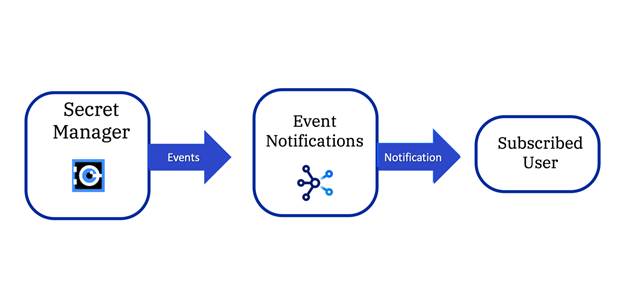

---

copyright:
   years: 2022
lastupdated: "2022-07-21"

keywords: event-notifications, event notifications, about event notifications, secrets manager certificates, secrets expiry 

subcollection: event-notifications

content-type: tutorial
account-plan: standard
completion-time: 30m

---

{{site.data.keyword.attribute-definition-list}}

# Monitor {{site.data.keyword.secrets-manager_full}} certificates and secrets expiry
{: #tutorial-en-monitor-secret}
{: toc-content-type="tutorial"}
{: toc-completion-time="30m"}
 
This tutorial shows you how to monitor the expiry date or any updates on the secrets or certificates by using TLS certificates or secrets. 
{: shortdesc}

{: caption="Figure 1. {{site.data.keyword.secrets-manager_short}} and {{site.data.keyword.en_short}}" caption-side="bottom"}

## How {{site.data.keyword.secrets-manager_short}} sends events
{: #tutorial-en-how-send}

When an event of interest takes place in your {{site.data.keyword.secrets-manager_short}} instance, it communicates with a connected {{site.data.keyword.en_short}} instance to forward a notification to a [Supported destination](/docs/event-notifications?topic=event-notifications-en-destination).

This tutorial shows you how to configure the following flow:

1. An alert is raised in {{site.data.keyword.secrets-manager_short}}.

1. {{site.data.keyword.secrets-manager_short}} sends a notification to {{site.data.keyword.en_short}}.

1. {{site.data.keyword.en_short}} creates an email and sends the email to the subscribed user.

Secrets Manager aggregates a list of your pending notifications by [event type](/docs/secrets-manager?topic=secrets-manager-event-notifications&interface=ui#event-notifications-list), the type of secret, and expiry details if they apply. Every few minutes, the service checks for and dispatches any pending notifications to the connected {{site.data.keyword.en_short}} service. For example, you might receive notifications that are similar to the following messages:

- You have five public certificate secrets that expire in 10 days.
- You have 100 imported certificate secrets that expire in 30 days.

You can be notified of a maximum 100 secrets in a single event notification.

## Before you begin
{: #cd-en-secrets-prereqs}

You need an {{site.data.keyword.cloud}} account. If you don't have an account, then [Create an {{site.data.keyword.cloud_notm}} account](https://cloud.ibm.com/registration/).

## Create an {{site.data.keyword.en_short}} service instance
{: #en-create-instance}
{: step}

1. Log in to your [{{site.data.keyword.cloud}}](https://cloud.ibm.com) account.

1. In the [{{site.data.keyword.cloud_notm}} catalog](https://cloud.ibm.com/catalog#services), search **Event Notifications > Event Notifications**.

1. Select a **Location** from the list of supported locations and select a pricing plan.

1. Enter a service name.

1. Select a resource group.

1. Accept the license agreement terms and click **Create**.

## Create an {{site.data.keyword.secrets-manager_short}} service instance
{: #en-create-secret-instance}
{: step}

1. In the [{{site.data.keyword.cloud_notm}} catalog](https://cloud.ibm.com/catalog#services), search **Secrets Manager > Secrets Manager**.

1. Select a **Location** from the list of supported locations and select a pricing plan.

1. Enter a service name.

1. Select a resource group.

1. Accept the license agreement terms and click **Create**.

## Connecting to {{site.data.keyword.en_short}} in the {{site.data.keyword.secrets-manager_short}} user interface 
{: #en-connect-secret}
{: step}

1. From the {{site.data.keyword.secrets-manager_short}} instance, click **Settings**.

1. In the Event Notifications section, click **Connect**.

1. In the side panel, review the source details for the connection. Optionally, provide a description.

1. Select the resource group and Event Notifications service instance that you want to connect to.

If an IAM authorization between {{site.data.keyword.secrets-manager_short}} and {{site.data.keyword.en_short}} doesn't exist in your account, a dialog is displayed. Follow the prompts to grant access between the services:

1. To grant access, click **Authorize**.

1. In the side panel, select **Event Notifications** as the target service.

1. From the list of instances, select the service instance that you want to authorize.

1. Select the Event Source Manager role.

1. Click **Review**.

1. Click **Assign**.

1. To confirm the connection, click **Connect**.

A success message is displayed to indicate that {{site.data.keyword.secrets-manager_short}} is now connected to {{site.data.keyword.en_short}}. 

## Verify the {{site.data.keyword.secrets-manager_short}} source in {{site.data.keyword.en_short}}
{: #en-verify-source}
{: step}

1. Click the menu icon **> Resource list**.

1. Open **Services and software**.

1. Open the {{site.data.keyword.secrets-manager_short}} instance that you created. For more information, see [Sending email notifications to {{site.data.keyword.en_short}}](/docs/monitoring?topic=monitoring-tutorial-en#en-create-instance) 

1. Click **Sources**.

When you connect to {{site.data.keyword.en_short}} in {{site.data.keyword.secrets-manager_short}}, a source, with the same name as your Secrets Manager instance name, is automatically added to your {{site.data.keyword.en_short}} list.

## Create an {{site.data.keyword.en_short}} destination
{: #en-secret-destination}
{: step}

This step ensures that an email destination exists where notifications are forwarded.

1. Click **Destinations**.

1. Notice in the Destinations list that, by default, an {{site.data.keyword.cloud_notm}} email service is defined. You do not need to do anything else to configure an email destination.

If you want to add a webhook as a destination, click **Add** and enter the appropriate information in the **Add a destination** panel.

## Create an {{site.data.keyword.en_short}} topic
{: #en-secret-topic}
{: step}

Define a topic that receives an event from {{site.data.keyword.secrets-manager_short}}.

1. Click **Topics**.

1. Click **Create**. 

1. In the **Topic details** panel enter the following details:
   - Enter the **Name** for your topic. For example, **MonitorSecretExpiry**.
   - For **Source** select the {{site.data.keyword.en_short}} source, which has the same name as your {{site.data.keyword.secrets-manager_short}} instance.
   - Select an **Event Type**. For this tutorial select **Secret about to expire**.
   - Select an **Event subtype**. For this tutorial select **Secret expire in 10 days**.
   - Select a **Severity**. For this tutorial select **High Severity**.

1. Click **Add a condition**. If you do not click **Add a condition** before you click **Create**, the topic is created with no conditions that are associated with it.

1. Click **Create**. Your topic is displayed in the Topics list.

Clicking **Add a condition** without selecting an **Event Type** sends the test event from {{site.data.keyword.secrets-manager_short}}.
{: note}

## Create an {{site.data.keyword.en_short}} email subscription
{: #en-secret-email-sub}
{: step}

Configure who receives an email when a notification is processed:

1. Click **Subscriptions**.

1. Click **Create**.

1. In the **Create a subscription** panel enter the following details:
   - Enter the **Name** for your subscription. For example, **SecretExpirySubscription**.
   - For **Topic** select the topic you created. For example, **MonitorSecretExpiry**.
   - For **Destination** select **{{site.data.keyword.cloud_notm}} email service**.
   - For **Recipients** enter a valid email address, for example, **MyEmail@MyCompany.com**.

1. Click **Create**. Your subscription is added to the Subscriptions list.

## Sending test event from {{site.data.keyword.secrets-manager_short}}
{: #en-secret-send-test-event}
{: step}

Send a test event as follows:

1. Click the **menu icon > Resource list**.

1. Open **Services and software**.

1. Open the {{site.data.keyword.secrets-manager_short}} instance that you created.

1. Click **Settings**.

1. Click send test event.

You should start receiving notifications at the email address that you configured whenever the criteria defined in both {{site.data.keyword.secrets-manager_short}} and {{site.data.keyword.en_short}} match.
