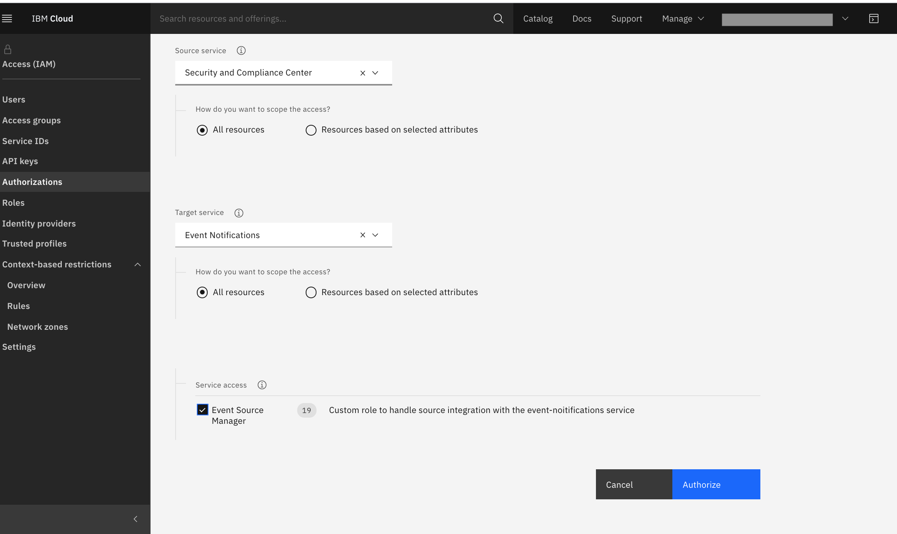

---

copyright:
  years: 2019, 2020
lastupdated: "2020-11-24"

keywords: question about event notifications, permission, integrating, authorization, authorize

subcollection: event-notifications

content-type: troubleshoot

---

{{site.data.keyword.attribute-definition-list}}

# Why am I denied permission to integrate an {{site.data.keyword.en_short}} instance?
{: #troubleshoot-integrate}
{: troubleshoot}
{: support} 

Denied permission while integrating an {{site.data.keyword.en_short}} service instance with an IBM Managed Service.
{: shortdesc}

'Permission denied' message, while integrating {{site.data.keyword.en_short}} service instance with IBM Managed Services. 
{: tsSymptoms}

{{site.data.keyword.en_short}} integration APIs use Service to Service [authorization](/docs/get-coding?topic=get-coding-grant-access).
{: tsCauses}

Grant authorization between the IBM Managed Service (for example: Security and Compliance Center) and {{site.data.keyword.en_short}} service instance.
{: tsResolve}

Manage --> Access (IAM) --> Authorization --> Create

{: caption="Figure 1. Grant authorization" caption-side="bottom"}