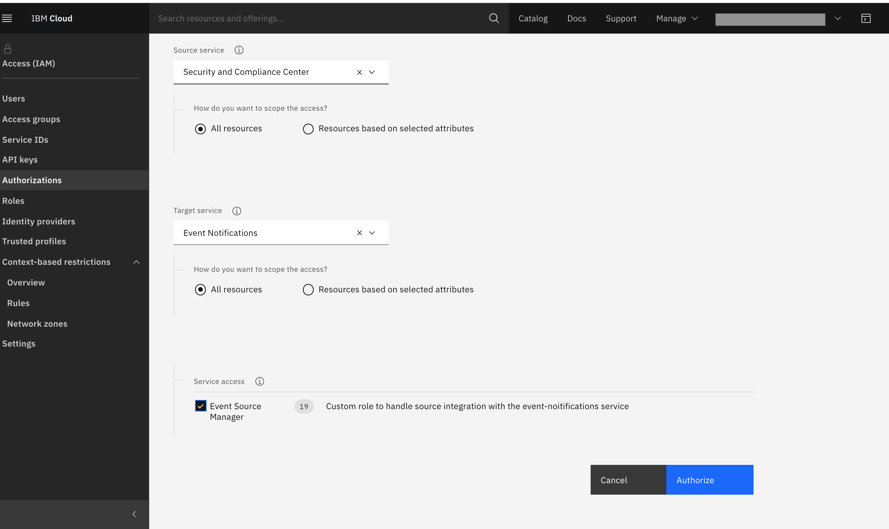

---

copyright:
  years: 2019, 2026
lastupdated: "2026-09-09"

keywords: question about event notifications, permission, integrating, authorization, authorize

subcollection: event-notifications

content-type: troubleshoot

---

{{site.data.keyword.attribute-definition-list}}

# Why don't I have permissions to integrate an {{site.data.keyword.en_short}} instance?
{: #troubleshoot-integrate}
{: troubleshoot}
{: support}

You are denied permission while integrating an {{site.data.keyword.en_short}} service instance with an IBM Cloud Service.
{: shortdesc}

You get a 'Permission denied' message, while integrating {{site.data.keyword.en_short}} service instance with IBM Cloud service.
{: tsSymptoms}

{{site.data.keyword.en_short}} integration APIs use Service to Service [authorization](/docs/iam?topic=iam-serviceauth&interface=ui){: external}.
{: tsCauses}

Grant authorization between the IBM Cloud Service (for example, Security and Compliance Center) and {{site.data.keyword.en_short}} service instance.
{: tsResolve}

In the {{site.data.keyword.cloud_notm}} console, go to **Manage** > **Access (IAM)** > **Authorizations** and click **Create**.

{: caption="Grant authorization" caption-side="bottom"}
