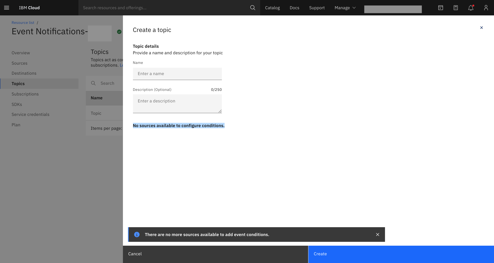
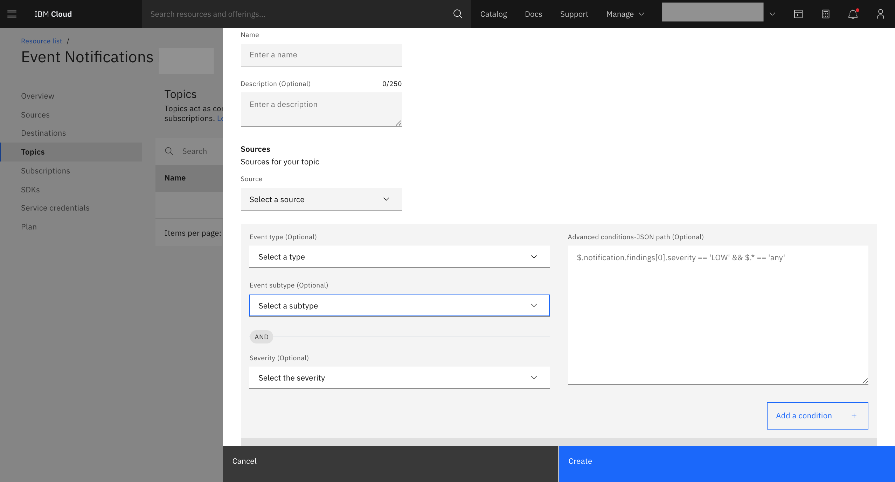

---

copyright:
  years: 2019, 2020
lastupdated: "2020-11-26"

keywords: question about event notifications, rules, topic

subcollection: event-notifications

content-type: troubleshoot

---

{{site.data.keyword.attribute-definition-list}}

# Why am I not able to write rules for the topic?
{: #troubleshoot-rules-topic}
{: troubleshoot}
{: support}

Section to add conditions (rules) for the topic are not visible.
{: shortdesc}

While creating a topic, you are not able to see the section to add conditions (rules) for the topic.
You see a message, 'No sources available to configure conditions'.
{: tsSymptoms}

{: caption="Figure 1. Unable to add conditions for the topic" caption-side="bottom"}

- {{site.data.keyword.en_short}} service is not integrated with IBM Managed Service (for example: {{site.data.keyword.compliance_short}}).
{: tsCauses}

- {{site.data.keyword.en_short}} service is integrated with IBM Managed service but source service is not added and authorized.

Provide service to service authorization between IBM Managed service and {{site.data.keyword.en_short}}.
Integrate {{site.data.keyword.en_short}} service with IBM Managed service, which registers IBM Managed service (for example, {{site.data.keyword.compliance_short}}) as source with {{site.data.keyword.en_short}} service instance.
{: tsResolve}

{: caption="Figure 2.  Add conditions for the topic)" caption-side="bottom"}

Once the source is registered with {{site.data.keyword.en_short}} service, you are all set to add conditions (rules) to the topic.