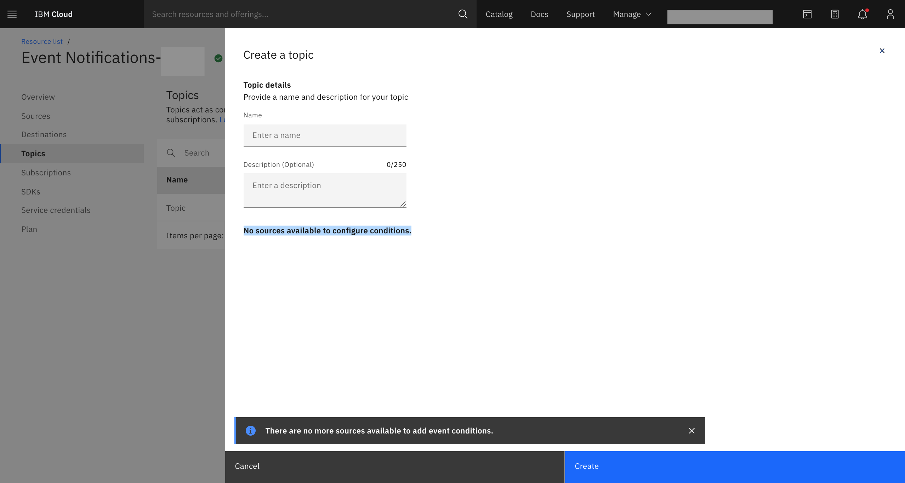
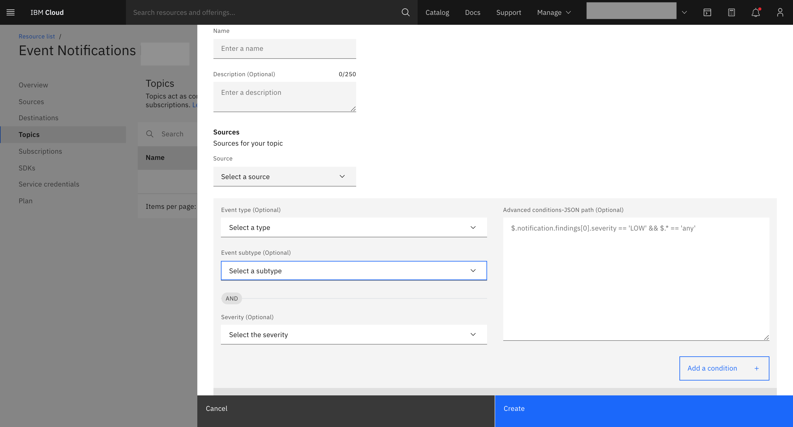

---

copyright:
  years: 2019, 2026
lastupdated: "2026-09-02"

keywords: question about event notifications, rules, topic

subcollection: event-notifications

content-type: troubleshoot

---

{{site.data.keyword.attribute-definition-list}}

# Why can't I write rules for the topic?
{: #troubleshoot-rules-topic}
{: troubleshoot}
{: support}

The section where you add rules, otherwise known as conditions, for a specific topic is not visible.
{: shortdesc}

When you create a topic, the section to add rules is not visible and you see the message: `No sources available to configure conditions`.
{: tsSymptoms}

{: caption="Unable to add conditions for the topic" caption-side="bottom"}

Either of the following issues might cause this error message:
{: tsCauses}

- {{site.data.keyword.en_short}} service is not integrated with the IBM Managed Service. For a list of integrated services, see [Event sources](/docs/event-notifications?topic=event-notifications-en-source).
- The service is not added as a source
- The service is not authorized.

Provide service-to-service authorization between the IBM Managed service and {{site.data.keyword.en_short}}.
Integrate {{site.data.keyword.en_short}} service with IBM Managed service, which registers IBM Managed service (for example, {{site.data.keyword.compliance_short}}) as source with {{site.data.keyword.en_short}} service instance.
{: tsResolve}

{: caption="Add conditions for the topic)" caption-side="bottom"}

When the source is registered with {{site.data.keyword.en_short}} service, you can add conditions (rules) to the topic.
