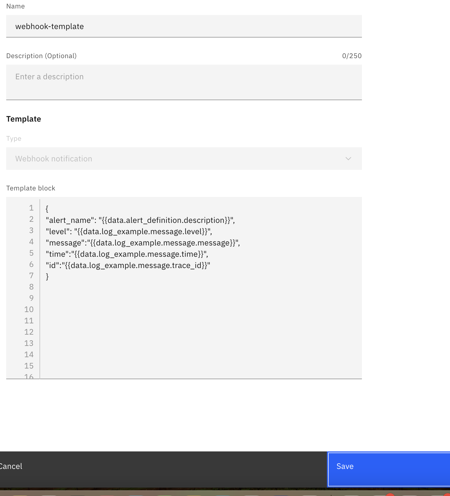

---

copyright:
  years: 2025
lastupdated: "2025-01-01"

keywords: event-notifications, event notifications, about event notifications, templates, webhook

subcollection: event-notifications

---

{{site.data.keyword.attribute-definition-list}}

# Webhook Notification Template
{: #en-webhook-notification-template}

A webhook represents a service destination, where an incoming notification can be consumed programmatically. 
For example, an incoming notification about an event can trigger a webhook destination to a backend microservice to act based on the content of the incoming notification.
{: shortdesc}

For more information about the Webhook destination, see [here](/docs/event-notifications?topic=event-notifications-en-destinations-webhook).

## How to construct a webhook notification template:
{: #en-construct-webhook-template}

Construct the template block. Make sure the template is a well-formed JSON that adheres to the Handlebars template syntax and semantics.

Handlebars is a templating language that allows for dynamic content generation within templates.Handlebars can be used to customize notification messages using template variables and conditional logic.

### Webhook notification template example
{: #webhook-template}

```json
    {
	"name": "Template for TIP",
	"params": {
		"body": "ewogIHt7I2VxdWFsIGRhdGEuYWxlcnRfZGVmaW5pdGlvbi5zZXZlcml0eSAiQ3JpdGljYWwifX0KCQkic2V2ZXJpdHkiOiAxLAoJe3svZXF1YWx9fQogIHt7I2VxdWFsIGRhdGEuYWxlcnRfZGVmaW5pdGlvbi5zZXZlcml0eSAiSW5mbyJ9fQoJCSJzZXZlcml0eSI6IDIsCgl7ey9lcXVhbH19CiAge3sjZXF1YWwgZGF0YS5hbGVydF9kZWZpbml0aW9uLnNldmVyaXR5ICJFcnJvciJ9fQoJCSJzZXZlcml0eSI6IDIsCgl7ey9lcXVhbH19CiAgImNvbnNvbGUiOiAidG9jIiwKICAidmVyc2lvbiI6ICIxLjAiLAogICJjcm4iOiB7CiAgICAgICJ2ZXJzaW9uIjogInYxIiwKICAgICJjdHlwZSI6ICJwdWJsaWMiLAogICAgImNuYW1lIjogImJsdWVtaXgiLAogICAgInJlc291cmNlX3R5cGUiOiAib2JqZWN0IiwKICAgICJyZXNvdXJjZSI6ICJldmVudC1ub3RpZmljYXRpb25zIiwKICAgICJzZXJ2aWNlX25hbWUiOiAiZXZlbnQtbm90aWZpY2F0aW9ucyIKICAgIH0sCiAgImFsZXJ0X2lkIjogInt7ZGF0YS5hbGVydF9kZWZpbml0aW9uLmlkfX0iLAogICJ0cmliZV9uYW1lIjogIk1vYmlsZSIsCiAgImRpc2FibGVfcGFnZXIiOiAiZmFsc2UiLAogICJzb3VyY2UiOiAie3tzb3VyY2V9fSIsCiAgInRpcF9tc2dfdHlwZSI6ICJjcmVhdGUubm90aWNlIiwKICAic2l0dWF0aW9uIjogInt7aWJtZW5kZWZhdWx0c2hvcnR9fSIsCiAgImN1c3RvbWVyX2ltcGFjdGluZyI6ICJmYWxzZSIsCiAgInJ1bmJvb2tfdG9jX2VuYWJsZWQiOiAiZmFsc2UiLAogICJzaG9ydF9kZXNjcmlwdGlvbiI6ICJ7e2libWVuZGVmYXVsdHNob3J0fX0iLAogICJwcm9kdWN0X3JlYWR5X2NvbXBsaWFuY2UiOiAidHJ1ZSIsCiAgImxvbmdfZGVzY3JpcHRpb24iOiAie3tkYXRhLmFsZXJ0X2RlZmluaXRpb24uZGVzY3JpcHRpb259fSIsCiAgInRpbWVzdGFtcCI6ICJ7e3RpbWV9fSIsCiAgImFsZXJ0X3VpX3VybCI6ICJ7e2RhdGEubGlua3Mudmlld19hbGVydH19IiwKICAicnVuYm9va191cmwiOiAie3tkYXRhLmFsZXJ0X2RlZmluaXRpb24ubWV0YV9sYWJlbHMucnVuYm9va319Igp9"
	},
	"type": "webhook.notification"
    }
 ```
 
{: caption="Creating Webhook Template" caption-side="bottom"}
